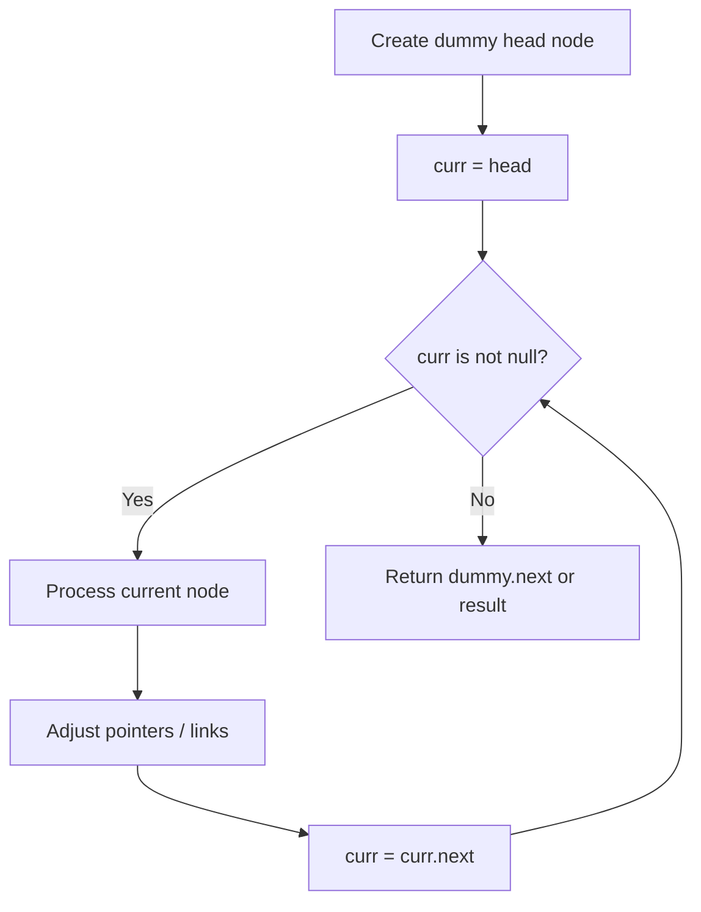
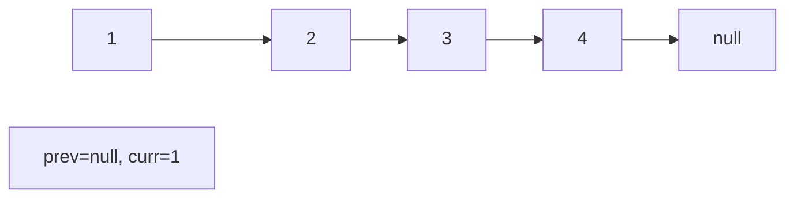
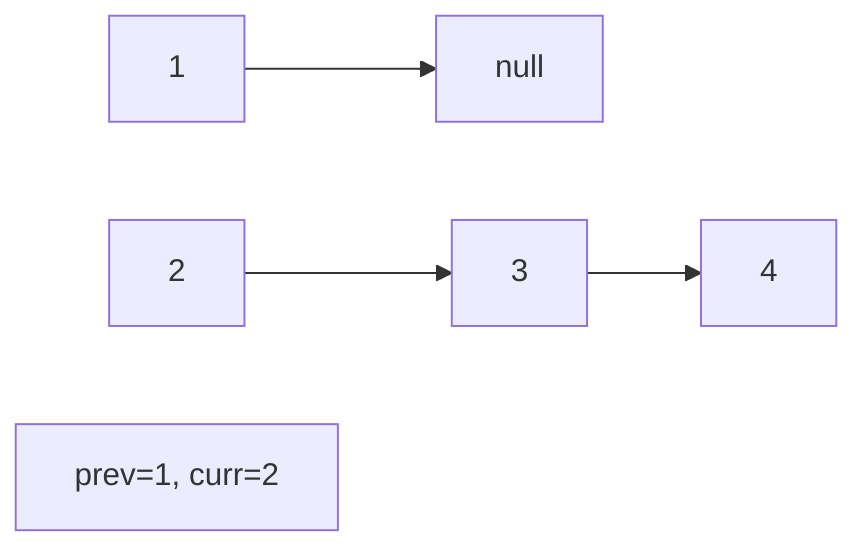
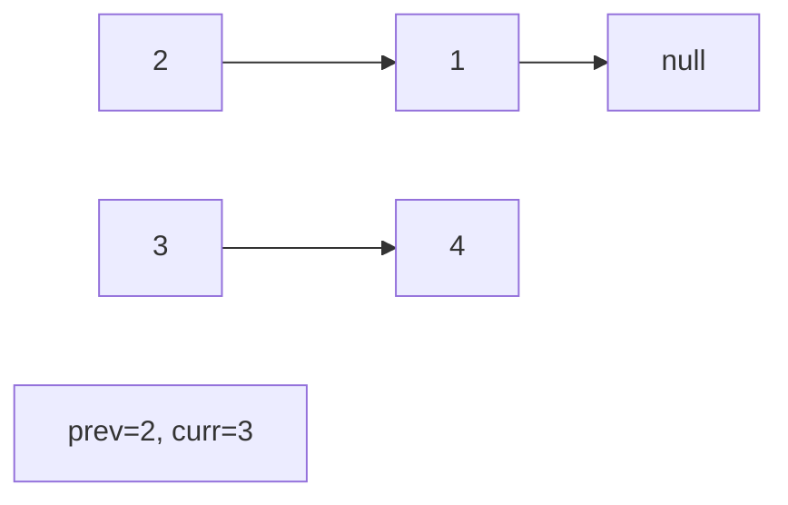
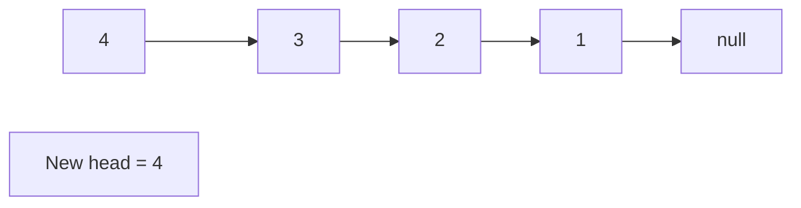

# Problem 1206: Design Skiplist

**Difficulty:** Hard  
**Tags:** Linked List, Design  
**Pattern:** Linked List  
**Link:** [leetcode.com/problems/design-skiplist](https://leetcode.com/problems/design-skiplist/)

## Description

Design a **Skiplist** without using any built-in libraries.

A **skiplist** is a data structure that takes `O(log(n))` time to add, erase and search. Comparing with treap and red-black tree which has the same function and performance, the code length of Skiplist can be comparatively short and the idea behind Skiplists is just simple linked lists.

For example, we have a Skiplist containing `[30,40,50,60,70,90]` and we want to add `80` and `45` into it. The Skiplist works this way:

Artyom Kalinin [CC BY-SA 3.0], via Wikimedia Commons

You can see there are many layers in the Skiplist. Each layer is a sorted linked list. With the help of the top layers, add, erase and search can be faster than `O(n)`. It can be proven that the average time complexity for each operation is `O(log(n))` and space complexity is `O(n)`.

See more about Skiplist: https://en.wikipedia.org/wiki/Skip_list

Implement the `Skiplist` class:

	- `Skiplist()` Initializes the object of the skiplist.
	- `bool search(int target)` Returns `true` if the integer `target` exists in the Skiplist or `false` otherwise.
	- `void add(int num)` Inserts the value `num` into the SkipList.
	- `bool erase(int num)` Removes the value `num` from the Skiplist and returns `true`. If `num` does not exist in the Skiplist, do nothing and return `false`. If there exist multiple `num` values, removing any one of them is fine.

Note that duplicates may exist in the Skiplist, your code needs to handle this situation.

 

Example 1:

```

**Input**
["Skiplist", "add", "add", "add", "search", "add", "search", "erase", "erase", "search"]
[[], [1], [2], [3], [0], [4], [1], [0], [1], [1]]
**Output**
[null, null, null, null, false, null, true, false, true, false]

**Explanation**
Skiplist skiplist = new Skiplist();
skiplist.add(1);
skiplist.add(2);
skiplist.add(3);
skiplist.search(0); // return False
skiplist.add(4);
skiplist.search(1); // return True
skiplist.erase(0);  // return False, 0 is not in skiplist.
skiplist.erase(1);  // return True
skiplist.search(1); // return False, 1 has already been erased.
```

 

**Constraints:**

	- `0 <= num, target <= 2 * 10^4`
	- At most `5 * 10^4` calls will be made to `search`, `add`, and `erase`.

## Approach: Linked List

Traverse or manipulate the linked list using pointer techniques. Common patterns: dummy head node for edge cases, fast/slow pointers for cycle detection or middle finding, in-place reversal, and merge operations.

## Pseudocode

```
1. Create dummy head if needed
2. Initialize pointer(s) at head
3. Traverse / modify list:
   a. Process current node
   b. Adjust next pointers as needed
   c. Move to next node
4. Return dummy.next or result
```

## Algorithm Flow



## Visual State Transitions

**Linked List Operation (Reverse):**

**Frame 1: Initial list**


**Frame 2: Reverse first link**


**Frame 3: Reverse second link**


**Frame 4: Fully reversed**



## Complexity Analysis

- **Time:** O(n)
- **Space:** O(1)

## Solution (Python3)

```python
class Skiplist:
    def __init__(self):
        # Initialize data structure
        pass

    def search(self, target: int) -> bool:
        return False

    def add(self, num: int) -> None:
        return None

    def erase(self, num: int) -> bool:
        return False

```

## Solution (C++)

```cpp
#include <string>
#include <vector>
using namespace std;

class Skiplist {
public:
    Skiplist() {
        // Initialize
    }

    bool search(int target) {
        return false;
    }

    void add(int num) {
        return ;
    }

    bool erase(int num) {
        return false;
    }

};
```
