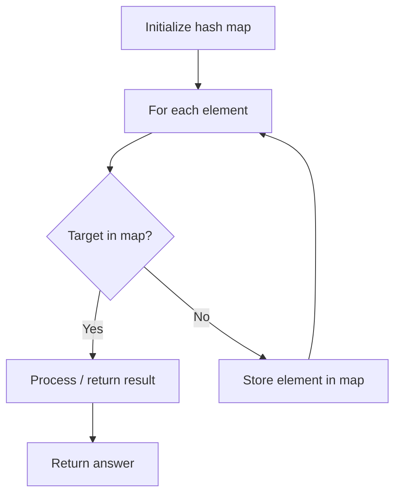

# Problem 1207: Unique Number of Occurrences

**Difficulty:** Easy  
**Tags:** Array, Hash Table  
**Pattern:** Hash Map Lookup  
**Link:** [leetcode.com/problems/unique-number-of-occurrences](https://leetcode.com/problems/unique-number-of-occurrences/)

## Description

Given an array of integers `arr`, return `true` *if the number of occurrences of each value in the array is **unique** or *`false`* otherwise*.

 

Example 1:

```

**Input:** arr = [1,2,2,1,1,3]
**Output:** true
**Explanation:** The value 1 has 3 occurrences, 2 has 2 and 3 has 1. No two values have the same number of occurrences.
```

Example 2:

```

**Input:** arr = [1,2]
**Output:** false

```

Example 3:

```

**Input:** arr = [-3,0,1,-3,1,1,1,-3,10,0]
**Output:** true

```

 

**Constraints:**

	- `1 <= arr.length <= 1000`
	- `-1000 <= arr[i] <= 1000`

## Approach: Hash Map Lookup

Use a hash map (dictionary) to store elements for O(1) lookup. Iterate through the input, checking membership or counting frequencies in the map.

## Pseudocode

```
1. Initialize hash map
2. Iterate through elements:
   a. Check if target/complement exists in map
   b. If found: process result
   c. Otherwise: store element in map
3. Return result
```

## Algorithm Flow



## Complexity Analysis

- **Time:** O(n)
- **Space:** O(n)

## Solution (Python3)

```python
class Solution:
    def uniqueOccurrences(self, arr: List[int]) -> bool:
        # Hash map approach - O(n) time, O(n) space
        seen = {}
        for i, val in enumerate(arr):
            complement = arr - val
            if complement in seen:
                return [seen[complement], i]
            seen[val] = i
        return False
```

## Solution (C++)

```cpp
#include <string>
#include <unordered_map>
#include <vector>
using namespace std;

class Solution {
public:
    bool uniqueOccurrences(vector<int>& arr) {
        // Hash map approach - O(n) time, O(n) space
        unordered_map<int, int> seen;
        for (int i = 0; i < arr.size(); i++) {
            int complement = arr - arr[i];
            if (seen.count(complement)) {
                return {seen[complement], i};
            }
            seen[arr[i]] = i;
        }
        return false;
    }
};
```
