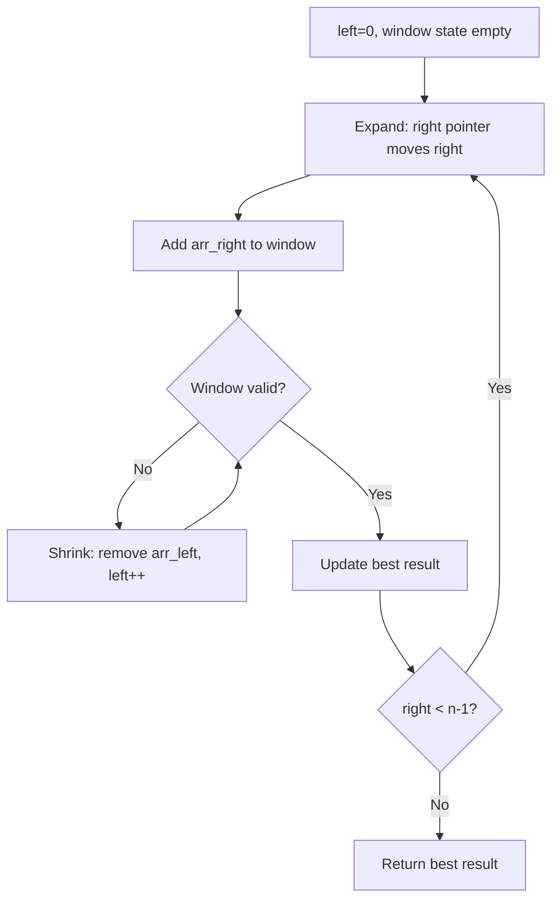
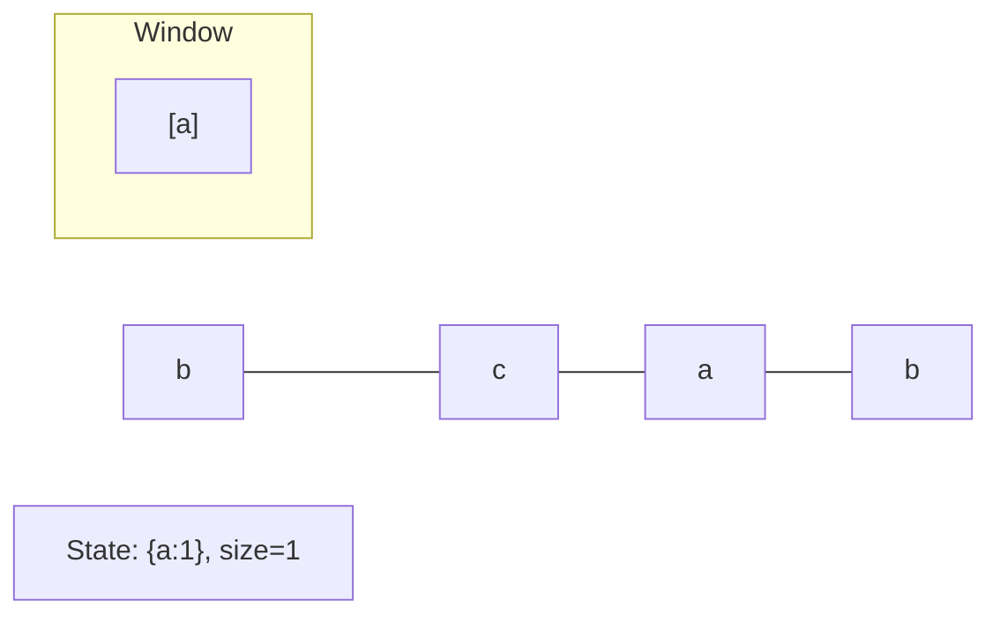
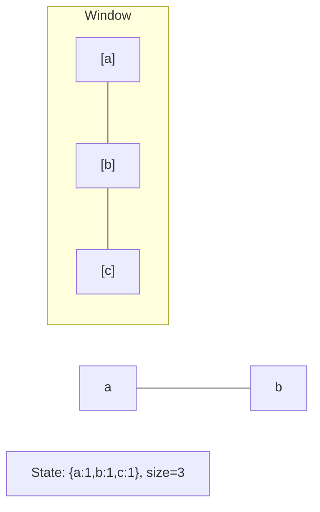
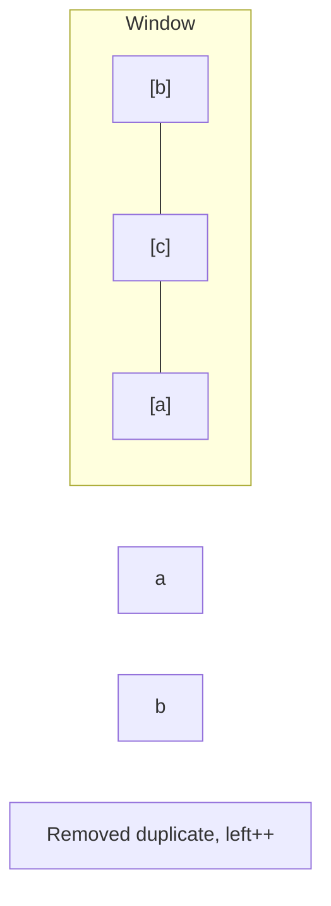
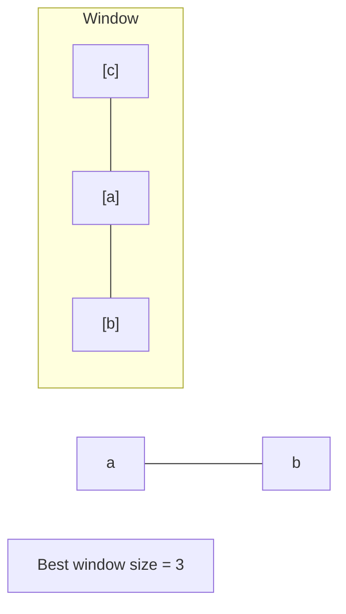

# Problem 1208: Get Equal Substrings Within Budget

**Difficulty:** Medium  
**Tags:** String, Binary Search, Sliding Window, Prefix Sum  
**Pattern:** Sliding Window  
**Link:** [leetcode.com/problems/get-equal-substrings-within-budget](https://leetcode.com/problems/get-equal-substrings-within-budget/)

## Description

You are given two strings `s` and `t` of the same length and an integer `maxCost`.

You want to change `s` to `t`. Changing the `i^th` character of `s` to `i^th` character of `t` costs `|s[i] - t[i]|` (i.e., the absolute difference between the ASCII values of the characters).

Return *the maximum length of a substring of *`s`* that can be changed to be the same as the corresponding substring of *`t`* with a cost less than or equal to *`maxCost`. If there is no substring from `s` that can be changed to its corresponding substring from `t`, return `0`.

 

Example 1:

```

**Input:** s = "abcd", t = "bcdf", maxCost = 3
**Output:** 3
**Explanation:** "abc" of s can change to "bcd".
That costs 3, so the maximum length is 3.

```

Example 2:

```

**Input:** s = "abcd", t = "cdef", maxCost = 3
**Output:** 1
**Explanation:** Each character in s costs 2 to change to character in t,  so the maximum length is 1.

```

Example 3:

```

**Input:** s = "abcd", t = "acde", maxCost = 0
**Output:** 1
**Explanation:** You cannot make any change, so the maximum length is 1.

```

 

**Constraints:**

	- `1 <= s.length <= 10^5`
	- `t.length == s.length`
	- `0 <= maxCost <= 10^6`
	- `s` and `t` consist of only lowercase English letters.

## Approach: Sliding Window

Maintain a window over the data using two pointers. Expand the right boundary to include new elements, and shrink the left boundary when the window constraint is violated. Track the optimal window.

## Pseudocode

```
1. Initialize left = 0, result = initial_value
2. For right in range(n):
   a. Add element at right to window state
   b. While window is invalid:
      - Remove element at left from window state
      - left++
   c. Update result = best of (result, window size/value)
3. Return result
```

## Algorithm Flow



## Visual State Transitions

**Sliding Window Step-by-Step:**

**Frame 1: Initial window (left=0, right=0)**


**Frame 2: Expand right (right=2)**


**Frame 3: Violation - shrink left**


**Frame 4: Continue expanding**



## Complexity Analysis

- **Time:** O(n)
- **Space:** O(k)

## Solution (Python3)

```python
class Solution:
    def equalSubstring(self, s: str, t: str, maxCost: int) -> int:
        # Sliding window approach - O(n) time, O(k) space
        from collections import defaultdict
        window = defaultdict(int)
        left = 0
        result = 0
        for right in range(len(s)):
            window[s[right]] += 1
            while len(window) > (t if isinstance(t, int) else len(s)):
                window[s[left]] -= 1
                if window[s[left]] == 0:
                    del window[s[left]]
                left += 1
            result = max(result, right - left + 1)
        return result
```

## Solution (C++)

```cpp
#include <algorithm>
#include <string>
#include <unordered_map>
#include <vector>
using namespace std;

class Solution {
public:
    int equalSubstring(string& s, string& t, int maxCost) {
        // Sliding window approach - O(n) time, O(k) space
        unordered_map<char, int> window;
        int left = 0, result = 0;
        for (int right = 0; right < s.size(); right++) {
            window[s[right]]++;
            while ((int)window.size() > t) {
                window[s[left]]--;
                if (window[s[left]] == 0)
                    window.erase(s[left]);
                left++;
            }
            result = max(result, right - left + 1);
        }
        return result;
    }
};
```
