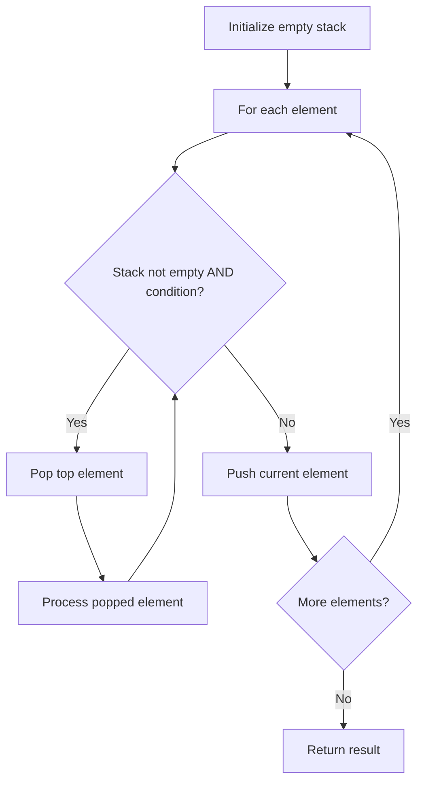

# Problem 1209: Remove All Adjacent Duplicates in String II

**Difficulty:** Medium  
**Tags:** String, Stack  
**Pattern:** Stack  
**Link:** [leetcode.com/problems/remove-all-adjacent-duplicates-in-string-ii](https://leetcode.com/problems/remove-all-adjacent-duplicates-in-string-ii/)

## Description

You are given a string `s` and an integer `k`, a `k` **duplicate removal** consists of choosing `k` adjacent and equal letters from `s` and removing them, causing the left and the right side of the deleted substring to concatenate together.

We repeatedly make `k` **duplicate removals** on `s` until we no longer can.

Return *the final string after all such duplicate removals have been made*. It is guaranteed that the answer is **unique**.

 

Example 1:

```

**Input:** s = "abcd", k = 2
**Output:** "abcd"
**Explanation: **There's nothing to delete.
```

Example 2:

```

**Input:** s = "deeedbbcccbdaa", k = 3
**Output:** "aa"
Explanation: 
First delete "eee" and "ccc", get "ddbbbdaa"
Then delete "bbb", get "dddaa"
Finally delete "ddd", get "aa"
```

Example 3:

```

**Input:** s = "pbbcggttciiippooaais", k = 2
**Output:** "ps"

```

 

**Constraints:**

	- `1 <= s.length <= 10^5`
	- `2 <= k <= 10^4`
	- `s` only contains lowercase English letters.

## Approach: Stack

Use a stack (LIFO) to process elements. Push elements when they might be needed later; pop when a matching or resolving condition is found. Common uses: parentheses matching, expression evaluation, next greater element.

## Pseudocode

```
1. Initialize empty stack
2. For each element:
   a. While stack is not empty and condition met:
      - Pop and process top element
   b. Push current element onto stack
3. Process remaining elements in stack if needed
4. Return result
```

## Algorithm Flow



## Complexity Analysis

- **Time:** O(n)
- **Space:** O(n)

## Solution (Python3)

```python
class Solution:
    def removeDuplicates(self, s: str, k: int) -> str:
        # Stack-based approach - O(n) time
        stack = []
        for ch in s:
            if stack and self._matches(stack[-1], ch):
                stack.pop()
            else:
                stack.append(ch)
        return len(stack) == 0 if isinstance("", bool) else stack

    def _matches(self, a, b):
        pairs = {'(': ')', '[': ']', '{': '}'}
        return pairs.get(a) == b
```

## Solution (C++)

```cpp
#include <stack>
#include <string>
#include <unordered_map>
#include <vector>
using namespace std;

class Solution {
public:
    string removeDuplicates(string& s, int k) {
        // Stack-based approach - O(n) time
        stack<char> st;
        unordered_map<char, char> pairs = {{'(', ')'}, {'[', ']'}, {'{', '}'}};
        for (char ch : s) {
            if (!st.empty() && pairs.count(st.top()) && pairs[st.top()] == ch) {
                st.pop();
            } else {
                st.push(ch);
            }
        }
        return st.empty();
    }
};
```
