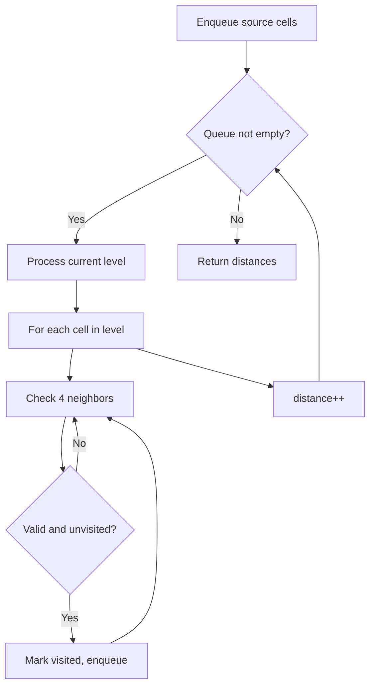
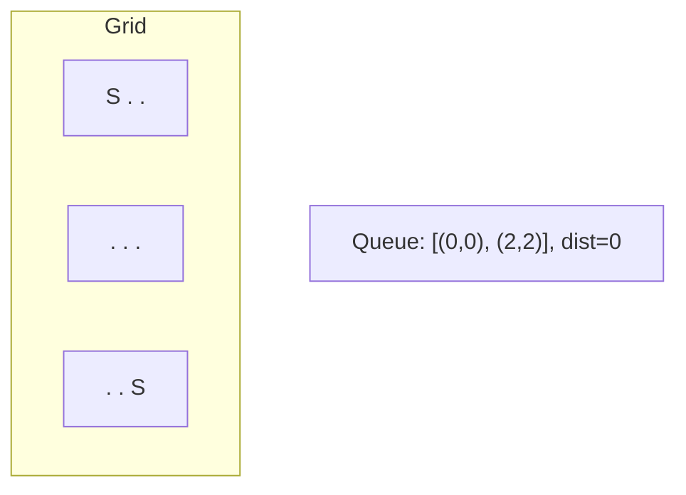
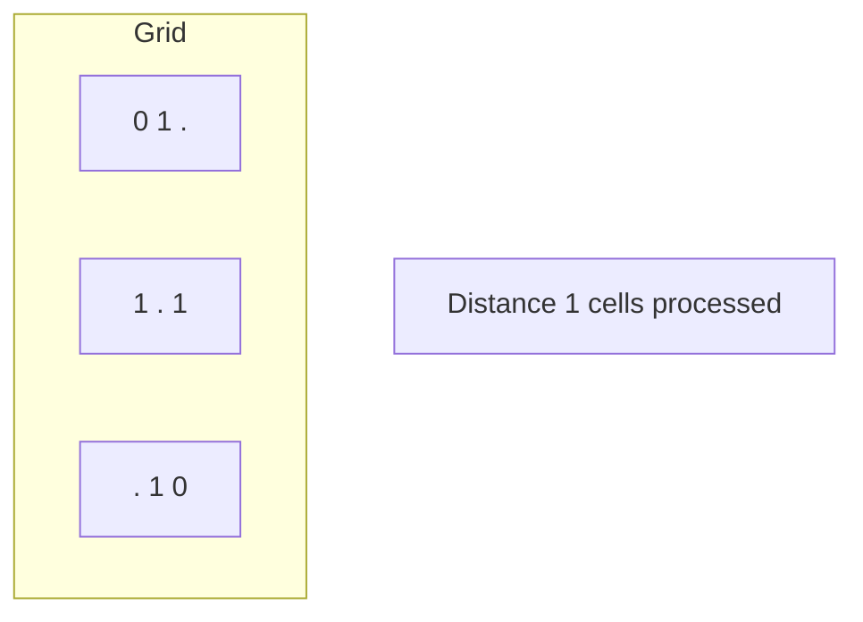
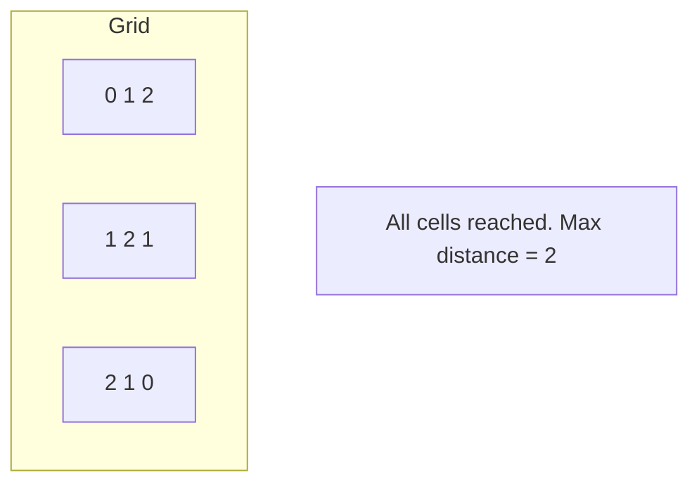

# Problem 1210: Minimum Moves to Reach Target with Rotations

**Difficulty:** Hard  
**Tags:** Array, Breadth-First Search, Matrix  
**Pattern:** BFS on Matrix / Grid  
**Link:** [leetcode.com/problems/minimum-moves-to-reach-target-with-rotations](https://leetcode.com/problems/minimum-moves-to-reach-target-with-rotations/)

## Description

In an `n*n` grid, there is a snake that spans 2 cells and starts moving from the top left corner at `(0, 0)` and `(0, 1)`. The grid has empty cells represented by zeros and blocked cells represented by ones. The snake wants to reach the lower right corner at `(n-1, n-2)` and `(n-1, n-1)`.

In one move the snake can:

	- Move one cell to the right if there are no blocked cells there. This move keeps the horizontal/vertical position of the snake as it is.
	- Move down one cell if there are no blocked cells there. This move keeps the horizontal/vertical position of the snake as it is.
	- Rotate clockwise if it's in a horizontal position and the two cells under it are both empty. In that case the snake moves from `(r, c)` and `(r, c+1)` to `(r, c)` and `(r+1, c)`.

	
	- Rotate counterclockwise if it's in a vertical position and the two cells to its right are both empty. In that case the snake moves from `(r, c)` and `(r+1, c)` to `(r, c)` and `(r, c+1)`.

	

Return the minimum number of moves to reach the target.

If there is no way to reach the target, return `-1`.

 

Example 1:

****

```

**Input:** grid = [[0,0,0,0,0,1],
               [1,1,0,0,1,0],
               [0,0,0,0,1,1],
               [0,0,1,0,1,0],
               [0,1,1,0,0,0],
               [0,1,1,0,0,0]]
**Output:** 11
Explanation:
One possible solution is [right, right, rotate clockwise, right, down, down, down, down, rotate counterclockwise, right, down].

```

Example 2:

```

**Input:** grid = [[0,0,1,1,1,1],
               [0,0,0,0,1,1],
               [1,1,0,0,0,1],
               [1,1,1,0,0,1],
               [1,1,1,0,0,1],
               [1,1,1,0,0,0]]
**Output:** 9

```

 

**Constraints:**

	- `2 <= n <= 100`
	- `0 <= grid[i][j] <= 1`
	- It is guaranteed that the snake starts at empty cells.

## Approach: BFS on Matrix / Grid

Breadth-first search on the grid. Enqueue all starting cells, then expand level by level. BFS on grids finds shortest distance from source(s).

## Pseudocode

```
1. Enqueue all source cells, mark visited
2. distance = 0
3. While queue not empty:
   a. Process all cells at current distance
   b. For each cell, enqueue unvisited neighbors
   c. distance++
4. Return result
```

## Algorithm Flow



## Visual State Transitions

**Multi-source BFS on Grid:**

**Frame 1: Enqueue all sources**


**Frame 2: Expand distance 1**


**Frame 3: Expand distance 2**



## Complexity Analysis

- **Time:** O(m * n)
- **Space:** O(m * n)

## Solution (Python3)

```python
class Solution:
    def minimumMoves(self, grid: List[List[int]]) -> int:
        # BFS on grid - O(m*n) time
        from collections import deque
        if not grid:
            return 0
        rows, cols = len(grid), len(grid[0])
        queue = deque()
        visited = set()
        # Initialize BFS sources
        for r in range(rows):
            for c in range(cols):
                if grid[r][c] == 1 or grid[r][c] == '1':
                    queue.append((r, c, 0))
                    visited.add((r, c))
        steps = 0
        while queue:
            r, c, d = queue.popleft()
            steps = max(steps, d)
            for dr, dc in [(1,0),(-1,0),(0,1),(0,-1)]:
                nr, nc = r+dr, c+dc
                if 0 <= nr < rows and 0 <= nc < cols and (nr,nc) not in visited:
                    visited.add((nr, nc))
                    queue.append((nr, nc, d+1))
        return steps
```

## Solution (C++)

```cpp
#include <algorithm>
#include <queue>
#include <string>
#include <tuple>
#include <vector>
using namespace std;

class Solution {
public:
    int minimumMoves(vector<vector<int>>& grid) {
        // BFS on grid - O(m*n) time
        if (grid.empty()) return 0;
        int rows = grid.size(), cols = grid[0].size();
        queue<tuple<int,int,int>> q;
        vector<vector<bool>> visited(rows, vector<bool>(cols, false));
        int dirs[4][2] = {{1,0},{-1,0},{0,1},{0,-1}};
        for (int r = 0; r < rows; r++)
            for (int c = 0; c < cols; c++)
                if (grid[r][c] == 1) {
                    q.push({r, c, 0});
                    visited[r][c] = true;
                }
        int steps = 0;
        while (!q.empty()) {
            auto [r, c, d] = q.front(); q.pop();
            steps = max(steps, d);
            for (auto& dir : dirs) {
                int nr = r+dir[0], nc = c+dir[1];
                if (nr>=0 && nr<rows && nc>=0 && nc<cols && !visited[nr][nc]) {
                    visited[nr][nc] = true;
                    q.push({nr, nc, d+1});
                }
            }
        }
        return steps;
    }
};
```
