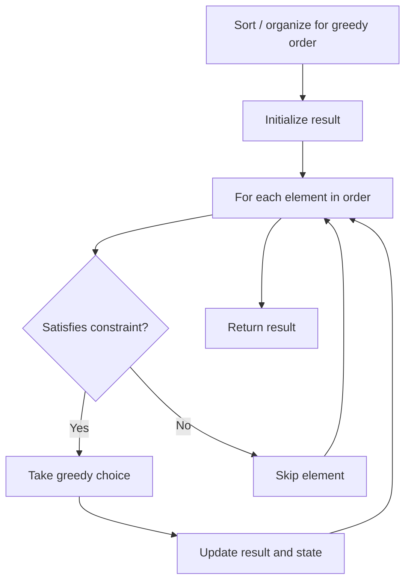

# Problem 1217: Minimum Cost to Move Chips to The Same Position

**Difficulty:** Easy  
**Tags:** Array, Math, Greedy  
**Pattern:** Greedy  
**Link:** [leetcode.com/problems/minimum-cost-to-move-chips-to-the-same-position](https://leetcode.com/problems/minimum-cost-to-move-chips-to-the-same-position/)

## Description

We have `n` chips, where the position of the `i^th` chip is `position[i]`.

We need to move all the chips to **the same position**. In one step, we can change the position of the `i^th` chip from `position[i]` to:

	- `position[i] + 2` or `position[i] - 2` with `cost = 0`.
	- `position[i] + 1` or `position[i] - 1` with `cost = 1`.

Return *the minimum cost* needed to move all the chips to the same position.

 

Example 1:

```

**Input:** position = [1,2,3]
**Output:** 1
**Explanation:** First step: Move the chip at position 3 to position 1 with cost = 0.
Second step: Move the chip at position 2 to position 1 with cost = 1.
Total cost is 1.

```

Example 2:

```

**Input:** position = [2,2,2,3,3]
**Output:** 2
**Explanation:** We can move the two chips at position  3 to position 2. Each move has cost = 1. The total cost = 2.

```

Example 3:

```

**Input:** position = [1,1000000000]
**Output:** 1

```

 

**Constraints:**

	- `1 <= position.length <= 100`
	- `1 <= position[i] <= 10^9`

## Approach: Greedy

Make the locally optimal choice at each step, trusting it leads to a global optimum. Greedy works when the problem has the greedy-choice property and optimal substructure.

## Pseudocode

```
1. Sort or organize data for greedy ordering
2. Initialize result
3. For each element in greedy order:
   a. If element satisfies constraint:
      - Take the greedy choice
      - Update result and state
4. Return result
```

## Algorithm Flow



## Complexity Analysis

- **Time:** O(n log n)
- **Space:** O(1)

## Solution (Python3)

```python
class Solution:
    def minCostToMoveChips(self, position: List[int]) -> int:
        # Greedy approach - O(n) time
        result = 0
        curr_max = 0
        for i in range(len(position)):
            if isinstance(position[i], int):
                curr_max = max(curr_max, position[i])
                result = max(result, curr_max)
            else:
                result += 1
        return result
```

## Solution (C++)

```cpp
#include <algorithm>
#include <string>
#include <vector>
using namespace std;

class Solution {
public:
    int minCostToMoveChips(vector<int>& position) {
        // Greedy approach - O(n) time
        int result = 0, curr_max = 0;
        for (int i = 0; i < (int)position.size(); i++) {
            curr_max = max(curr_max, position[i]);
            result = max(result, curr_max);
        }
        return result;
    }
};
```
