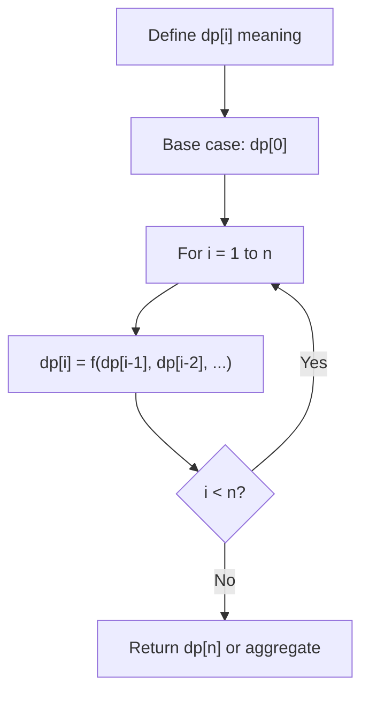
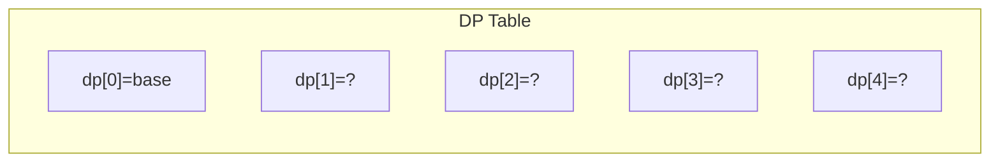
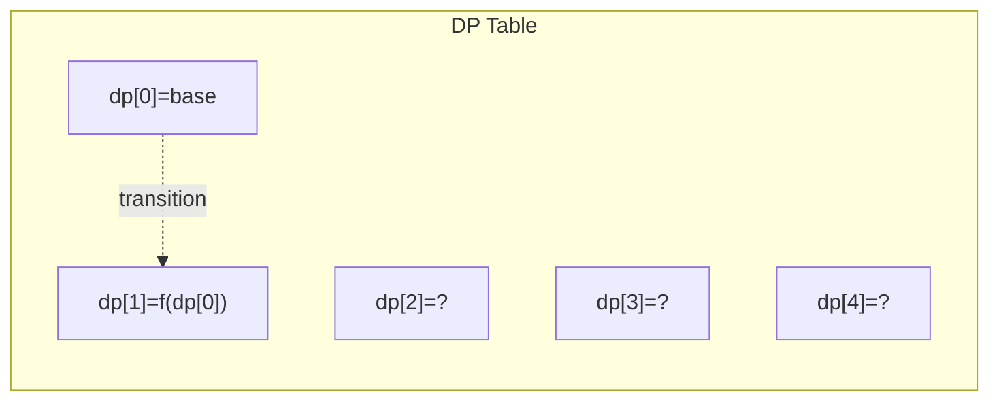
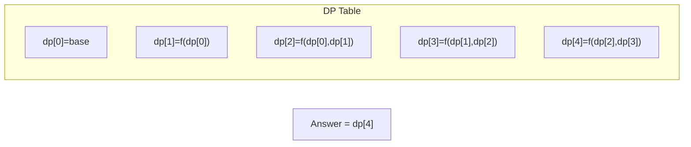

# Problem 1218: Longest Arithmetic Subsequence of Given Difference

**Difficulty:** Medium  
**Tags:** Array, Hash Table, Dynamic Programming  
**Pattern:** Dynamic Programming (1D)  
**Link:** [leetcode.com/problems/longest-arithmetic-subsequence-of-given-difference](https://leetcode.com/problems/longest-arithmetic-subsequence-of-given-difference/)

## Description

Given an integer array `arr` and an integer `difference`, return the length of the longest subsequence in `arr` which is an arithmetic sequence such that the difference between adjacent elements in the subsequence equals `difference`.

A **subsequence** is a sequence that can be derived from `arr` by deleting some or no elements without changing the order of the remaining elements.

 

Example 1:

```

**Input:** arr = [1,2,3,4], difference = 1
**Output:** 4
**Explanation: **The longest arithmetic subsequence is [1,2,3,4].
```

Example 2:

```

**Input:** arr = [1,3,5,7], difference = 1
**Output:** 1
**Explanation: **The longest arithmetic subsequence is any single element.

```

Example 3:

```

**Input:** arr = [1,5,7,8,5,3,4,2,1], difference = -2
**Output:** 4
**Explanation: **The longest arithmetic subsequence is [7,5,3,1].

```

 

**Constraints:**

	- `1 <= arr.length <= 10^5`
	- `-10^4 <= arr[i], difference <= 10^4`

## Approach: Dynamic Programming (1D)

Break the problem into overlapping subproblems. Define dp[i] as the optimal value for the subproblem ending at or considering index i. Build the solution bottom-up, using previously computed dp values.

## Pseudocode

```
1. Define dp[i] = optimal value for subproblem i
2. Base case: dp[0] = initial value
3. For i from 1 to n:
   a. dp[i] = recurrence(dp[i-1], dp[i-2], ...)
4. Return dp[n] or max/min of dp
```

## Algorithm Flow



## Visual State Transitions

**1D Dynamic Programming Table Build:**

**Frame 1: Initialize base cases**


**Frame 2: Fill dp[1] from dp[0]**


**Frame 3: Fill remaining cells**



## Complexity Analysis

- **Time:** O(n)
- **Space:** O(n)

## Solution (Python3)

```python
class Solution:
    def longestSubsequence(self, arr: List[int], difference: int) -> int:
        # Dynamic programming (1D) - O(n) time, O(n) space
        if not arr:
            return 0
        n = len(arr) if isinstance(arr, list) else arr
        dp = [0] * (n + 1)
        dp[0] = 1  # base case
        for i in range(1, n + 1):
            dp[i] = dp[i-1]  # transition (customize per problem)
            if i >= 2:
                dp[i] += dp[i-2]
        return dp[n]
```

## Solution (C++)

```cpp
#include <string>
#include <vector>
using namespace std;

class Solution {
public:
    int longestSubsequence(vector<int>& arr, int difference) {
        // Dynamic programming (1D) - O(n) time, O(n) space
        int n = arr;
        if (n <= 0) return 0;
        vector<int> dp(n + 1, 0);
        dp[0] = 1;
        for (int i = 1; i <= n; i++) {
            dp[i] = dp[i-1];
            if (i >= 2) dp[i] += dp[i-2];
        }
        return dp[n];
    }
};
```
