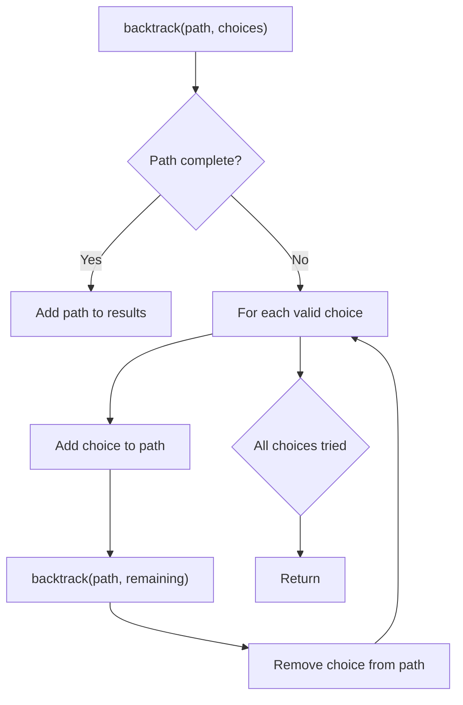
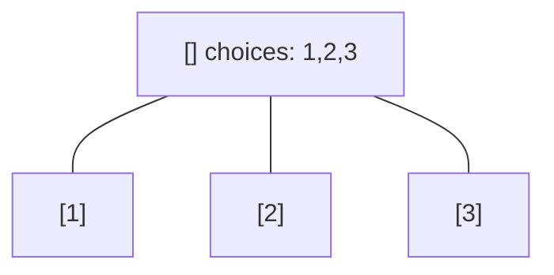
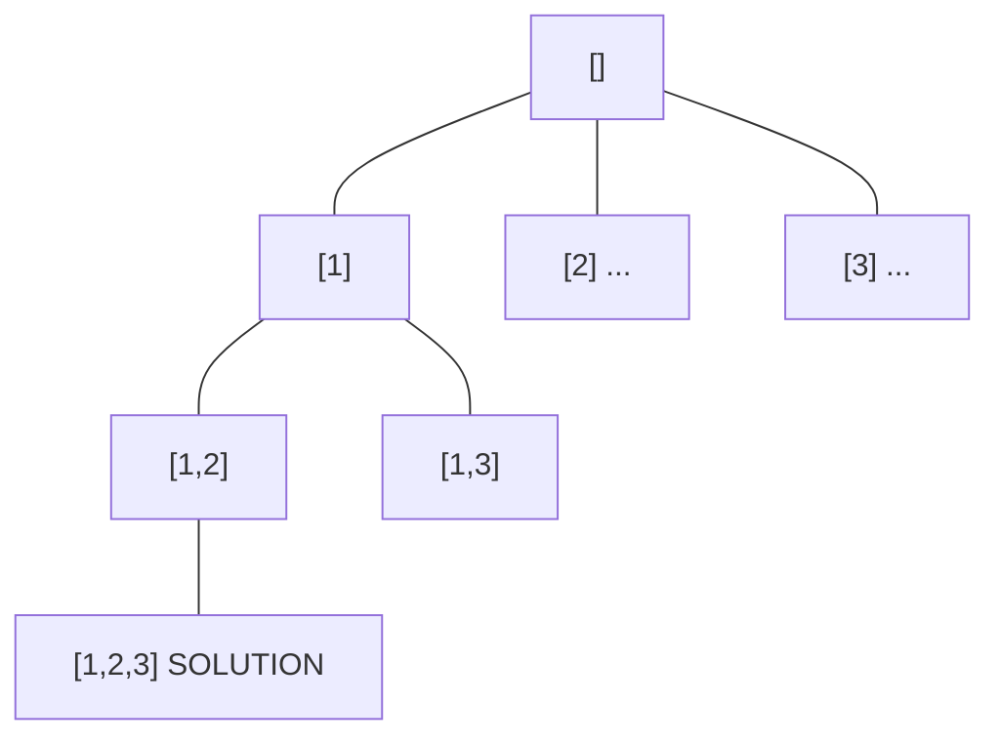
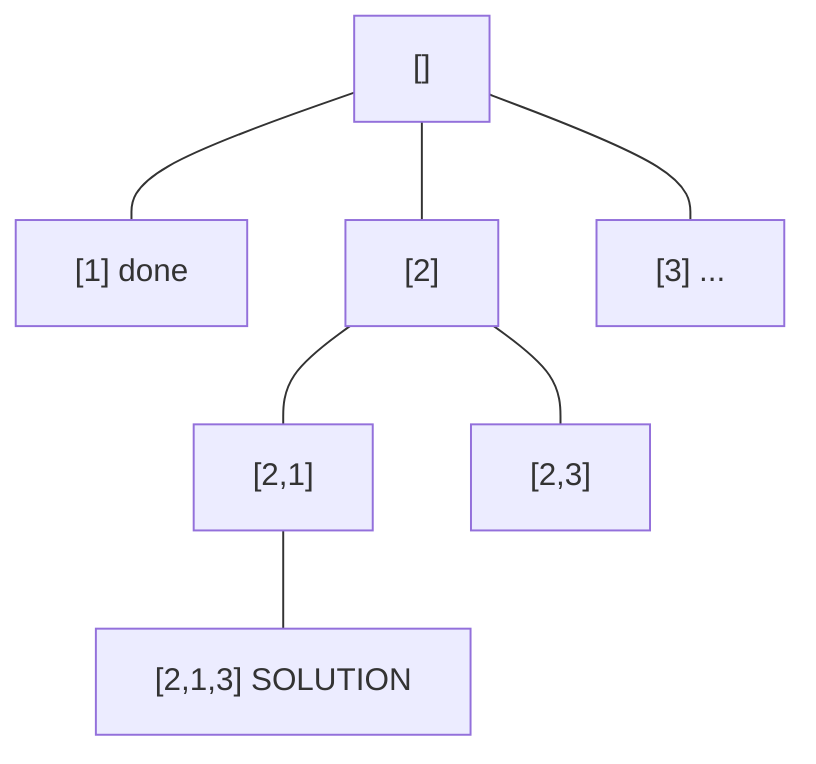
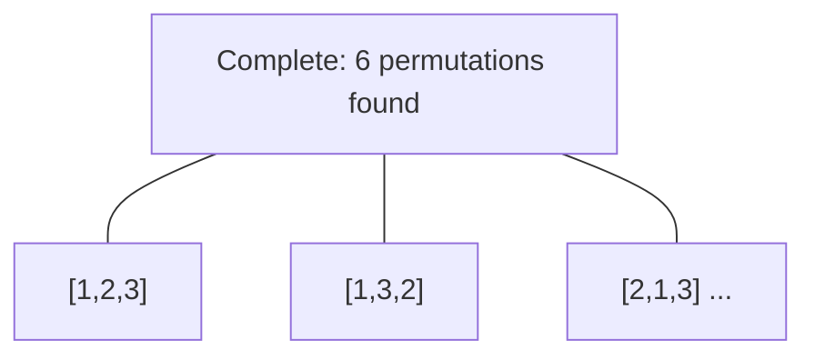

# Problem 1219: Path with Maximum Gold

**Difficulty:** Medium  
**Tags:** Array, Backtracking, Matrix  
**Pattern:** Backtracking  
**Link:** [leetcode.com/problems/path-with-maximum-gold](https://leetcode.com/problems/path-with-maximum-gold/)

## Description

In a gold mine `grid` of size `m x n`, each cell in this mine has an integer representing the amount of gold in that cell, `0` if it is empty.

Return the maximum amount of gold you can collect under the conditions:

	- Every time you are located in a cell you will collect all the gold in that cell.
	- From your position, you can walk one step to the left, right, up, or down.
	- You can't visit the same cell more than once.
	- Never visit a cell with `0` gold.
	- You can start and stop collecting gold from **any **position in the grid that has some gold.

 

Example 1:

```

**Input:** grid = [[0,6,0],[5,8,7],[0,9,0]]
**Output:** 24
**Explanation:**
[[0,6,0],
 [5,8,7],
 [0,9,0]]
Path to get the maximum gold, 9 -> 8 -> 7.

```

Example 2:

```

**Input:** grid = [[1,0,7],[2,0,6],[3,4,5],[0,3,0],[9,0,20]]
**Output:** 28
**Explanation:**
[[1,0,7],
 [2,0,6],
 [3,4,5],
 [0,3,0],
 [9,0,20]]
Path to get the maximum gold, 1 -> 2 -> 3 -> 4 -> 5 -> 6 -> 7.

```

 

**Constraints:**

	- `m == grid.length`
	- `n == grid[i].length`
	- `1 <= m, n <= 15`
	- `0 <= grid[i][j] <= 100`
	- There are at most **25 **cells containing gold.

## Approach: Backtracking

Explore all possible solutions by building candidates incrementally. At each step, make a choice and recurse. If the choice leads to a dead end, undo the choice (backtrack) and try the next option.

## Pseudocode

```
1. Define backtrack(path, choices):
   a. If path is a complete solution: add to results
   b. For each choice in choices:
      - If choice is valid:
        * Add choice to path
        * backtrack(path, remaining_choices)
        * Remove choice from path (backtrack)
2. Call backtrack([], all_choices)
```

## Algorithm Flow



## Visual State Transitions

**Backtracking Decision Tree:**

**Frame 1: Root - start with empty path**


**Frame 2: Explore branch [1]**


**Frame 3: Backtrack, explore [2]**


**Frame 4: All solutions found**



## Complexity Analysis

- **Time:** O(k^n) or O(n!)
- **Space:** O(n)

## Solution (Python3)

```python
class Solution:
    def getMaximumGold(self, grid: List[List[int]]) -> int:
        # Backtracking - O(2^n) or O(n!) time
        result = []
        
        def backtrack(path, start):
            result.append(path[:])
            for i in range(start, len(grid)):
                path.append(grid[i])
                backtrack(path, i + 1)
                path.pop()
        
        backtrack([], 0)
        return result
```

## Solution (C++)

```cpp
#include <functional>
#include <string>
#include <vector>
using namespace std;

class Solution {
public:
    int getMaximumGold(vector<vector<int>>& grid) {
        // Backtracking - O(2^n) or O(n!) time
        vector<vector<int>> result;
        vector<int> path;
        function<void(int)> backtrack = [&](int start) {
            result.push_back(path);
            for (int i = start; i < (int)grid.size(); i++) {
                path.push_back(grid[i]);
                backtrack(i + 1);
                path.pop_back();
            }
        };
        backtrack(0);
        return result;
    }
};
```
