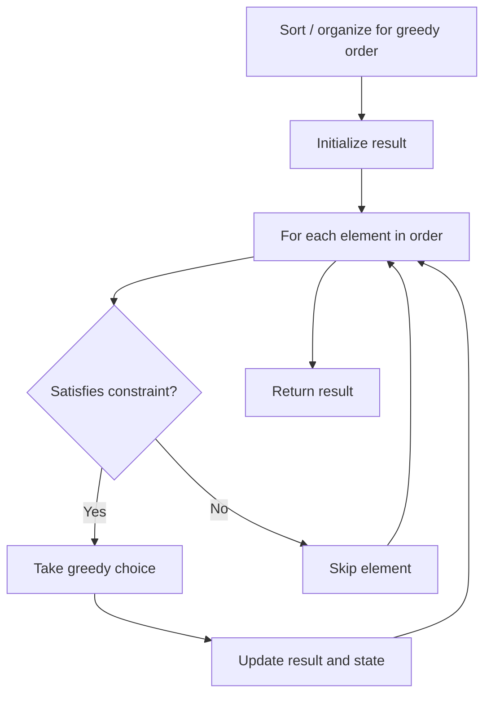

# Problem 1221: Split a String in Balanced Strings

**Difficulty:** Easy  
**Tags:** String, Greedy, Counting  
**Pattern:** Greedy  
**Link:** [leetcode.com/problems/split-a-string-in-balanced-strings](https://leetcode.com/problems/split-a-string-in-balanced-strings/)

## Description

**Balanced** strings are those that have an equal quantity of `'L'` and `'R'` characters.

Given a **balanced** string `s`, split it into some number of substrings such that:

	- Each substring is balanced.

Return *the **maximum** number of balanced strings you can obtain.*

 

Example 1:

```

**Input:** s = "RLRRLLRLRL"
**Output:** 4
**Explanation:** s can be split into "RL", "RRLL", "RL", "RL", each substring contains same number of 'L' and 'R'.

```

Example 2:

```

**Input:** s = "RLRRRLLRLL"
**Output:** 2
**Explanation:** s can be split into "RL", "RRRLLRLL", each substring contains same number of 'L' and 'R'.
Note that s cannot be split into "RL", "RR", "RL", "LR", "LL", because the 2nd and 5th substrings are not balanced.
```

Example 3:

```

**Input:** s = "LLLLRRRR"
**Output:** 1
**Explanation:** s can be split into "LLLLRRRR".

```

 

**Constraints:**

	- `2 <= s.length <= 1000`
	- `s[i]` is either `'L'` or `'R'`.
	- `s` is a **balanced** string.

## Approach: Greedy

Make the locally optimal choice at each step, trusting it leads to a global optimum. Greedy works when the problem has the greedy-choice property and optimal substructure.

## Pseudocode

```
1. Sort or organize data for greedy ordering
2. Initialize result
3. For each element in greedy order:
   a. If element satisfies constraint:
      - Take the greedy choice
      - Update result and state
4. Return result
```

## Algorithm Flow



## Complexity Analysis

- **Time:** O(n log n)
- **Space:** O(1)

## Solution (Python3)

```python
class Solution:
    def balancedStringSplit(self, s: str) -> int:
        # Greedy approach - O(n) time
        result = 0
        curr_max = 0
        for i in range(len(s)):
            if isinstance(s[i], int):
                curr_max = max(curr_max, s[i])
                result = max(result, curr_max)
            else:
                result += 1
        return result
```

## Solution (C++)

```cpp
#include <algorithm>
#include <string>
#include <vector>
using namespace std;

class Solution {
public:
    int balancedStringSplit(string& s) {
        // Greedy approach - O(n) time
        int result = 0, curr_max = 0;
        for (int i = 0; i < (int)s.size(); i++) {
            curr_max = max(curr_max, s[i]);
            result = max(result, curr_max);
        }
        return result;
    }
};
```
