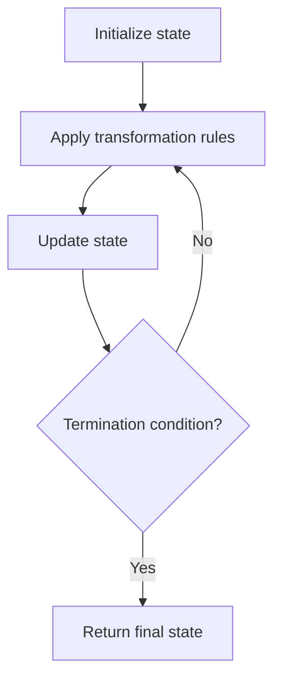

# Problem 1222: Queens That Can Attack the King

**Difficulty:** Medium  
**Tags:** Array, Matrix, Simulation  
**Pattern:** Simulation  
**Link:** [leetcode.com/problems/queens-that-can-attack-the-king](https://leetcode.com/problems/queens-that-can-attack-the-king/)

## Description

On a **0-indexed** `8 x 8` chessboard, there can be multiple black queens and one white king.

You are given a 2D integer array `queens` where `queens[i] = [xQueeni, yQueeni]` represents the position of the `i^th` black queen on the chessboard. You are also given an integer array `king` of length `2` where `king = [xKing, yKing]` represents the position of the white king.

Return *the coordinates of the black queens that can directly attack the king*. You may return the answer in **any order**.

 

Example 1:

```

**Input:** queens = [[0,1],[1,0],[4,0],[0,4],[3,3],[2,4]], king = [0,0]
**Output:** [[0,1],[1,0],[3,3]]
**Explanation:** The diagram above shows the three queens that can directly attack the king and the three queens that cannot attack the king (i.e., marked with red dashes).

```

Example 2:

```

**Input:** queens = [[0,0],[1,1],[2,2],[3,4],[3,5],[4,4],[4,5]], king = [3,3]
**Output:** [[2,2],[3,4],[4,4]]
**Explanation:** The diagram above shows the three queens that can directly attack the king and the three queens that cannot attack the king (i.e., marked with red dashes).

```

 

**Constraints:**

	- `1 <= queens.length < 64`
	- `queens[i].length == king.length == 2`
	- `0 <= xQueeni, yQueeni, xKing, yKing < 8`
	- All the given positions are **unique**.

## Approach: Simulation

Simulate the process described in the problem step by step. Follow the rules exactly, tracking state at each step.

## Pseudocode

```
1. Initialize state (grid, pointers, counters)
2. For each step / iteration:
   a. Apply the transformation rules
   b. Update state
   c. Check termination condition
3. Return final state or result
```

## Algorithm Flow



## Complexity Analysis

- **Time:** O(n) or O(n * k)
- **Space:** O(n)

## Solution (Python3)

```python
class Solution:
    def queensAttacktheKing(self, queens: List[List[int]], king: List[int]) -> List[List[int]]:
        # Simulation approach - follow the rules step by step
        result = []
        for i in range(len(queens) if isinstance(queens, list) else queens):
            # Simulate each step
            pass
        return result
```

## Solution (C++)

```cpp
#include <string>
#include <vector>
using namespace std;

class Solution {
public:
    vector<vector<int>> queensAttacktheKing(vector<vector<int>>& queens, vector<int>& king) {
        // Simulation approach
        int n = queens.size();
        for (int i = 0; i < n; i++) {
            // Simulate each step
        }
        return {};
    }
};
```
