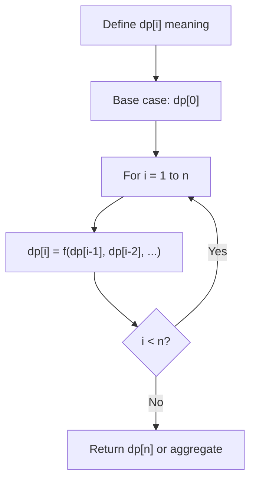
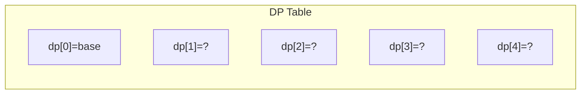
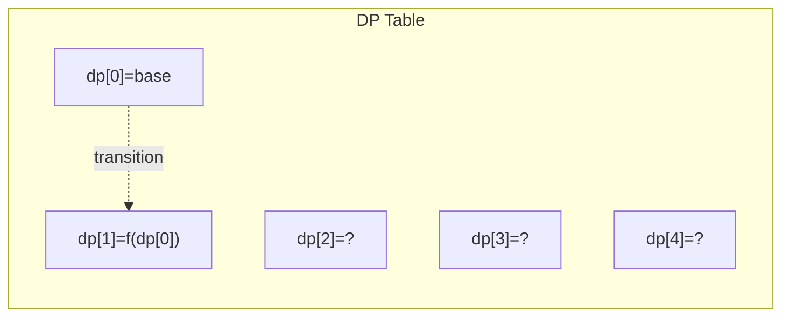
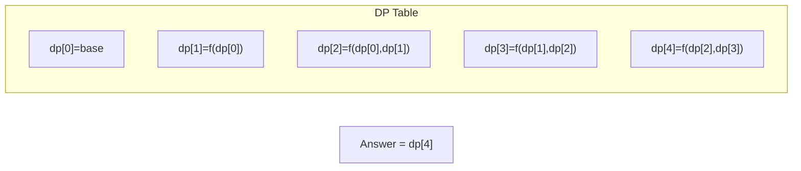

# Problem 1223: Dice Roll Simulation

**Difficulty:** Hard  
**Tags:** Array, Dynamic Programming  
**Pattern:** Dynamic Programming (1D)  
**Link:** [leetcode.com/problems/dice-roll-simulation](https://leetcode.com/problems/dice-roll-simulation/)

## Description

A die simulator generates a random number from `1` to `6` for each roll. You introduced a constraint to the generator such that it cannot roll the number `i` more than `rollMax[i]` (**1-indexed**) consecutive times.

Given an array of integers `rollMax` and an integer `n`, return *the number of distinct sequences that can be obtained with exact *`n`* rolls*. Since the answer may be too large, return it **modulo** `10^9 + 7`.

Two sequences are considered different if at least one element differs from each other.

 

Example 1:

```

**Input:** n = 2, rollMax = [1,1,2,2,2,3]
**Output:** 34
**Explanation:** There will be 2 rolls of die, if there are no constraints on the die, there are 6 * 6 = 36 possible combinations. In this case, looking at rollMax array, the numbers 1 and 2 appear at most once consecutively, therefore sequences (1,1) and (2,2) cannot occur, so the final answer is 36-2 = 34.

```

Example 2:

```

**Input:** n = 2, rollMax = [1,1,1,1,1,1]
**Output:** 30

```

Example 3:

```

**Input:** n = 3, rollMax = [1,1,1,2,2,3]
**Output:** 181

```

 

**Constraints:**

	- `1 <= n <= 5000`
	- `rollMax.length == 6`
	- `1 <= rollMax[i] <= 15`

## Approach: Dynamic Programming (1D)

Break the problem into overlapping subproblems. Define dp[i] as the optimal value for the subproblem ending at or considering index i. Build the solution bottom-up, using previously computed dp values.

## Pseudocode

```
1. Define dp[i] = optimal value for subproblem i
2. Base case: dp[0] = initial value
3. For i from 1 to n:
   a. dp[i] = recurrence(dp[i-1], dp[i-2], ...)
4. Return dp[n] or max/min of dp
```

## Algorithm Flow



## Visual State Transitions

**1D Dynamic Programming Table Build:**

**Frame 1: Initialize base cases**


**Frame 2: Fill dp[1] from dp[0]**


**Frame 3: Fill remaining cells**



## Complexity Analysis

- **Time:** O(n)
- **Space:** O(n)

## Solution (Python3)

```python
class Solution:
    def dieSimulator(self, n: int, rollMax: List[int]) -> int:
        # Dynamic programming (1D) - O(n) time, O(n) space
        if not n:
            return 0
        n = len(n) if isinstance(n, list) else n
        dp = [0] * (n + 1)
        dp[0] = 1  # base case
        for i in range(1, n + 1):
            dp[i] = dp[i-1]  # transition (customize per problem)
            if i >= 2:
                dp[i] += dp[i-2]
        return dp[n]
```

## Solution (C++)

```cpp
#include <string>
#include <vector>
using namespace std;

class Solution {
public:
    int dieSimulator(int n, vector<int>& rollMax) {
        // Dynamic programming (1D) - O(n) time, O(n) space
        int n = n;
        if (n <= 0) return 0;
        vector<int> dp(n + 1, 0);
        dp[0] = 1;
        for (int i = 1; i <= n; i++) {
            dp[i] = dp[i-1];
            if (i >= 2) dp[i] += dp[i-2];
        }
        return dp[n];
    }
};
```
