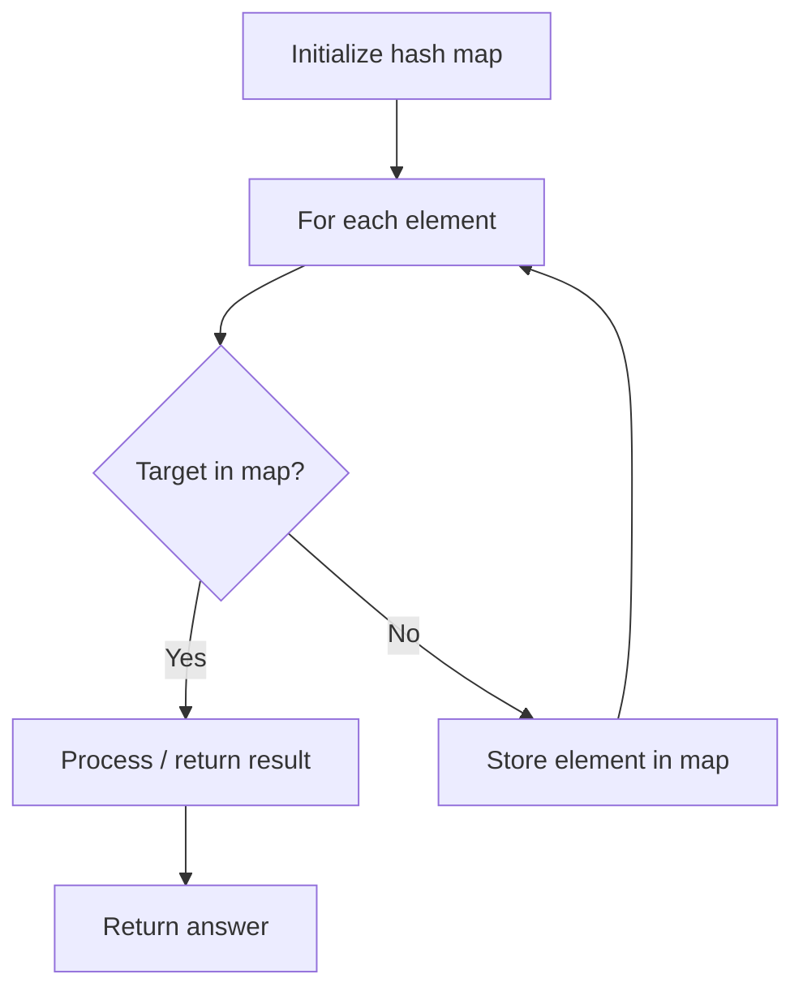

# Problem 1224: Maximum Equal Frequency

**Difficulty:** Hard  
**Tags:** Array, Hash Table  
**Pattern:** Hash Map Lookup  
**Link:** [leetcode.com/problems/maximum-equal-frequency](https://leetcode.com/problems/maximum-equal-frequency/)

## Description

Given an array `nums` of positive integers, return the longest possible length of an array prefix of `nums`, such that it is possible to remove **exactly one** element from this prefix so that every number that has appeared in it will have the same number of occurrences.

If after removing one element there are no remaining elements, it's still considered that every appeared number has the same number of ocurrences (0).

 

Example 1:

```

**Input:** nums = [2,2,1,1,5,3,3,5]
**Output:** 7
**Explanation:** For the subarray [2,2,1,1,5,3,3] of length 7, if we remove nums[4] = 5, we will get [2,2,1,1,3,3], so that each number will appear exactly twice.

```

Example 2:

```

**Input:** nums = [1,1,1,2,2,2,3,3,3,4,4,4,5]
**Output:** 13

```

 

**Constraints:**

	- `2 <= nums.length <= 10^5`
	- `1 <= nums[i] <= 10^5`

## Approach: Hash Map Lookup

Use a hash map (dictionary) to store elements for O(1) lookup. Iterate through the input, checking membership or counting frequencies in the map.

## Pseudocode

```
1. Initialize hash map
2. Iterate through elements:
   a. Check if target/complement exists in map
   b. If found: process result
   c. Otherwise: store element in map
3. Return result
```

## Algorithm Flow



## Complexity Analysis

- **Time:** O(n)
- **Space:** O(n)

## Solution (Python3)

```python
class Solution:
    def maxEqualFreq(self, nums: List[int]) -> int:
        # Hash map approach - O(n) time, O(n) space
        seen = {}
        for i, val in enumerate(nums):
            complement = nums - val
            if complement in seen:
                return [seen[complement], i]
            seen[val] = i
        return 0
```

## Solution (C++)

```cpp
#include <string>
#include <unordered_map>
#include <vector>
using namespace std;

class Solution {
public:
    int maxEqualFreq(vector<int>& nums) {
        // Hash map approach - O(n) time, O(n) space
        unordered_map<int, int> seen;
        for (int i = 0; i < nums.size(); i++) {
            int complement = nums - nums[i];
            if (seen.count(complement)) {
                return {seen[complement], i};
            }
            seen[nums[i]] = i;
        }
        return 0;
    }
};
```
