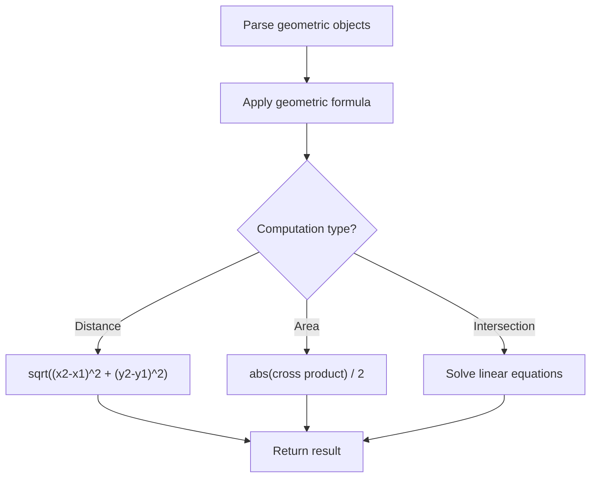

# Problem 1232: Check If It Is a Straight Line

**Difficulty:** Easy  
**Tags:** Array, Math, Geometry  
**Pattern:** Geometry  
**Link:** [leetcode.com/problems/check-if-it-is-a-straight-line](https://leetcode.com/problems/check-if-it-is-a-straight-line/)

## Description

You are given an integer array `coordinates`, `coordinates[i] = [x, y]`, where `[x, y]` represents the coordinate of a point. Check if these points make a straight line in the XY plane.

 

 

Example 1:

```

**Input:** coordinates = [[1,2],[2,3],[3,4],[4,5],[5,6],[6,7]]
**Output:** true

```

Example 2:

****

```

**Input:** coordinates = [[1,1],[2,2],[3,4],[4,5],[5,6],[7,7]]
**Output:** false

```

 

**Constraints:**

	- `2 <= coordinates.length <= 1000`
	- `coordinates[i].length == 2`
	- `-10^4 <= coordinates[i][0], coordinates[i][1] <= 10^4`
	- `coordinates` contains no duplicate point.

## Approach: Geometry

Apply geometric formulas: distance, area, cross product, convex hull, line intersection. Handle floating-point precision carefully.

## Pseudocode

```
1. Parse geometric objects (points, lines, shapes)
2. Apply geometric operations:
   - Distance formula
   - Cross/dot product
   - Area computation
3. Handle precision and edge cases
4. Return result
```

## Algorithm Flow



## Complexity Analysis

- **Time:** O(n^2) or O(n log n)
- **Space:** O(n)

## Solution (Python3)

```python
class Solution:
    def checkStraightLine(self, coordinates: List[List[int]]) -> bool:
        # Geometry approach
        import math
        result = 0
        for i in range(len(coordinates)):
            for j in range(i + 1, len(coordinates)):
                dx = coordinates[i][0] - coordinates[j][0]
                dy = coordinates[i][1] - coordinates[j][1]
                dist = math.sqrt(dx*dx + dy*dy)
                result = max(result, dist)
        return result
```

## Solution (C++)

```cpp
#include <algorithm>
#include <cmath>
#include <string>
#include <vector>
using namespace std;

class Solution {
public:
    bool checkStraightLine(vector<vector<int>>& coordinates) {
        // Geometry approach
        double result = 0;
        for (int i = 0; i < (int)coordinates.size(); i++) {
            for (int j = i + 1; j < (int)coordinates.size(); j++) {
                double dx = coordinates[i][0] - coordinates[j][0];
                double dy = coordinates[i][1] - coordinates[j][1];
                result = max(result, sqrt(dx*dx + dy*dy));
            }
        }
        return result;
    }
};
```
