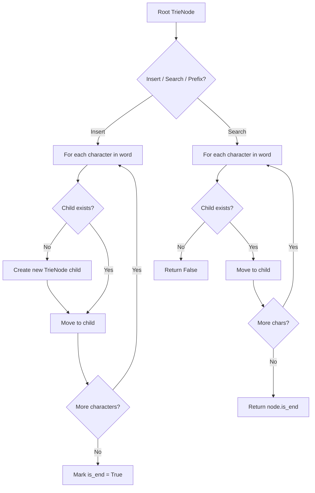
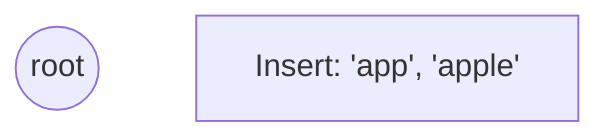
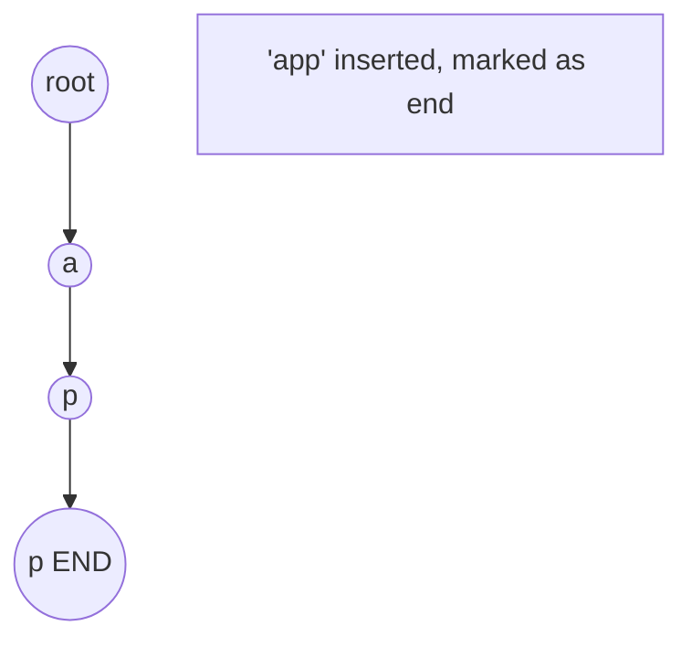
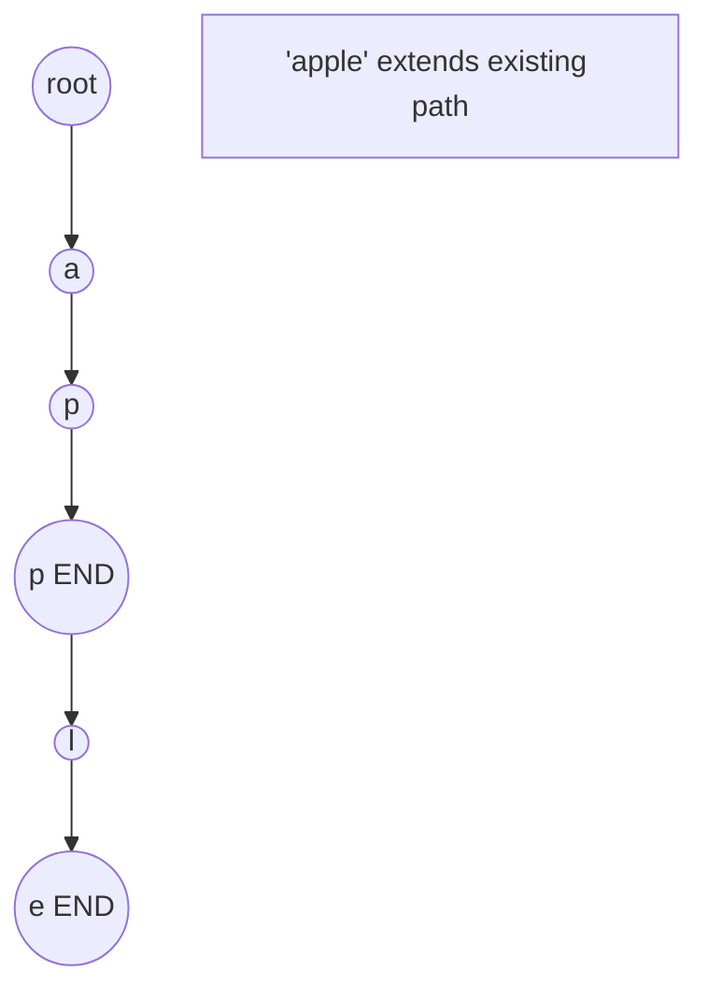
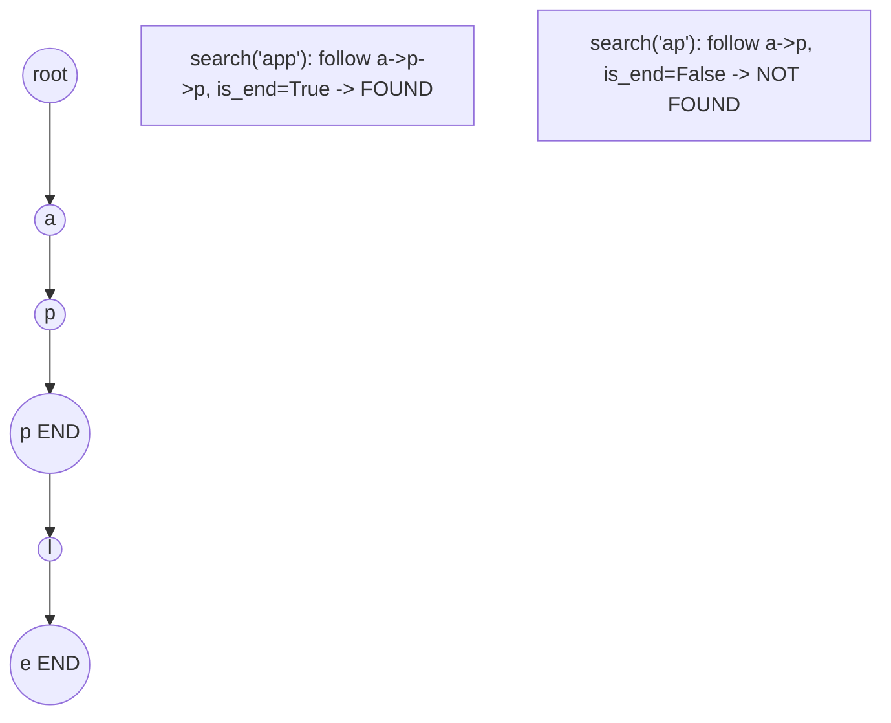

# Problem 1233: Remove Sub-Folders from the Filesystem

**Difficulty:** Medium  
**Tags:** Array, String, Depth-First Search, Trie  
**Pattern:** Trie / Prefix Tree  
**Link:** [leetcode.com/problems/remove-sub-folders-from-the-filesystem](https://leetcode.com/problems/remove-sub-folders-from-the-filesystem/)

## Description

Given a list of folders `folder`, return *the folders after removing all **sub-folders** in those folders*. You may return the answer in **any order**.

If a `folder[i]` is located within another `folder[j]`, it is called a **sub-folder** of it. A sub-folder of `folder[j]` must start with `folder[j]`, followed by a `"/"`. For example, `"/a/b"` is a sub-folder of `"/a"`, but `"/b"` is not a sub-folder of `"/a/b/c"`.

The format of a path is one or more concatenated strings of the form: `'/'` followed by one or more lowercase English letters.

	- For example, `"/leetcode"` and `"/leetcode/problems"` are valid paths while an empty string and `"/"` are not.

 

Example 1:

```

**Input:** folder = ["/a","/a/b","/c/d","/c/d/e","/c/f"]
**Output:** ["/a","/c/d","/c/f"]
**Explanation:** Folders "/a/b" is a subfolder of "/a" and "/c/d/e" is inside of folder "/c/d" in our filesystem.

```

Example 2:

```

**Input:** folder = ["/a","/a/b/c","/a/b/d"]
**Output:** ["/a"]
**Explanation:** Folders "/a/b/c" and "/a/b/d" will be removed because they are subfolders of "/a".

```

Example 3:

```

**Input:** folder = ["/a/b/c","/a/b/ca","/a/b/d"]
**Output:** ["/a/b/c","/a/b/ca","/a/b/d"]

```

 

**Constraints:**

	- `1 <= folder.length <= 4 * 10^4`
	- `2 <= folder[i].length <= 100`
	- `folder[i]` contains only lowercase letters and `'/'`.
	- `folder[i]` always starts with the character `'/'`.
	- Each folder name is **unique**.

## Approach: Trie / Prefix Tree

Build a trie (prefix tree) where each node represents a character. Insert words character by character, and search by following child pointers. Supports efficient prefix matching.

## Pseudocode

```
1. TrieNode: children = {}, is_end = False
2. Insert(word):
   - For each char: create child if absent, move to child
   - Mark last node as end
3. Search(word):
   - For each char: if child absent return False, move to child
   - Return node.is_end
4. StartsWith(prefix): same as search but return True at end
```

## Algorithm Flow



## Visual State Transitions

**Trie Insert and Search:**

**Frame 1: Empty trie**


**Frame 2: Insert 'app'**


**Frame 3: Insert 'apple'**


**Frame 4: Search 'app' = True, 'ap' = False**



## Complexity Analysis

- **Time:** O(L) per operation
- **Space:** O(N * L)

## Solution (Python3)

```python
class Solution:
    def removeSubfolders(self, folder: List[str]) -> List[str]:
        # Trie-based approach
        trie = {}
        # Build trie from word list
        words = folder if isinstance(folder, list) else [folder]
        for word in words:
            node = trie
            for ch in word:
                if ch not in node:
                    node[ch] = {}
                node = node[ch]
            node['#'] = True
        
        # Search in trie
        def search(word):
            node = trie
            for ch in word:
                if ch not in node:
                    return False
                node = node[ch]
            return '#' in node
        
        return []
```

## Solution (C++)

```cpp
#include <string>
#include <vector>
using namespace std;

class Solution {
public:
    vector<string> removeSubfolders(vector<string>& folder) {
        // Trie-based approach
        struct TrieNode {
            TrieNode* children[26] = {};
            bool isEnd = false;
        };
        TrieNode* root = new TrieNode();
        // Build trie
        for (auto& word : folder) {
            TrieNode* node = root;
            for (char ch : word) {
                int idx = ch - 'a';
                if (!node->children[idx])
                    node->children[idx] = new TrieNode();
                node = node->children[idx];
            }
            node->isEnd = true;
        }
        return {};
    }
};
```
