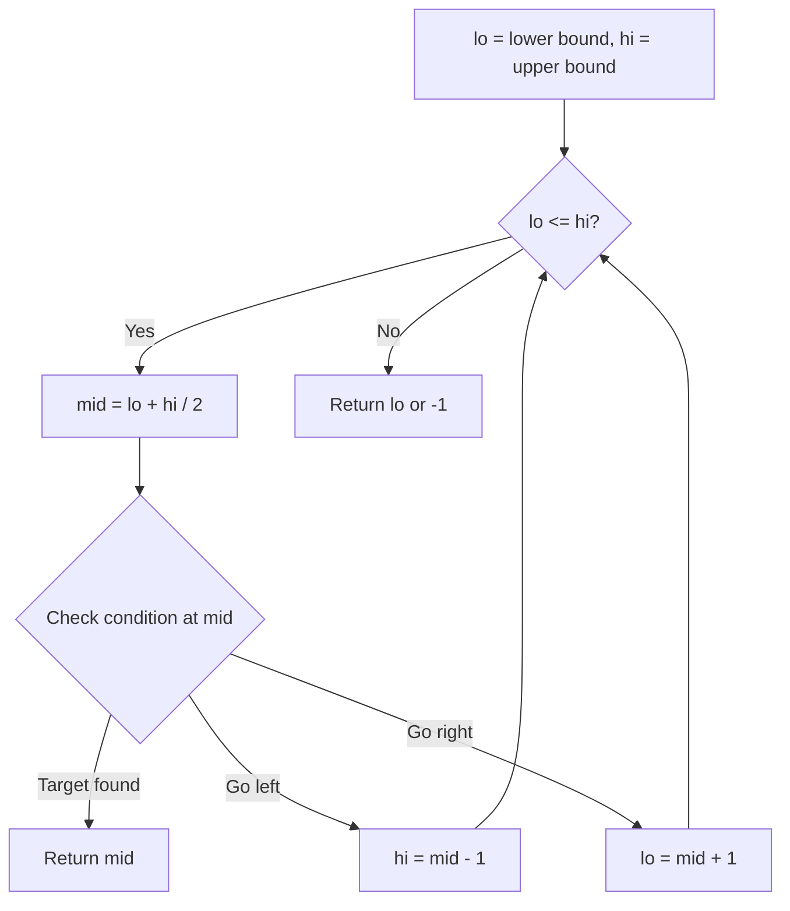
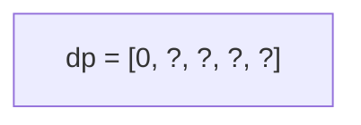
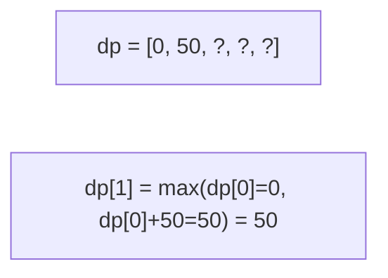
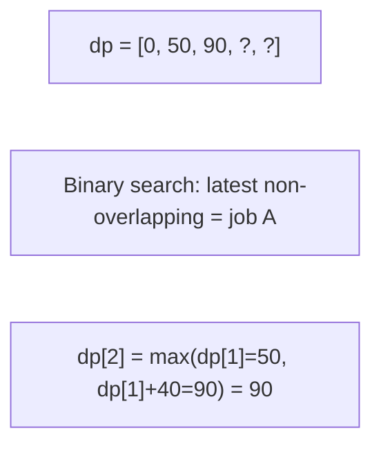
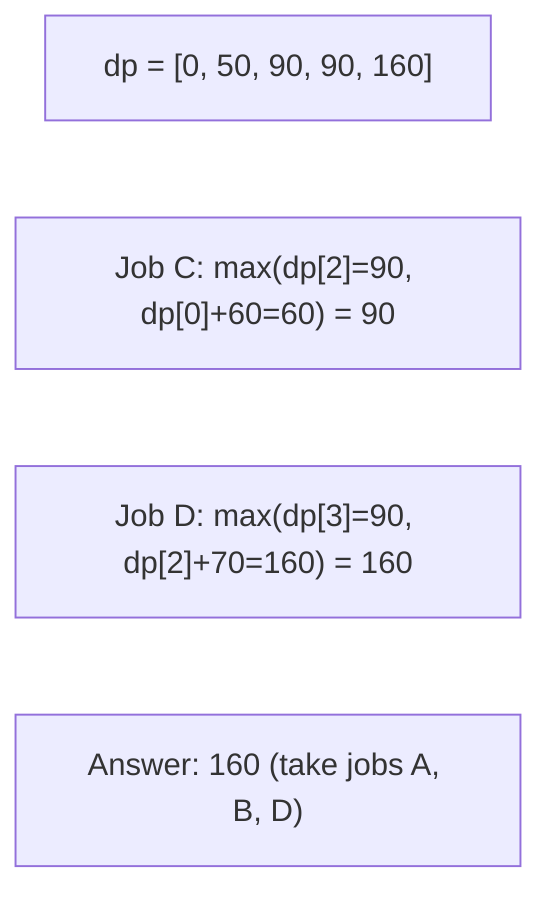

# Problem 1235: Maximum Profit in Job Scheduling

**Difficulty:** Hard  
**Tags:** Array, Binary Search, Dynamic Programming, Sorting  
**Pattern:** Dynamic Programming + Binary Search  
**Link:** [leetcode.com/problems/maximum-profit-in-job-scheduling](https://leetcode.com/problems/maximum-profit-in-job-scheduling/)

## Description

We have `n` jobs, where every job is scheduled to be done from `startTime[i]` to `endTime[i]`, obtaining a profit of `profit[i]`.

You're given the `startTime`, `endTime` and `profit` arrays, return the maximum profit you can take such that there are no two jobs in the subset with overlapping time range.

If you choose a job that ends at time `X` you will be able to start another job that starts at time `X`.

 

Example 1:

****

```

**Input:** startTime = [1,2,3,3], endTime = [3,4,5,6], profit = [50,10,40,70]
**Output:** 120
**Explanation:** The subset chosen is the first and fourth job. 
Time range [1-3]+[3-6] , we get profit of 120 = 50 + 70.

```

Example 2:

** **

```

**Input:** startTime = [1,2,3,4,6], endTime = [3,5,10,6,9], profit = [20,20,100,70,60]
**Output:** 150
**Explanation:** The subset chosen is the first, fourth and fifth job. 
Profit obtained 150 = 20 + 70 + 60.

```

Example 3:

****

```

**Input:** startTime = [1,1,1], endTime = [2,3,4], profit = [5,6,4]
**Output:** 6

```

 

**Constraints:**

	- `1 <= startTime.length == endTime.length == profit.length <= 5 * 10^4`
	- `1 <= startTime[i] < endTime[i] <= 10^9`
	- `1 <= profit[i] <= 10^4`

## Approach: Dynamic Programming + Binary Search

Sort by end time. For each job, binary search for the latest non-overlapping job. dp[i] = max(skip, take).

## Pseudocode

```
1. lo = lower_bound, hi = upper_bound
2. While lo <= hi (or lo < hi):
   a. mid = (lo + hi) // 2
   b. If condition(mid) is satisfied: record answer, search left half
   c. Else: search right half
3. Return answer
```

## Algorithm Flow



## Visual State Transitions

**Job Scheduling DP:**

**Jobs sorted by end time:**

| Job | Start | End | Profit |
|-----|-------|-----|--------|
| A   | 1     | 2   | 50     |
| B   | 3     | 5   | 40     |
| C   | 1     | 5   | 60     |
| D   | 6     | 8   | 70     |

**Frame 1: dp[0] = 0 (no jobs)**


**Frame 2: Job A (1-2, profit 50)**


**Frame 3: Job B (3-5, profit 40)**


**Frame 4: Job C (1-5, profit 60) and Job D (6-8, profit 70)**



## Complexity Analysis

- **Time:** O(n log n)
- **Space:** O(n)

## Solution (Python3)

```python
import bisect

class Solution:
    def jobScheduling(self, startTime, endTime, profit):
        jobs = sorted(zip(startTime, endTime, profit), key=lambda x: x[1])
        n = len(jobs)
        dp = [0] * (n + 1)
        ends = [j[1] for j in jobs]
        for i in range(1, n + 1):
            s, e, p = jobs[i-1]
            j = bisect.bisect_right(ends, s, 0, i-1)
            dp[i] = max(dp[i-1], dp[j] + p)
        return dp[n]
```

## Solution (C++)

```cpp
#include <string>
#include <vector>
using namespace std;

class Solution {
public:
    int jobScheduling(vector<int>& startTime, vector<int>& endTime, vector<int>& profit) {
        // Binary search - O(log n) time, O(1) space
        int lo = 0, hi = startTime.size() - 1;
        while (lo <= hi) {
            int mid = lo + (hi - lo) / 2;
            if (startTime[mid] == endTime) {
                return mid;
            } else if (startTime[mid] < endTime) {
                lo = mid + 1;
            } else {
                hi = mid - 1;
            }
        }
        return 0;
    }
};
```
