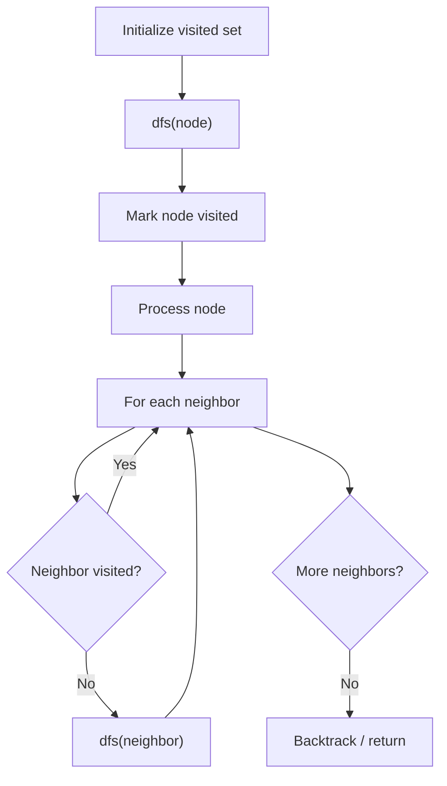

# Problem 1236: Web Crawler

**Difficulty:** Medium  
**Tags:** String, Depth-First Search, Breadth-First Search, Interactive  
**Pattern:** DFS Graph Traversal  
**Link:** [leetcode.com/problems/web-crawler](https://leetcode.com/problems/web-crawler/)

## Description

*(Premium problem -- description requires LeetCode subscription)*

## Approach: DFS Graph Traversal

Explore the graph depth-first using recursion or a stack. Mark nodes as visited to avoid cycles. Process each node and explore all unvisited neighbors.

## Pseudocode

```
1. Initialize visited set
2. Define dfs(node):
   a. Mark node as visited
   b. Process node
   c. For each neighbor of node:
      - If not visited: dfs(neighbor)
3. Call dfs(start) for each unvisited node
```

## Algorithm Flow



## Complexity Analysis

- **Time:** O(V + E)
- **Space:** O(V)

## Solution (Python3)

```python
class Solution:
    pass
```

## Solution (C++)

```cpp
class Solution {
public:
    // Design problem stub
};
```
