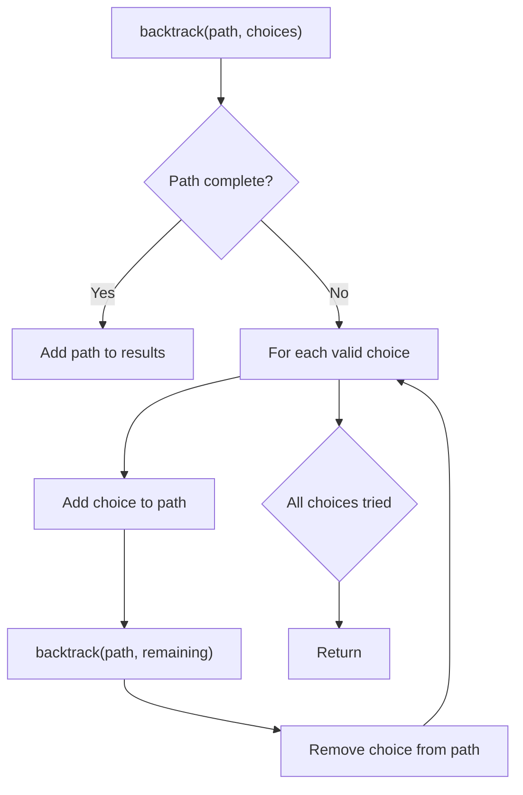
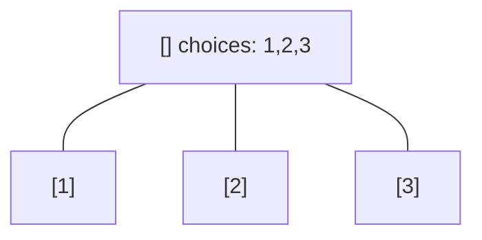
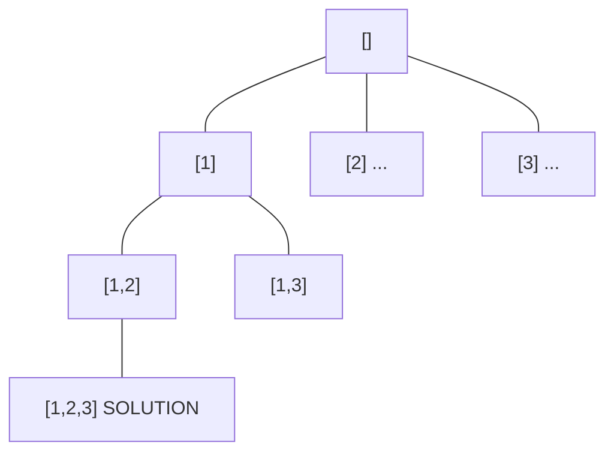
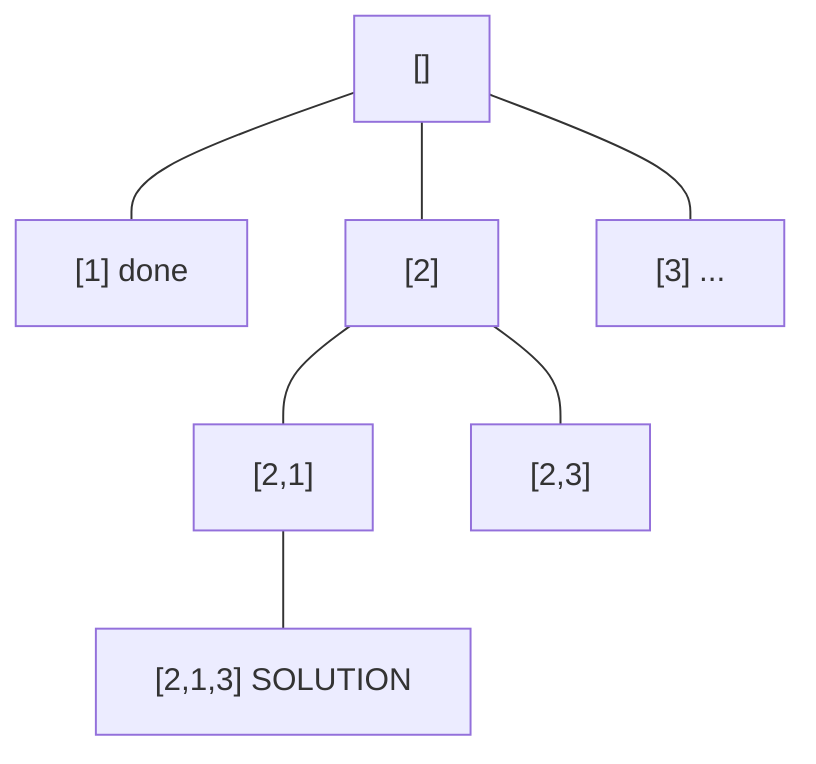
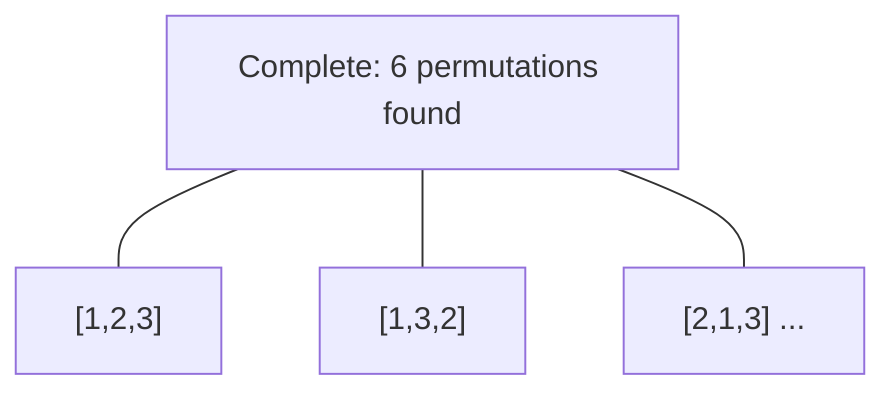

# Problem 1239: Maximum Length of a Concatenated String with Unique Characters

**Difficulty:** Medium  
**Tags:** Array, String, Backtracking, Bit Manipulation  
**Pattern:** Backtracking  
**Link:** [leetcode.com/problems/maximum-length-of-a-concatenated-string-with-unique-characters](https://leetcode.com/problems/maximum-length-of-a-concatenated-string-with-unique-characters/)

## Description

You are given an array of strings `arr`. A string `s` is formed by the **concatenation** of a **subsequence** of `arr` that has **unique characters**.

Return *the **maximum** possible length* of `s`.

A **subsequence** is an array that can be derived from another array by deleting some or no elements without changing the order of the remaining elements.

 

Example 1:

```

**Input:** arr = ["un","iq","ue"]
**Output:** 4
**Explanation:** All the valid concatenations are:
- ""
- "un"
- "iq"
- "ue"
- "uniq" ("un" + "iq")
- "ique" ("iq" + "ue")
Maximum length is 4.

```

Example 2:

```

**Input:** arr = ["cha","r","act","ers"]
**Output:** 6
**Explanation:** Possible longest valid concatenations are "chaers" ("cha" + "ers") and "acters" ("act" + "ers").

```

Example 3:

```

**Input:** arr = ["abcdefghijklmnopqrstuvwxyz"]
**Output:** 26
**Explanation:** The only string in arr has all 26 characters.

```

 

**Constraints:**

	- `1 <= arr.length <= 16`
	- `1 <= arr[i].length <= 26`
	- `arr[i]` contains only lowercase English letters.

## Approach: Backtracking

Explore all possible solutions by building candidates incrementally. At each step, make a choice and recurse. If the choice leads to a dead end, undo the choice (backtrack) and try the next option.

## Pseudocode

```
1. Define backtrack(path, choices):
   a. If path is a complete solution: add to results
   b. For each choice in choices:
      - If choice is valid:
        * Add choice to path
        * backtrack(path, remaining_choices)
        * Remove choice from path (backtrack)
2. Call backtrack([], all_choices)
```

## Algorithm Flow



## Visual State Transitions

**Backtracking Decision Tree:**

**Frame 1: Root - start with empty path**


**Frame 2: Explore branch [1]**


**Frame 3: Backtrack, explore [2]**


**Frame 4: All solutions found**



## Complexity Analysis

- **Time:** O(k^n) or O(n!)
- **Space:** O(n)

## Solution (Python3)

```python
class Solution:
    def maxLength(self, arr: List[str]) -> int:
        # Backtracking - O(2^n) or O(n!) time
        result = []
        
        def backtrack(path, start):
            result.append(path[:])
            for i in range(start, len(arr)):
                path.append(arr[i])
                backtrack(path, i + 1)
                path.pop()
        
        backtrack([], 0)
        return result
```

## Solution (C++)

```cpp
#include <functional>
#include <string>
#include <vector>
using namespace std;

class Solution {
public:
    int maxLength(vector<string>& arr) {
        // Backtracking - O(2^n) or O(n!) time
        vector<vector<int>> result;
        vector<int> path;
        function<void(int)> backtrack = [&](int start) {
            result.push_back(path);
            for (int i = start; i < (int)arr.size(); i++) {
                path.push_back(arr[i]);
                backtrack(i + 1);
                path.pop_back();
            }
        };
        backtrack(0);
        return result;
    }
};
```
