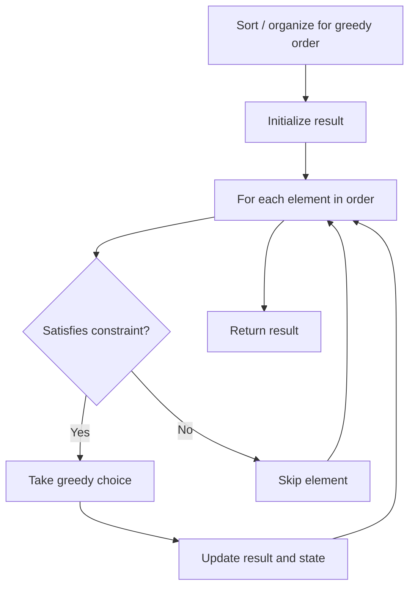

# Problem 1247: Minimum Swaps to Make Strings Equal

**Difficulty:** Medium  
**Tags:** Math, String, Greedy  
**Pattern:** Greedy  
**Link:** [leetcode.com/problems/minimum-swaps-to-make-strings-equal](https://leetcode.com/problems/minimum-swaps-to-make-strings-equal/)

## Description

You are given two strings `s1` and `s2` of equal length consisting of letters `"x"` and `"y"` **only**. Your task is to make these two strings equal to each other. You can swap any two characters that belong to **different** strings, which means: swap `s1[i]` and `s2[j]`.

Return the minimum number of swaps required to make `s1` and `s2` equal, or return `-1` if it is impossible to do so.

 

Example 1:

```

**Input:** s1 = "xx", s2 = "yy"
**Output:** 1
**Explanation:** Swap s1[0] and s2[1], s1 = "yx", s2 = "yx".

```

Example 2:

```

**Input:** s1 = "xy", s2 = "yx"
**Output:** 2
**Explanation:** Swap s1[0] and s2[0], s1 = "yy", s2 = "xx".
Swap s1[0] and s2[1], s1 = "xy", s2 = "xy".
Note that you cannot swap s1[0] and s1[1] to make s1 equal to "yx", cause we can only swap chars in different strings.

```

Example 3:

```

**Input:** s1 = "xx", s2 = "xy"
**Output:** -1

```

 

**Constraints:**

	- `1 <= s1.length, s2.length <= 1000`
	- `s1.length == s2.length`
	- `s1, s2` only contain `'x'` or `'y'`.

## Approach: Greedy

Make the locally optimal choice at each step, trusting it leads to a global optimum. Greedy works when the problem has the greedy-choice property and optimal substructure.

## Pseudocode

```
1. Sort or organize data for greedy ordering
2. Initialize result
3. For each element in greedy order:
   a. If element satisfies constraint:
      - Take the greedy choice
      - Update result and state
4. Return result
```

## Algorithm Flow



## Complexity Analysis

- **Time:** O(n log n)
- **Space:** O(1)

## Solution (Python3)

```python
class Solution:
    def minimumSwap(self, s1: str, s2: str) -> int:
        # Greedy approach - O(n) time
        result = 0
        curr_max = 0
        for i in range(len(s1)):
            if isinstance(s1[i], int):
                curr_max = max(curr_max, s1[i])
                result = max(result, curr_max)
            else:
                result += 1
        return result
```

## Solution (C++)

```cpp
#include <algorithm>
#include <string>
#include <vector>
using namespace std;

class Solution {
public:
    int minimumSwap(string& s1, string& s2) {
        // Greedy approach - O(n) time
        int result = 0, curr_max = 0;
        for (int i = 0; i < (int)s1.size(); i++) {
            curr_max = max(curr_max, s1[i]);
            result = max(result, curr_max);
        }
        return result;
    }
};
```
