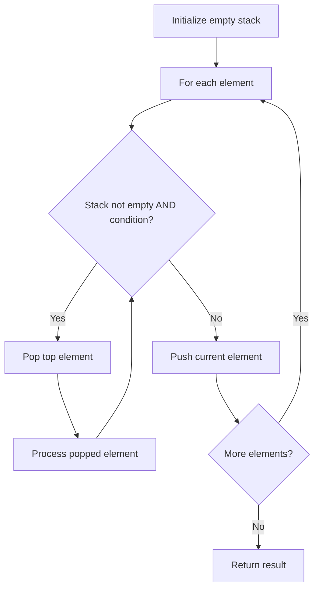

# Problem 1249: Minimum Remove to Make Valid Parentheses

**Difficulty:** Medium  
**Tags:** String, Stack  
**Pattern:** Stack  
**Link:** [leetcode.com/problems/minimum-remove-to-make-valid-parentheses](https://leetcode.com/problems/minimum-remove-to-make-valid-parentheses/)

## Description

Given a string s of `'('` , `')'` and lowercase English characters.

Your task is to remove the minimum number of parentheses ( `'('` or `')'`, in any positions ) so that the resulting *parentheses string* is valid and return **any** valid string.

Formally, a *parentheses string* is valid if and only if:

	- It is the empty string, contains only lowercase characters, or
	- It can be written as `AB` (`A` concatenated with `B`), where `A` and `B` are valid strings, or
	- It can be written as `(A)`, where `A` is a valid string.

 

Example 1:

```

**Input:** s = "lee(t(c)o)de)"
**Output:** "lee(t(c)o)de"
**Explanation:** "lee(t(co)de)" , "lee(t(c)ode)" would also be accepted.

```

Example 2:

```

**Input:** s = "a)b(c)d"
**Output:** "ab(c)d"

```

Example 3:

```

**Input:** s = "))(("
**Output:** ""
**Explanation:** An empty string is also valid.

```

 

**Constraints:**

	- `1 <= s.length <= 10^5`
	- `s[i]` is either `'('` , `')'`, or lowercase English letter.

## Approach: Stack

Use a stack (LIFO) to process elements. Push elements when they might be needed later; pop when a matching or resolving condition is found. Common uses: parentheses matching, expression evaluation, next greater element.

## Pseudocode

```
1. Initialize empty stack
2. For each element:
   a. While stack is not empty and condition met:
      - Pop and process top element
   b. Push current element onto stack
3. Process remaining elements in stack if needed
4. Return result
```

## Algorithm Flow



## Complexity Analysis

- **Time:** O(n)
- **Space:** O(n)

## Solution (Python3)

```python
class Solution:
    def minRemoveToMakeValid(self, s: str) -> str:
        # Stack-based approach - O(n) time
        stack = []
        for ch in s:
            if stack and self._matches(stack[-1], ch):
                stack.pop()
            else:
                stack.append(ch)
        return len(stack) == 0 if isinstance("", bool) else stack

    def _matches(self, a, b):
        pairs = {'(': ')', '[': ']', '{': '}'}
        return pairs.get(a) == b
```

## Solution (C++)

```cpp
#include <stack>
#include <string>
#include <unordered_map>
#include <vector>
using namespace std;

class Solution {
public:
    string minRemoveToMakeValid(string& s) {
        // Stack-based approach - O(n) time
        stack<char> st;
        unordered_map<char, char> pairs = {{'(', ')'}, {'[', ']'}, {'{', '}'}};
        for (char ch : s) {
            if (!st.empty() && pairs.count(st.top()) && pairs[st.top()] == ch) {
                st.pop();
            } else {
                st.push(ch);
            }
        }
        return st.empty();
    }
};
```
