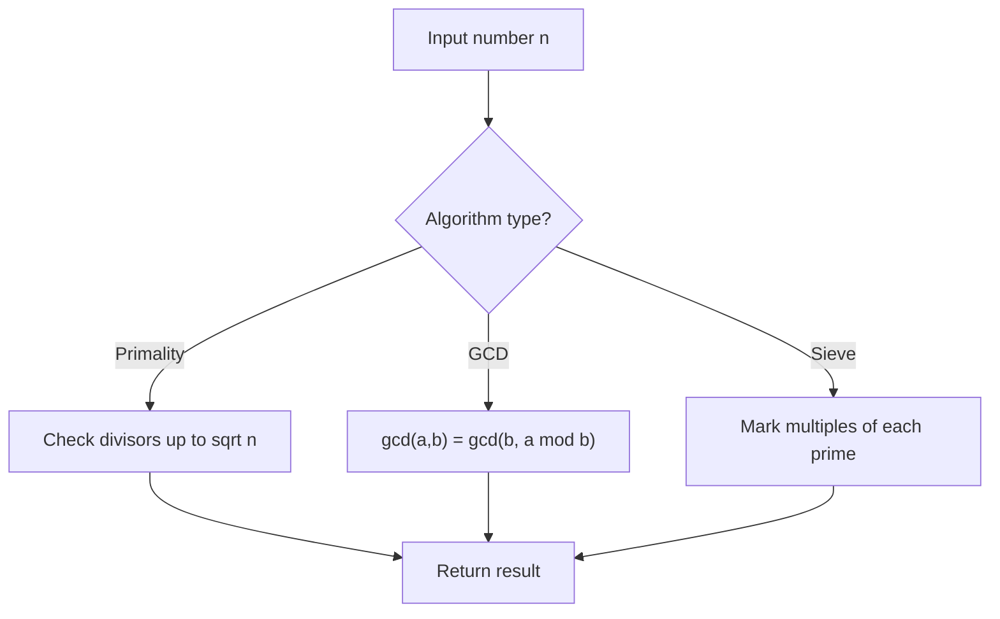

# Problem 1250: Check If It Is a Good Array

**Difficulty:** Hard  
**Tags:** Array, Math, Number Theory  
**Pattern:** Number Theory  
**Link:** [leetcode.com/problems/check-if-it-is-a-good-array](https://leetcode.com/problems/check-if-it-is-a-good-array/)

## Description

Given an array `nums` of positive integers. Your task is to select some subset of `nums`, multiply each element by an integer and add all these numbers. The array is said to be **good **if you can obtain a sum of `1` from the array by any possible subset and multiplicand.

Return `True` if the array is **good **otherwise return `False`.

 

Example 1:

```

**Input:** nums = [12,5,7,23]
**Output:** true
**Explanation:** Pick numbers 5 and 7.
5*3 + 7*(-2) = 1

```

Example 2:

```

**Input:** nums = [29,6,10]
**Output:** true
**Explanation:** Pick numbers 29, 6 and 10.
29*1 + 6*(-3) + 10*(-1) = 1

```

Example 3:

```

**Input:** nums = [3,6]
**Output:** false

```

 

**Constraints:**

	- `1 <= nums.length <= 10^5`
	- `1 <= nums[i] <= 10^9`

## Approach: Number Theory

Apply number theory: prime checking, factorization, GCD, modular exponentiation, sieve of Eratosthenes, or Euler's totient.

## Pseudocode

```
1. Apply number-theoretic algorithm:
   - Sieve for primes up to n
   - GCD via Euclidean algorithm
   - Modular exponentiation
2. Process results
3. Return answer
```

## Algorithm Flow



## Complexity Analysis

- **Time:** O(sqrt(n)) or O(n log log n)
- **Space:** O(n)

## Solution (Python3)

```python
class Solution:
    def isGoodArray(self, nums: List[int]) -> bool:
        # Number theory approach
        def gcd(a, b):
            while b:
                a, b = b, a % b
            return a
        
        result = nums[0] if isinstance(nums, list) else nums
        if isinstance(nums, list):
            for val in nums[1:]:
                result = gcd(result, val)
        return result
```

## Solution (C++)

```cpp
#include <string>
#include <vector>
using namespace std;

class Solution {
public:
    bool isGoodArray(vector<int>& nums) {
        // Number theory approach
        auto gcd_func = [](int a, int b) -> int {
            while (b) { int t = b; b = a % b; a = t; }
            return a;
        };
        int result = nums[0];
        for (int i = 1; i < (int)nums.size(); i++) {
            result = gcd_func(result, nums[i]);
        }
        return result;
    }
};
```
