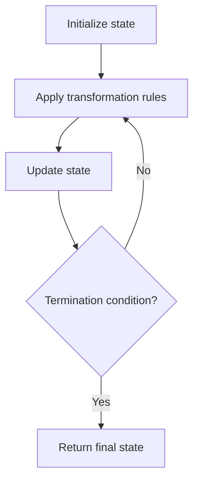

# Problem 1252: Cells with Odd Values in a Matrix

**Difficulty:** Easy  
**Tags:** Array, Math, Simulation  
**Pattern:** Simulation  
**Link:** [leetcode.com/problems/cells-with-odd-values-in-a-matrix](https://leetcode.com/problems/cells-with-odd-values-in-a-matrix/)

## Description

There is an `m x n` matrix that is initialized to all `0`'s. There is also a 2D array `indices` where each `indices[i] = [ri, ci]` represents a **0-indexed location** to perform some increment operations on the matrix.

For each location `indices[i]`, do **both** of the following:

	- Increment **all** the cells on row `ri`.
	- Increment **all** the cells on column `ci`.

Given `m`, `n`, and `indices`, return *the **number of odd-valued cells** in the matrix after applying the increment to all locations in *`indices`.

 

Example 1:

```

**Input:** m = 2, n = 3, indices = [[0,1],[1,1]]
**Output:** 6
**Explanation:** Initial matrix = [[0,0,0],[0,0,0]].
After applying first increment it becomes [[1,2,1],[0,1,0]].
The final matrix is [[1,3,1],[1,3,1]], which contains 6 odd numbers.

```

Example 2:

```

**Input:** m = 2, n = 2, indices = [[1,1],[0,0]]
**Output:** 0
**Explanation:** Final matrix = [[2,2],[2,2]]. There are no odd numbers in the final matrix.

```

 

**Constraints:**

	- `1 <= m, n <= 50`
	- `1 <= indices.length <= 100`
	- `0 <= ri < m`
	- `0 <= ci < n`

 

**Follow up:** Could you solve this in `O(n + m + indices.length)` time with only `O(n + m)` extra space?

## Approach: Simulation

Simulate the process described in the problem step by step. Follow the rules exactly, tracking state at each step.

## Pseudocode

```
1. Initialize state (grid, pointers, counters)
2. For each step / iteration:
   a. Apply the transformation rules
   b. Update state
   c. Check termination condition
3. Return final state or result
```

## Algorithm Flow



## Complexity Analysis

- **Time:** O(n) or O(n * k)
- **Space:** O(n)

## Solution (Python3)

```python
class Solution:
    def oddCells(self, m: int, n: int, indices: List[List[int]]) -> int:
        # Simulation approach - follow the rules step by step
        result = 0
        for i in range(len(m) if isinstance(m, list) else m):
            # Simulate each step
            pass
        return result
```

## Solution (C++)

```cpp
#include <string>
#include <vector>
using namespace std;

class Solution {
public:
    int oddCells(int m, int n, vector<vector<int>>& indices) {
        // Simulation approach
        int n = m.size();
        for (int i = 0; i < n; i++) {
            // Simulate each step
        }
        return 0;
    }
};
```
