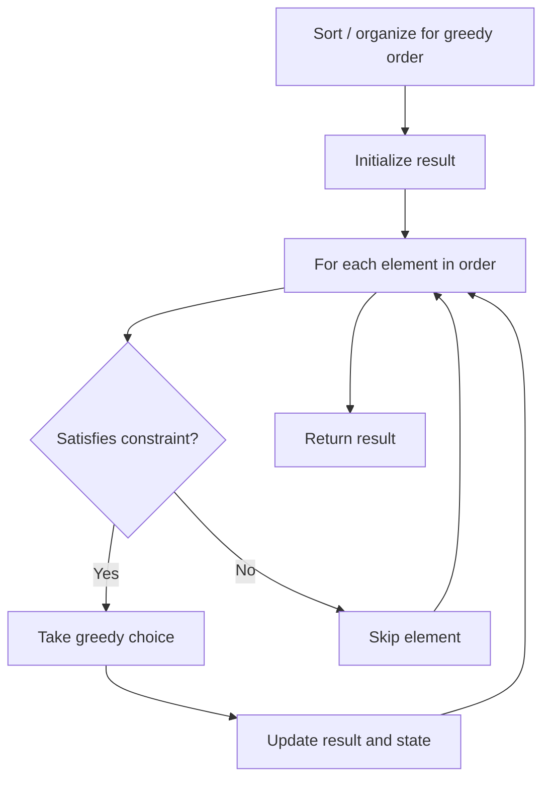

# Problem 1253: Reconstruct a 2-Row Binary Matrix

**Difficulty:** Medium  
**Tags:** Array, Greedy, Matrix  
**Pattern:** Greedy  
**Link:** [leetcode.com/problems/reconstruct-a-2-row-binary-matrix](https://leetcode.com/problems/reconstruct-a-2-row-binary-matrix/)

## Description

Given the following details of a matrix with `n` columns and `2` rows :

	- The matrix is a binary matrix, which means each element in the matrix can be `0` or `1`.
	- The sum of elements of the 0-th(upper) row is given as `upper`.
	- The sum of elements of the 1-st(lower) row is given as `lower`.
	- The sum of elements in the i-th column(0-indexed) is `colsum[i]`, where `colsum` is given as an integer array with length `n`.

Your task is to reconstruct the matrix with `upper`, `lower` and `colsum`.

Return it as a 2-D integer array.

If there are more than one valid solution, any of them will be accepted.

If no valid solution exists, return an empty 2-D array.

 

Example 1:

```

**Input:** upper = 2, lower = 1, colsum = [1,1,1]
**Output:** [[1,1,0],[0,0,1]]
**Explanation: **[[1,0,1],[0,1,0]], and [[0,1,1],[1,0,0]] are also correct answers.

```

Example 2:

```

**Input:** upper = 2, lower = 3, colsum = [2,2,1,1]
**Output:** []

```

Example 3:

```

**Input:** upper = 5, lower = 5, colsum = [2,1,2,0,1,0,1,2,0,1]
**Output:** [[1,1,1,0,1,0,0,1,0,0],[1,0,1,0,0,0,1,1,0,1]]

```

 

**Constraints:**

	- `1 <= colsum.length <= 10^5`
	- `0 <= upper, lower <= colsum.length`
	- `0 <= colsum[i] <= 2`

## Approach: Greedy

Make the locally optimal choice at each step, trusting it leads to a global optimum. Greedy works when the problem has the greedy-choice property and optimal substructure.

## Pseudocode

```
1. Sort or organize data for greedy ordering
2. Initialize result
3. For each element in greedy order:
   a. If element satisfies constraint:
      - Take the greedy choice
      - Update result and state
4. Return result
```

## Algorithm Flow



## Complexity Analysis

- **Time:** O(n log n)
- **Space:** O(1)

## Solution (Python3)

```python
class Solution:
    def reconstructMatrix(self, upper: int, lower: int, colsum: List[int]) -> List[List[int]]:
        # Greedy approach - O(n) time
        result = 0
        curr_max = 0
        for i in range(len(upper)):
            if isinstance(upper[i], int):
                curr_max = max(curr_max, upper[i])
                result = max(result, curr_max)
            else:
                result += 1
        return result
```

## Solution (C++)

```cpp
#include <algorithm>
#include <string>
#include <vector>
using namespace std;

class Solution {
public:
    vector<vector<int>> reconstructMatrix(int upper, int lower, vector<int>& colsum) {
        // Greedy approach - O(n) time
        int result = 0, curr_max = 0;
        for (int i = 0; i < (int)upper.size(); i++) {
            curr_max = max(curr_max, upper[i]);
            result = max(result, curr_max);
        }
        return result;
    }
};
```
