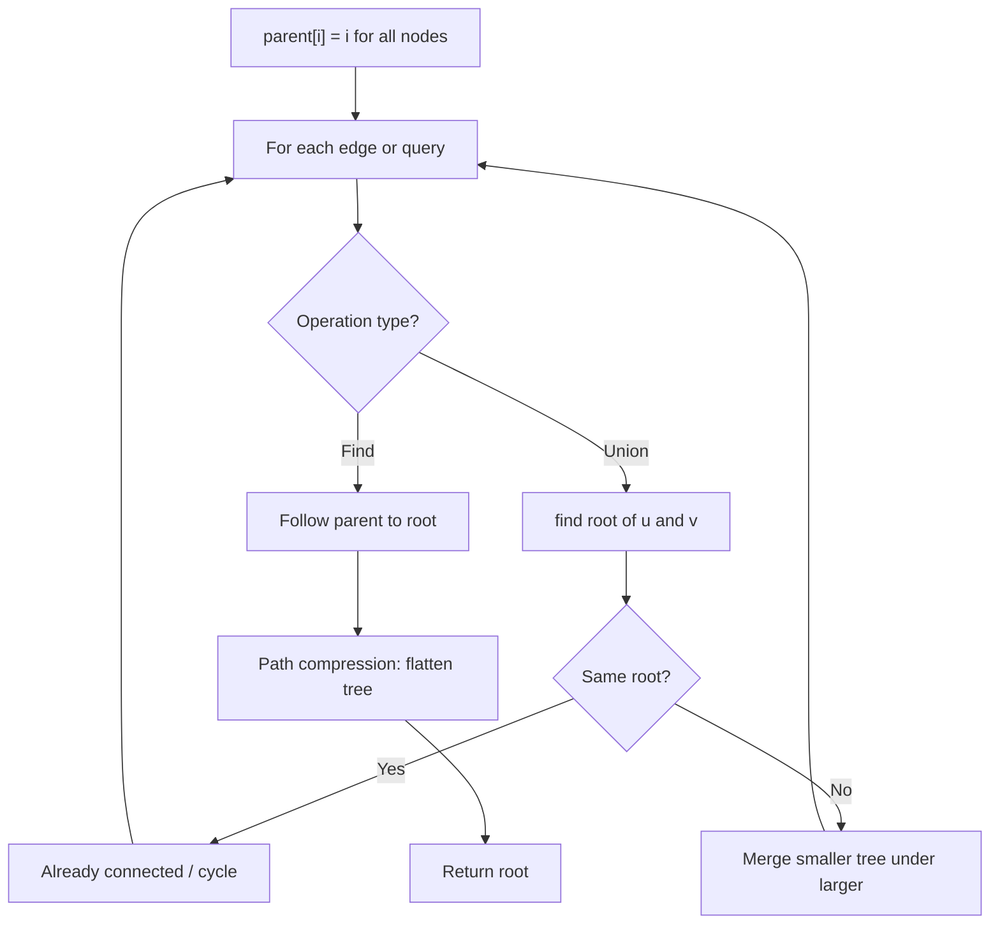
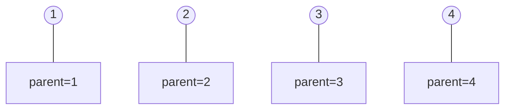
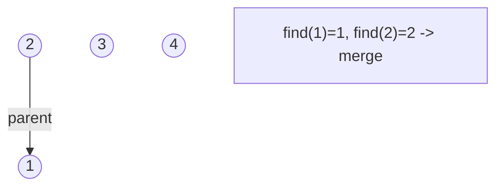
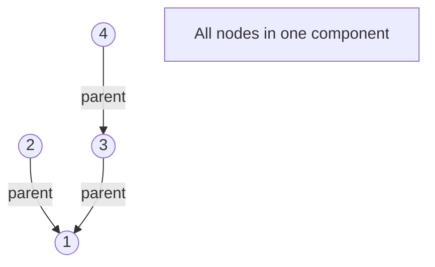
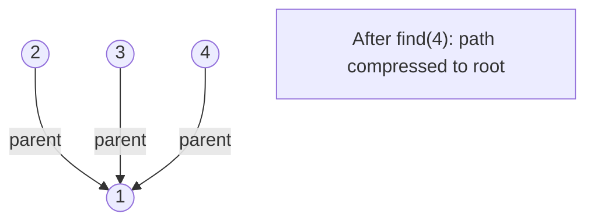

# Problem 1254: Number of Closed Islands

**Difficulty:** Medium  
**Tags:** Array, Depth-First Search, Breadth-First Search, Union-Find, Matrix  
**Pattern:** DFS / Graph  
**Link:** [leetcode.com/problems/number-of-closed-islands](https://leetcode.com/problems/number-of-closed-islands/)

## Description

Given a 2D `grid` consists of `0s` (land) and `1s` (water).  An *island* is a maximal 4-directionally connected group of `0s` and a *closed island* is an island **totally** (all left, top, right, bottom) surrounded by `1s.`

Return the number of *closed islands*.

 

Example 1:

```

**Input:** grid = [[1,1,1,1,1,1,1,0],[1,0,0,0,0,1,1,0],[1,0,1,0,1,1,1,0],[1,0,0,0,0,1,0,1],[1,1,1,1,1,1,1,0]]
**Output:** 2
**Explanation:** 
Islands in gray are closed because they are completely surrounded by water (group of 1s).
```

Example 2:

```

**Input:** grid = [[0,0,1,0,0],[0,1,0,1,0],[0,1,1,1,0]]
**Output:** 1

```

Example 3:

```

**Input:** grid = [[1,1,1,1,1,1,1],
               [1,0,0,0,0,0,1],
               [1,0,1,1,1,0,1],
               [1,0,1,0,1,0,1],
               [1,0,1,1,1,0,1],
               [1,0,0,0,0,0,1],
               [1,1,1,1,1,1,1]]
**Output:** 2

```

 

**Constraints:**

	- `1 <= grid.length, grid[0].length <= 100`
	- `0 <= grid[i][j] <=1`

## Approach: DFS / Graph

DFS each land island. If DFS never goes out of bounds, it is closed.

## Pseudocode

```
1. parent[i] = i for all nodes (each is its own set)
2. find(x): follow parent pointers to root (with path compression)
3. union(x, y): merge sets of x and y by rank
4. Process edges/operations:
   a. For each edge (u, v): union(u, v)
5. Answer queries using find()
```

## Algorithm Flow



## Visual State Transitions

**Union-Find Step-by-Step:**

**Frame 1: Initial - each node is own parent**


**Frame 2: Union(1,2) - merge components**


**Frame 3: Union(3,4) then Union(2,3)**


**Frame 4: Path compression on find(4)**



## Complexity Analysis

- **Time:** O(m*n)
- **Space:** O(m*n)

## Solution (Python3)

```python
class Solution:
    def closedIsland(self, grid: list[list[int]]) -> int:
        m, n = len(grid), len(grid[0])
        def dfs(r, c):
            if r < 0 or r >= m or c < 0 or c >= n:
                return False
            if grid[r][c] == 1:
                return True
            grid[r][c] = 1
            a = dfs(r+1,c)
            b = dfs(r-1,c)
            c1 = dfs(r,c+1)
            d = dfs(r,c-1)
            return a and b and c1 and d
        count = 0
        for r in range(m):
            for c in range(n):
                if grid[r][c] == 0 and dfs(r, c):
                    count += 1
        return count
```

## Solution (C++)

```cpp
#include <functional>
#include <numeric>
#include <string>
#include <vector>
using namespace std;

class Solution {
public:
    int closedIsland(vector<vector<int>>& grid) {
        // Union Find (DSU) - O(n * alpha(n))
        int n = grid.size();
        vector<int> parent(n + 1), rnk(n + 1, 0);
        iota(parent.begin(), parent.end(), 0);
        function<int(int)> find = [&](int x) -> int {
            return parent[x] == x ? x : parent[x] = find(parent[x]);
        };
        auto unite = [&](int x, int y) -> bool {
            int px = find(x), py = find(y);
            if (px == py) return false;
            if (rnk[px] < rnk[py]) swap(px, py);
            parent[py] = px;
            if (rnk[px] == rnk[py]) rnk[px]++;
            return true;
        };
        int components = n;
        return components;
    }
};
```
