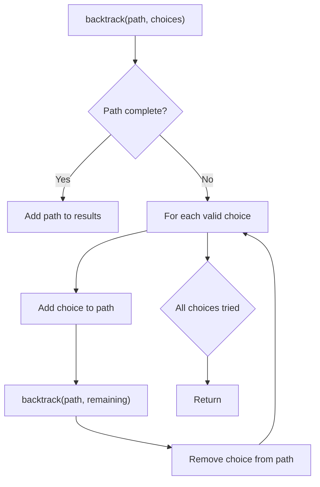
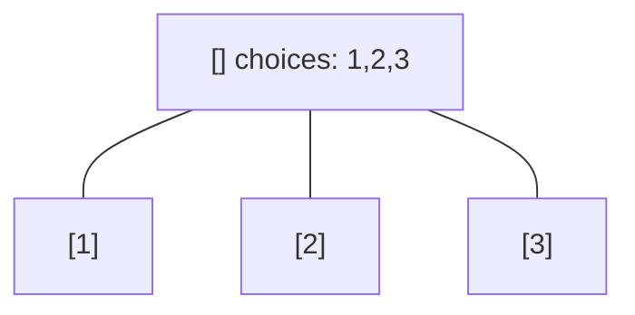
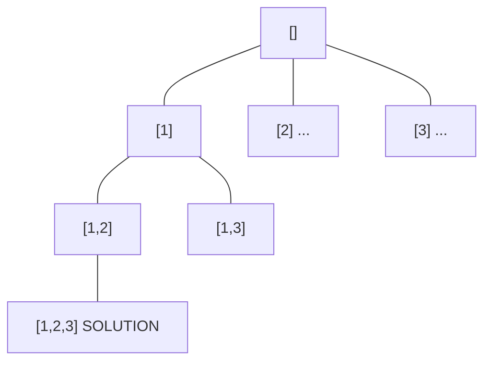
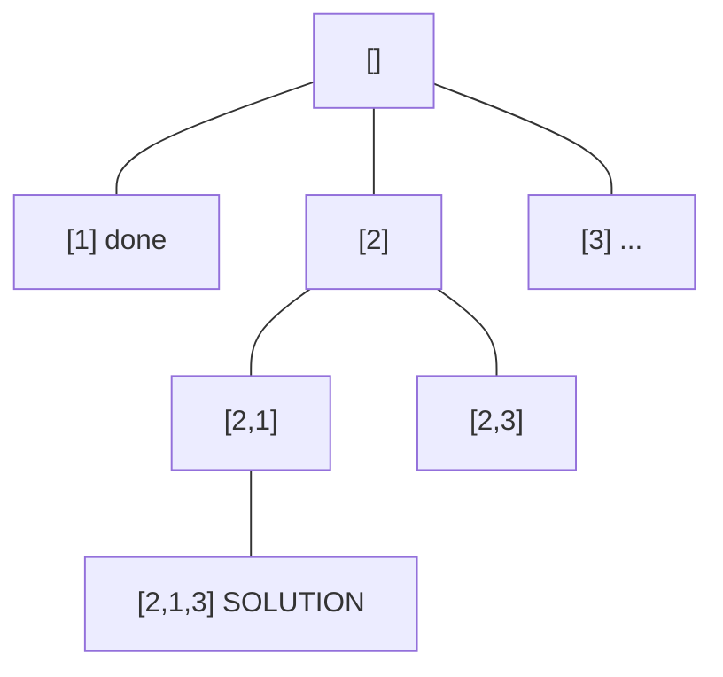
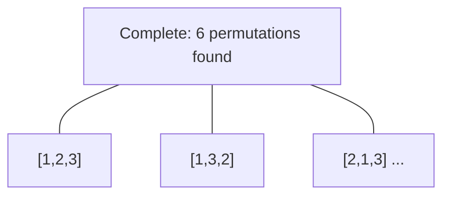

# Problem 1255: Maximum Score Words Formed by Letters

**Difficulty:** Hard  
**Tags:** Array, Hash Table, String, Dynamic Programming, Backtracking, Bit Manipulation, Counting, Bitmask  
**Pattern:** Backtracking  
**Link:** [leetcode.com/problems/maximum-score-words-formed-by-letters](https://leetcode.com/problems/maximum-score-words-formed-by-letters/)

## Description

Given a list of `words`, list of  single `letters` (might be repeating) and `score` of every character.

Return the maximum score of **any** valid set of words formed by using the given letters (`words[i]` cannot be used two or more times).

It is not necessary to use all characters in `letters` and each letter can only be used once. Score of letters `'a'`, `'b'`, `'c'`, ... ,`'z'` is given by `score[0]`, `score[1]`, ... , `score[25]` respectively.

 

Example 1:

```

**Input:** words = ["dog","cat","dad","good"], letters = ["a","a","c","d","d","d","g","o","o"], score = [1,0,9,5,0,0,3,0,0,0,0,0,0,0,2,0,0,0,0,0,0,0,0,0,0,0]
**Output:** 23
**Explanation:**
Score  a=1, c=9, d=5, g=3, o=2
Given letters, we can form the words "dad" (5+1+5) and "good" (3+2+2+5) with a score of 23.
Words "dad" and "dog" only get a score of 21.
```

Example 2:

```

**Input:** words = ["xxxz","ax","bx","cx"], letters = ["z","a","b","c","x","x","x"], score = [4,4,4,0,0,0,0,0,0,0,0,0,0,0,0,0,0,0,0,0,0,0,0,5,0,10]
**Output:** 27
**Explanation:**
Score  a=4, b=4, c=4, x=5, z=10
Given letters, we can form the words "ax" (4+5), "bx" (4+5) and "cx" (4+5) with a score of 27.
Word "xxxz" only get a score of 25.
```

Example 3:

```

**Input:** words = ["leetcode"], letters = ["l","e","t","c","o","d"], score = [0,0,1,1,1,0,0,0,0,0,0,1,0,0,1,0,0,0,0,1,0,0,0,0,0,0]
**Output:** 0
**Explanation:**
Letter "e" can only be used once.
```

 

**Constraints:**

	- `1 <= words.length <= 14`
	- `1 <= words[i].length <= 15`
	- `1 <= letters.length <= 100`
	- `letters[i].length == 1`
	- `score.length == 26`
	- `0 <= score[i] <= 10`
	- `words[i]`, `letters[i]` contains only lower case English letters.

## Approach: Backtracking

Explore all possible solutions by building candidates incrementally. At each step, make a choice and recurse. If the choice leads to a dead end, undo the choice (backtrack) and try the next option.

## Pseudocode

```
1. Define backtrack(path, choices):
   a. If path is a complete solution: add to results
   b. For each choice in choices:
      - If choice is valid:
        * Add choice to path
        * backtrack(path, remaining_choices)
        * Remove choice from path (backtrack)
2. Call backtrack([], all_choices)
```

## Algorithm Flow



## Visual State Transitions

**Backtracking Decision Tree:**

**Frame 1: Root - start with empty path**


**Frame 2: Explore branch [1]**


**Frame 3: Backtrack, explore [2]**


**Frame 4: All solutions found**



## Complexity Analysis

- **Time:** O(k^n) or O(n!)
- **Space:** O(n)

## Solution (Python3)

```python
class Solution:
    def maxScoreWords(self, words: List[str], letters: List[str], score: List[int]) -> int:
        # Backtracking - O(2^n) or O(n!) time
        result = []
        
        def backtrack(path, start):
            result.append(path[:])
            for i in range(start, len(words)):
                path.append(words[i])
                backtrack(path, i + 1)
                path.pop()
        
        backtrack([], 0)
        return result
```

## Solution (C++)

```cpp
#include <functional>
#include <string>
#include <vector>
using namespace std;

class Solution {
public:
    int maxScoreWords(vector<string>& words, vector<string>& letters, vector<int>& score) {
        // Backtracking - O(2^n) or O(n!) time
        vector<vector<int>> result;
        vector<int> path;
        function<void(int)> backtrack = [&](int start) {
            result.push_back(path);
            for (int i = start; i < (int)words.size(); i++) {
                path.push_back(words[i]);
                backtrack(i + 1);
                path.pop_back();
            }
        };
        backtrack(0);
        return result;
    }
};
```
