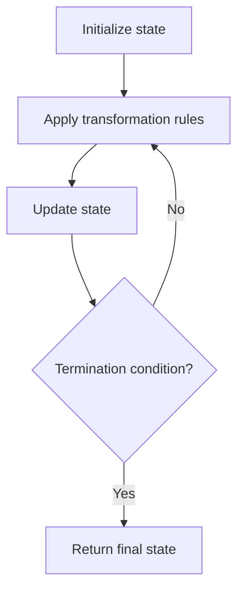

# Problem 1260: Shift 2D Grid

**Difficulty:** Easy  
**Tags:** Array, Matrix, Simulation  
**Pattern:** Simulation  
**Link:** [leetcode.com/problems/shift-2d-grid](https://leetcode.com/problems/shift-2d-grid/)

## Description

Given a 2D `grid` of size `m x n` and an integer `k`. You need to shift the `grid` `k` times.

In one shift operation:

	- Element at `grid[i][j]` moves to `grid[i][j + 1]`.
	- Element at `grid[i][n - 1]` moves to `grid[i + 1][0]`.
	- Element at `grid[m - 1][n - 1]` moves to `grid[0][0]`.

Return the *2D grid* after applying shift operation `k` times.

 

Example 1:

```

**Input:** `grid` = [[1,2,3],[4,5,6],[7,8,9]], k = 1
**Output:** [[9,1,2],[3,4,5],[6,7,8]]

```

Example 2:

```

**Input:** `grid` = [[3,8,1,9],[19,7,2,5],[4,6,11,10],[12,0,21,13]], k = 4
**Output:** [[12,0,21,13],[3,8,1,9],[19,7,2,5],[4,6,11,10]]

```

Example 3:

```

**Input:** `grid` = [[1,2,3],[4,5,6],[7,8,9]], k = 9
**Output:** [[1,2,3],[4,5,6],[7,8,9]]

```

 

**Constraints:**

	- `m == grid.length`
	- `n == grid[i].length`
	- `1 <= m <= 50`
	- `1 <= n <= 50`
	- `-1000 <= grid[i][j] <= 1000`
	- `0 <= k <= 100`

## Approach: Simulation

Simulate the process described in the problem step by step. Follow the rules exactly, tracking state at each step.

## Pseudocode

```
1. Initialize state (grid, pointers, counters)
2. For each step / iteration:
   a. Apply the transformation rules
   b. Update state
   c. Check termination condition
3. Return final state or result
```

## Algorithm Flow



## Complexity Analysis

- **Time:** O(n) or O(n * k)
- **Space:** O(n)

## Solution (Python3)

```python
class Solution:
    def shiftGrid(self, grid: List[List[int]], k: int) -> List[List[int]]:
        # Simulation approach - follow the rules step by step
        result = []
        for i in range(len(grid) if isinstance(grid, list) else grid):
            # Simulate each step
            pass
        return result
```

## Solution (C++)

```cpp
#include <string>
#include <vector>
using namespace std;

class Solution {
public:
    vector<vector<int>> shiftGrid(vector<vector<int>>& grid, int k) {
        // Simulation approach
        int n = grid.size();
        for (int i = 0; i < n; i++) {
            // Simulate each step
        }
        return {};
    }
};
```
