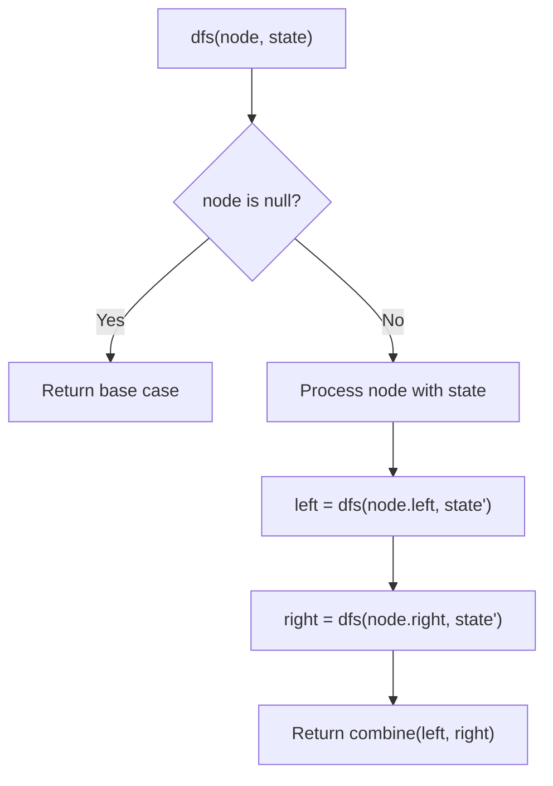
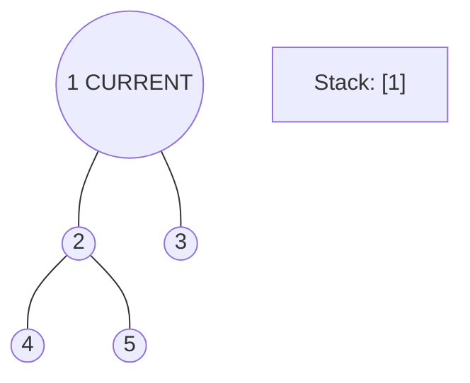
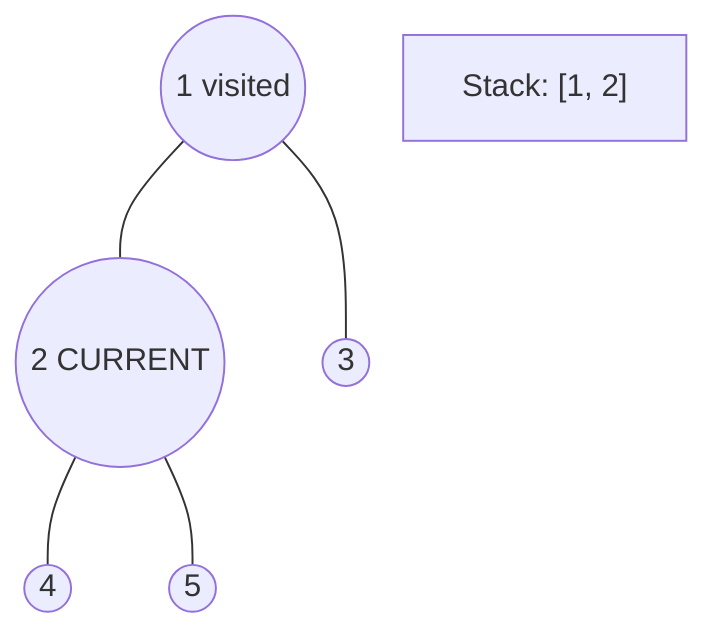
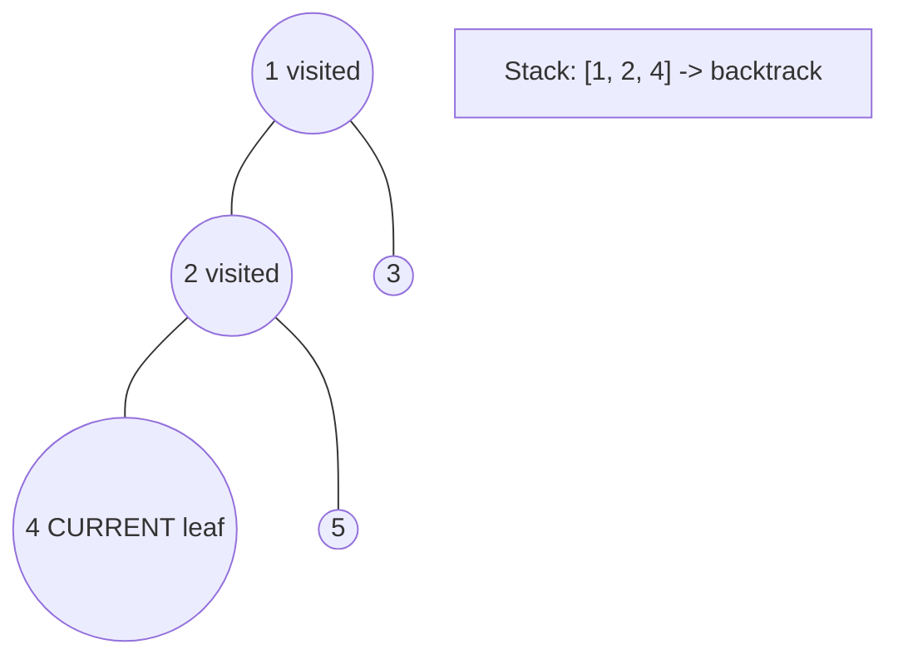
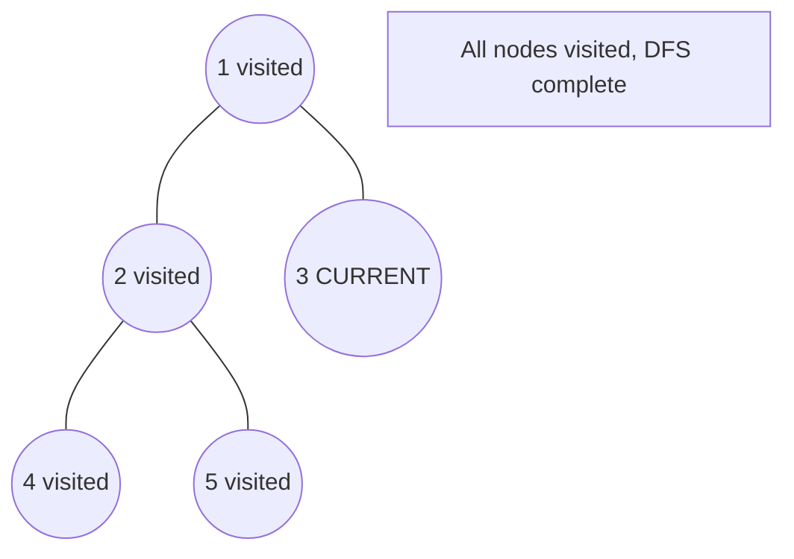

# Problem 1261: Find Elements in a Contaminated Binary Tree

**Difficulty:** Medium  
**Tags:** Hash Table, Tree, Depth-First Search, Breadth-First Search, Design, Binary Tree  
**Pattern:** DFS Tree Traversal  
**Link:** [leetcode.com/problems/find-elements-in-a-contaminated-binary-tree](https://leetcode.com/problems/find-elements-in-a-contaminated-binary-tree/)

## Description

Given a binary tree with the following rules:

	- `root.val == 0`
	- For any `treeNode`:
	
		If `treeNode.val` has a value `x` and `treeNode.left != null`, then `treeNode.left.val == 2 * x + 1`
		- If `treeNode.val` has a value `x` and `treeNode.right != null`, then `treeNode.right.val == 2 * x + 2`
	
	

Now the binary tree is contaminated, which means all `treeNode.val` have been changed to `-1`.

Implement the `FindElements` class:

	- `FindElements(TreeNode* root)` Initializes the object with a contaminated binary tree and recovers it.
	- `bool find(int target)` Returns `true` if the `target` value exists in the recovered binary tree.

 

Example 1:

```

**Input**
["FindElements","find","find"]
[[[-1,null,-1]],[1],[2]]
**Output**
[null,false,true]
**Explanation**
FindElements findElements = new FindElements([-1,null,-1]); 
findElements.find(1); // return False 
findElements.find(2); // return True 
```

Example 2:

```

**Input**
["FindElements","find","find","find"]
[[[-1,-1,-1,-1,-1]],[1],[3],[5]]
**Output**
[null,true,true,false]
**Explanation**
FindElements findElements = new FindElements([-1,-1,-1,-1,-1]);
findElements.find(1); // return True
findElements.find(3); // return True
findElements.find(5); // return False
```

Example 3:

```

**Input**
["FindElements","find","find","find","find"]
[[[-1,null,-1,-1,null,-1]],[2],[3],[4],[5]]
**Output**
[null,true,false,false,true]
**Explanation**
FindElements findElements = new FindElements([-1,null,-1,-1,null,-1]);
findElements.find(2); // return True
findElements.find(3); // return False
findElements.find(4); // return False
findElements.find(5); // return True

```

 

**Constraints:**

	- `TreeNode.val == -1`
	- The height of the binary tree is less than or equal to `20`
	- The total number of nodes is between `[1, 10^4]`
	- Total calls of `find()` is between `[1, 10^4]`
	- `0 <= target <= 10^6`

## Approach: DFS Tree Traversal

Perform depth-first search on the tree. Recurse on left and right subtrees, combining results bottom-up. Track state (path, depth, sum) during traversal.

## Pseudocode

```
1. Define dfs(node, state):
   a. Base case: if null, return default
   b. Process node with current state
   c. left_result = dfs(node.left, updated_state)
   d. right_result = dfs(node.right, updated_state)
   e. Return combine(left_result, right_result)
2. Return dfs(root, initial_state)
```

## Algorithm Flow



## Visual State Transitions

**DFS Tree Traversal Step-by-Step:**

**Frame 1: Start at root**


**Frame 2: Go left - visit node 2**


**Frame 3: Go left - visit node 4 (leaf)**


**Frame 4: Backtrack, visit node 5, then node 3**



## Complexity Analysis

- **Time:** O(n)
- **Space:** O(h)

## Solution (Python3)

```python
class FindElements:
    def __init__(self, root: Optional[TreeNode]):
        # Initialize data structure
        self.root = root

    def find(self, target: int) -> bool:
        return False

```

## Solution (C++)

```cpp
#include <algorithm>
#include <functional>
#include <string>
#include <vector>
using namespace std;

class FindElements {
public:
    FindElements(TreeNode* root) {
        // Initialize
    }

    bool find(int target) {
        return false;
    }

};
```
