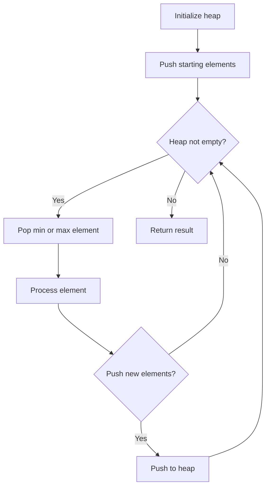
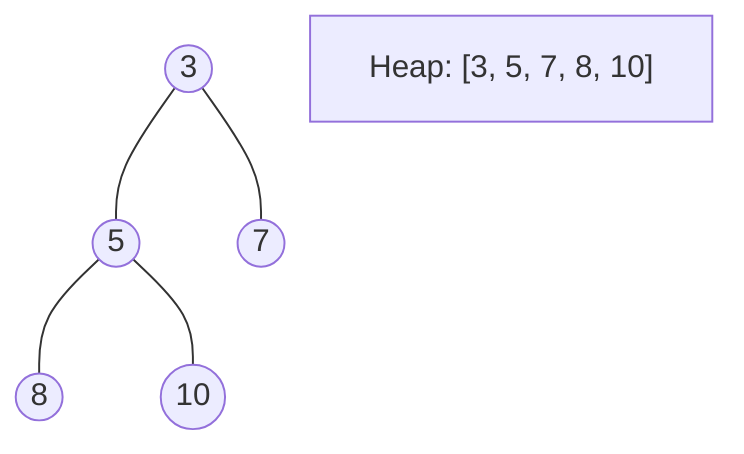
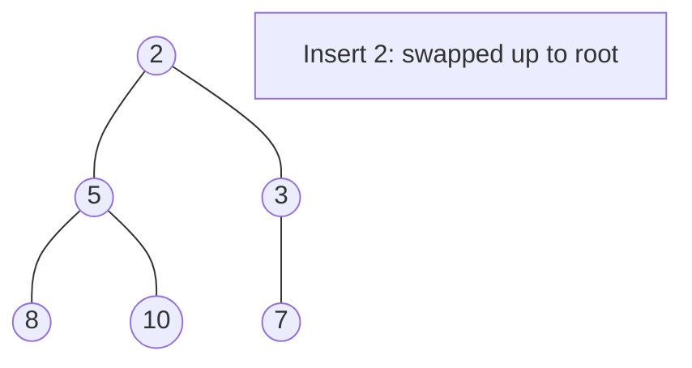
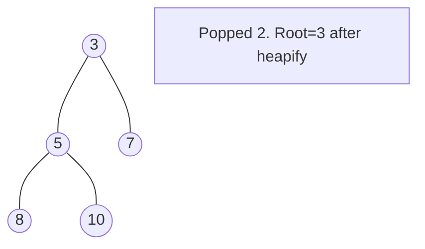

# Problem 1263: Minimum Moves to Move a Box to Their Target Location

**Difficulty:** Hard  
**Tags:** Array, Breadth-First Search, Heap (Priority Queue), Matrix  
**Pattern:** Heap / Priority Queue  
**Link:** [leetcode.com/problems/minimum-moves-to-move-a-box-to-their-target-location](https://leetcode.com/problems/minimum-moves-to-move-a-box-to-their-target-location/)

## Description

A storekeeper is a game in which the player pushes boxes around in a warehouse trying to get them to target locations.

The game is represented by an `m x n` grid of characters `grid` where each element is a wall, floor, or box.

Your task is to move the box `'B'` to the target position `'T'` under the following rules:

	- The character `'S'` represents the player. The player can move up, down, left, right in `grid` if it is a floor (empty cell).
	- The character `'.'` represents the floor which means a free cell to walk.
	- The character `'#'` represents the wall which means an obstacle (impossible to walk there).
	- There is only one box `'B'` and one target cell `'T'` in the `grid`.
	- The box can be moved to an adjacent free cell by standing next to the box and then moving in the direction of the box. This is a **push**.
	- The player cannot walk through the box.

Return *the minimum number of **pushes** to move the box to the target*. If there is no way to reach the target, return `-1`.

 

Example 1:

```

**Input:** grid = [["#","#","#","#","#","#"],
               ["#","T","#","#","#","#"],
               ["#",".",".","B",".","#"],
               ["#",".","#","#",".","#"],
               ["#",".",".",".","S","#"],
               ["#","#","#","#","#","#"]]
**Output:** 3
**Explanation:** We return only the number of times the box is pushed.
```

Example 2:

```

**Input:** grid = [["#","#","#","#","#","#"],
               ["#","T","#","#","#","#"],
               ["#",".",".","B",".","#"],
               ["#","#","#","#",".","#"],
               ["#",".",".",".","S","#"],
               ["#","#","#","#","#","#"]]
**Output:** -1

```

Example 3:

```

**Input:** grid = [["#","#","#","#","#","#"],
               ["#","T",".",".","#","#"],
               ["#",".","#","B",".","#"],
               ["#",".",".",".",".","#"],
               ["#",".",".",".","S","#"],
               ["#","#","#","#","#","#"]]
**Output:** 5
**Explanation:** push the box down, left, left, up and up.

```

 

**Constraints:**

	- `m == grid.length`
	- `n == grid[i].length`
	- `1 <= m, n <= 20`
	- `grid` contains only characters `'.'`, `'#'`, `'S'`, `'T'`, or `'B'`.
	- There is only one character `'S'`, `'B'`, and `'T'` in the `grid`.

## Approach: Heap / Priority Queue

Use a min-heap or max-heap to efficiently access the smallest/largest element. Push elements and pop the top to process in priority order.

## Pseudocode

```
1. Initialize heap (min or max)
2. Push initial elements onto heap
3. While heap not empty and condition:
   a. Pop top element (min or max)
   b. Process element
   c. Push new elements if needed
4. Return result
```

## Algorithm Flow



## Visual State Transitions

**Heap Operations (Min-Heap):**

**Frame 1: Initial heap**


**Frame 2: Insert 2 - bubble up**


**Frame 3: Pop minimum (2) - heapify down**



## Complexity Analysis

- **Time:** O(n log n)
- **Space:** O(n)

## Solution (Python3)

```python
class Solution:
    def minPushBox(self, grid: List[List[str]]) -> int:
        # Heap/Priority Queue - O(n log k) time
        import heapq
        if not grid:
            return 0
        # Min heap (negate for max heap)
        heap = []
        for val in grid:
            heapq.heappush(heap, val)
            if len(heap) > (grid if isinstance(grid, int) else len(grid)):
                heapq.heappop(heap)
        return heap[0] if heap else 0
```

## Solution (C++)

```cpp
#include <queue>
#include <string>
#include <vector>
using namespace std;

class Solution {
public:
    int minPushBox(vector<vector<string>>& grid) {
        // Heap/Priority Queue - O(n log k) time
        priority_queue<int, vector<int>, greater<int>> pq;
        for (int val : grid) {
            pq.push(val);
            if ((int)pq.size() > grid)
                pq.pop();
        }
        return pq.empty() ? 0 : pq.top();
    }
};
```
