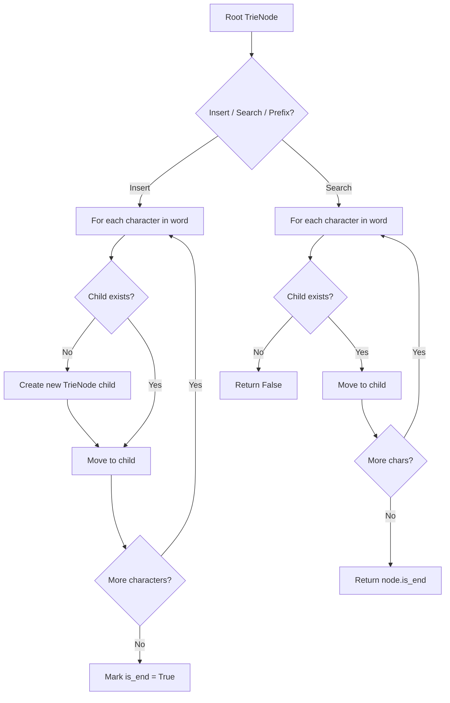
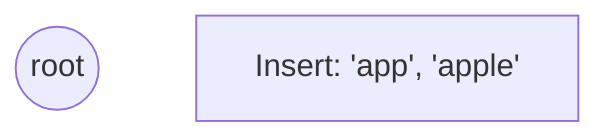
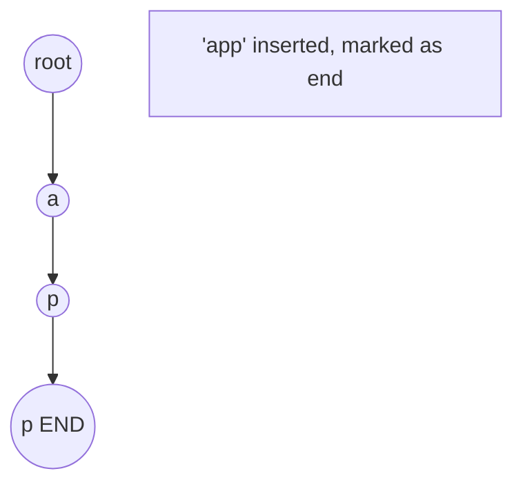
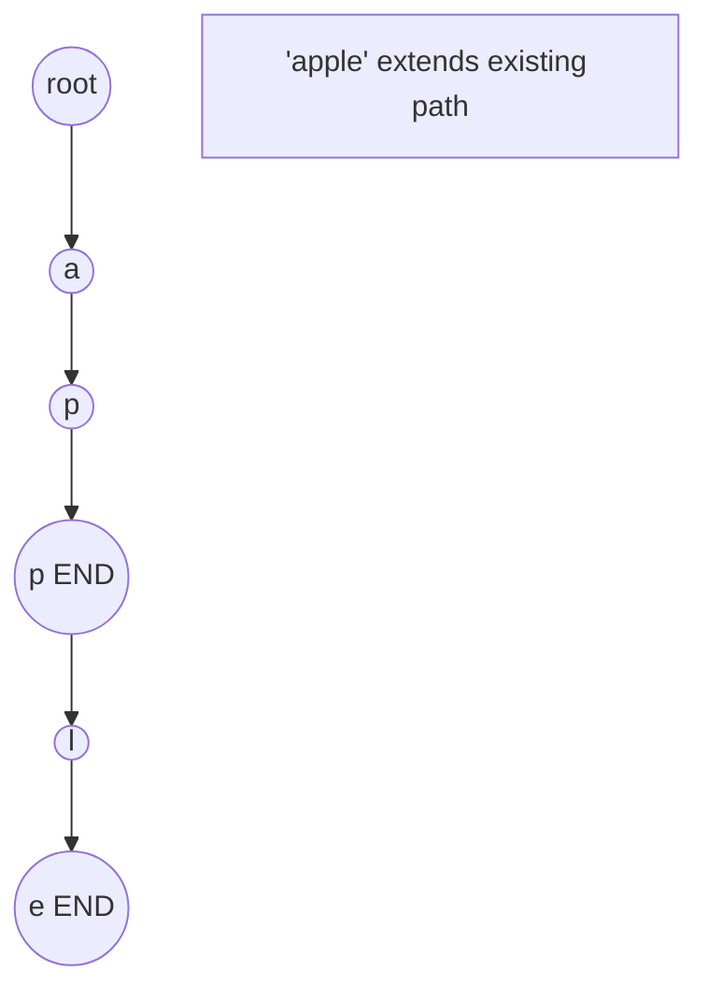
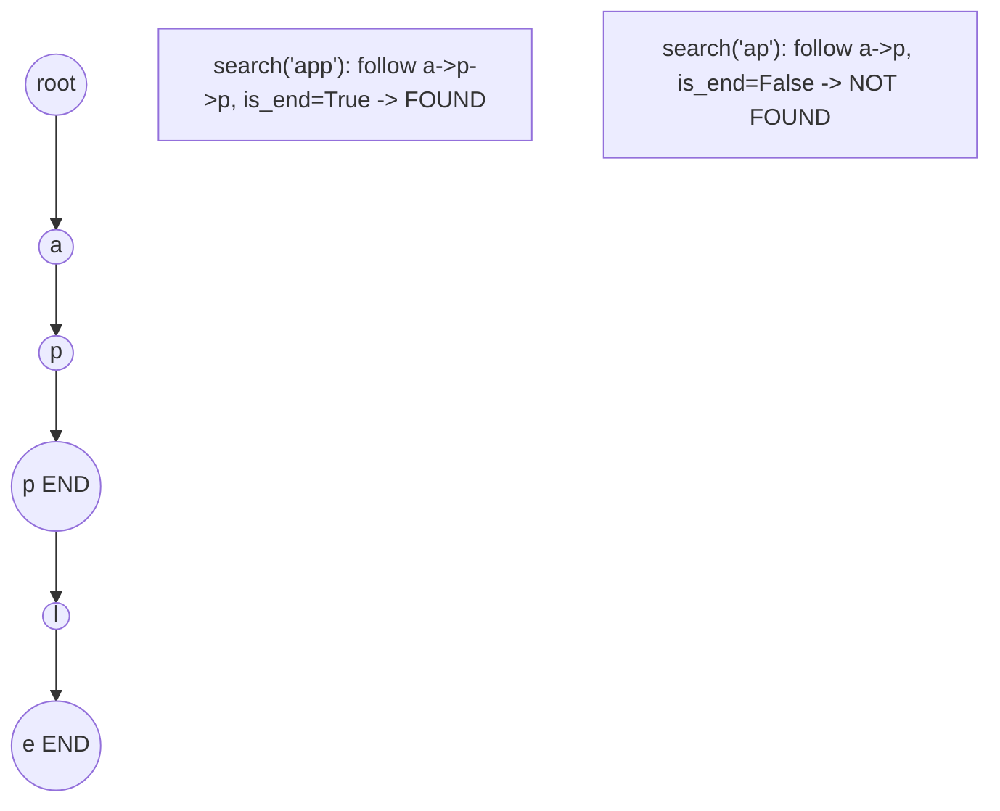

# Problem 1268: Search Suggestions System

**Difficulty:** Medium  
**Tags:** Array, String, Binary Search, Trie, Sorting, Heap (Priority Queue)  
**Pattern:** Binary Search / Trie  
**Link:** [leetcode.com/problems/search-suggestions-system](https://leetcode.com/problems/search-suggestions-system/)

## Description

You are given an array of strings `products` and a string `searchWord`.

Design a system that suggests at most three product names from `products` after each character of `searchWord` is typed. Suggested products should have common prefix with `searchWord`. If there are more than three products with a common prefix return the three lexicographically minimums products.

Return *a list of lists of the suggested products after each character of *`searchWord`* is typed*.

 

Example 1:

```

**Input:** products = ["mobile","mouse","moneypot","monitor","mousepad"], searchWord = "mouse"
**Output:** [["mobile","moneypot","monitor"],["mobile","moneypot","monitor"],["mouse","mousepad"],["mouse","mousepad"],["mouse","mousepad"]]
**Explanation:** products sorted lexicographically = ["mobile","moneypot","monitor","mouse","mousepad"].
After typing m and mo all products match and we show user ["mobile","moneypot","monitor"].
After typing mou, mous and mouse the system suggests ["mouse","mousepad"].

```

Example 2:

```

**Input:** products = ["havana"], searchWord = "havana"
**Output:** [["havana"],["havana"],["havana"],["havana"],["havana"],["havana"]]
**Explanation:** The only word "havana" will be always suggested while typing the search word.

```

 

**Constraints:**

	- `1 <= products.length <= 1000`
	- `1 <= products[i].length <= 3000`
	- `1 <= sum(products[i].length) <= 2 * 10^4`
	- All the strings of `products` are **unique**.
	- `products[i]` consists of lowercase English letters.
	- `1 <= searchWord.length <= 1000`
	- `searchWord` consists of lowercase English letters.

## Approach: Binary Search / Trie

Sort products. For each prefix, binary search for matching range, return first 3.

## Pseudocode

```
1. TrieNode: children = {}, is_end = False
2. Insert(word):
   - For each char: create child if absent, move to child
   - Mark last node as end
3. Search(word):
   - For each char: if child absent return False, move to child
   - Return node.is_end
4. StartsWith(prefix): same as search but return True at end
```

## Algorithm Flow



## Visual State Transitions

**Trie Insert and Search:**

**Frame 1: Empty trie**


**Frame 2: Insert 'app'**


**Frame 3: Insert 'apple'**


**Frame 4: Search 'app' = True, 'ap' = False**



## Complexity Analysis

- **Time:** O(n log n + m*log n)
- **Space:** O(1) extra

## Solution (Python3)

```python
class Solution:
    def suggestedProducts(self, products: list[str], searchWord: str) -> list[list[str]]:
        products.sort()
        result = []
        prefix = ''
        start = 0
        for c in searchWord:
            prefix += c
            import bisect
            start = bisect.bisect_left(products, prefix, start)
            end = bisect.bisect_left(products, prefix[:-1] + chr(ord(prefix[-1]) + 1), start)
            result.append(products[start:min(start + 3, end)])
        return result
```

## Solution (C++)

```cpp
#include <string>
#include <vector>
using namespace std;

class Solution {
public:
    vector<vector<string>> suggestedProducts(vector<string>& products, string& searchWord) {
        // Trie-based approach
        struct TrieNode {
            TrieNode* children[26] = {};
            bool isEnd = false;
        };
        TrieNode* root = new TrieNode();
        // Build trie
        for (auto& word : products) {
            TrieNode* node = root;
            for (char ch : word) {
                int idx = ch - 'a';
                if (!node->children[idx])
                    node->children[idx] = new TrieNode();
                node = node->children[idx];
            }
            node->isEnd = true;
        }
        return {};
    }
};
```
