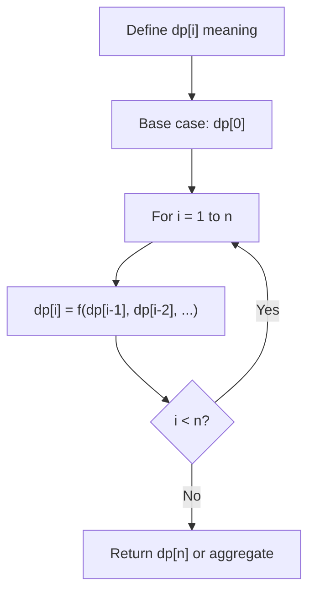
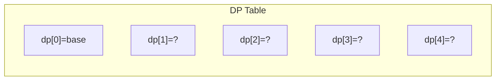
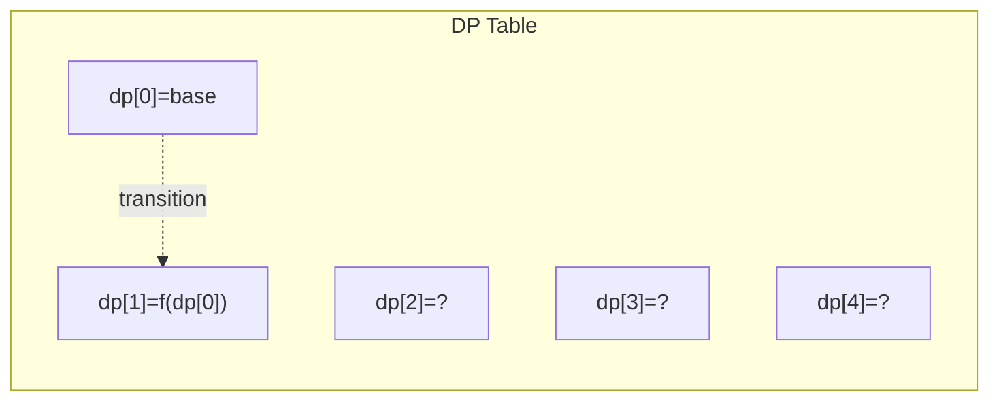
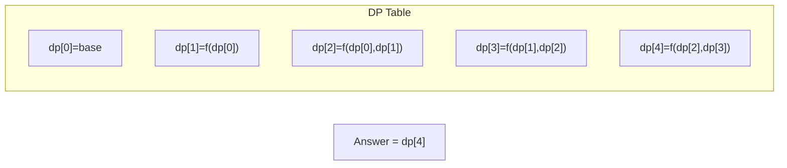

# Problem 1269: Number of Ways to Stay in the Same Place After Some Steps

**Difficulty:** Hard  
**Tags:** Dynamic Programming  
**Pattern:** Dynamic Programming (1D)  
**Link:** [leetcode.com/problems/number-of-ways-to-stay-in-the-same-place-after-some-steps](https://leetcode.com/problems/number-of-ways-to-stay-in-the-same-place-after-some-steps/)

## Description

You have a pointer at index `0` in an array of size `arrLen`. At each step, you can move 1 position to the left, 1 position to the right in the array, or stay in the same place (The pointer should not be placed outside the array at any time).

Given two integers `steps` and `arrLen`, return the number of ways such that your pointer is still at index `0` after **exactly** `steps` steps. Since the answer may be too large, return it **modulo** `10^9 + 7`.

 

Example 1:

```

**Input:** steps = 3, arrLen = 2
**Output:** 4
**Explanation: **There are 4 differents ways to stay at index 0 after 3 steps.
Right, Left, Stay
Stay, Right, Left
Right, Stay, Left
Stay, Stay, Stay

```

Example 2:

```

**Input:** steps = 2, arrLen = 4
**Output:** 2
**Explanation:** There are 2 differents ways to stay at index 0 after 2 steps
Right, Left
Stay, Stay

```

Example 3:

```

**Input:** steps = 4, arrLen = 2
**Output:** 8

```

 

**Constraints:**

	- `1 <= steps <= 500`
	- `1 <= arrLen <= 10^6`

## Approach: Dynamic Programming (1D)

Break the problem into overlapping subproblems. Define dp[i] as the optimal value for the subproblem ending at or considering index i. Build the solution bottom-up, using previously computed dp values.

## Pseudocode

```
1. Define dp[i] = optimal value for subproblem i
2. Base case: dp[0] = initial value
3. For i from 1 to n:
   a. dp[i] = recurrence(dp[i-1], dp[i-2], ...)
4. Return dp[n] or max/min of dp
```

## Algorithm Flow



## Visual State Transitions

**1D Dynamic Programming Table Build:**

**Frame 1: Initialize base cases**


**Frame 2: Fill dp[1] from dp[0]**


**Frame 3: Fill remaining cells**



## Complexity Analysis

- **Time:** O(n)
- **Space:** O(n)

## Solution (Python3)

```python
class Solution:
    def numWays(self, steps: int, arrLen: int) -> int:
        # Dynamic programming (1D) - O(n) time, O(n) space
        if not steps:
            return 0
        n = len(steps) if isinstance(steps, list) else steps
        dp = [0] * (n + 1)
        dp[0] = 1  # base case
        for i in range(1, n + 1):
            dp[i] = dp[i-1]  # transition (customize per problem)
            if i >= 2:
                dp[i] += dp[i-2]
        return dp[n]
```

## Solution (C++)

```cpp
#include <string>
#include <vector>
using namespace std;

class Solution {
public:
    int numWays(int steps, int arrLen) {
        // Dynamic programming (1D) - O(n) time, O(n) space
        int n = steps;
        if (n <= 0) return 0;
        vector<int> dp(n + 1, 0);
        dp[0] = 1;
        for (int i = 1; i <= n; i++) {
            dp[i] = dp[i-1];
            if (i >= 2) dp[i] += dp[i-2];
        }
        return dp[n];
    }
};
```
