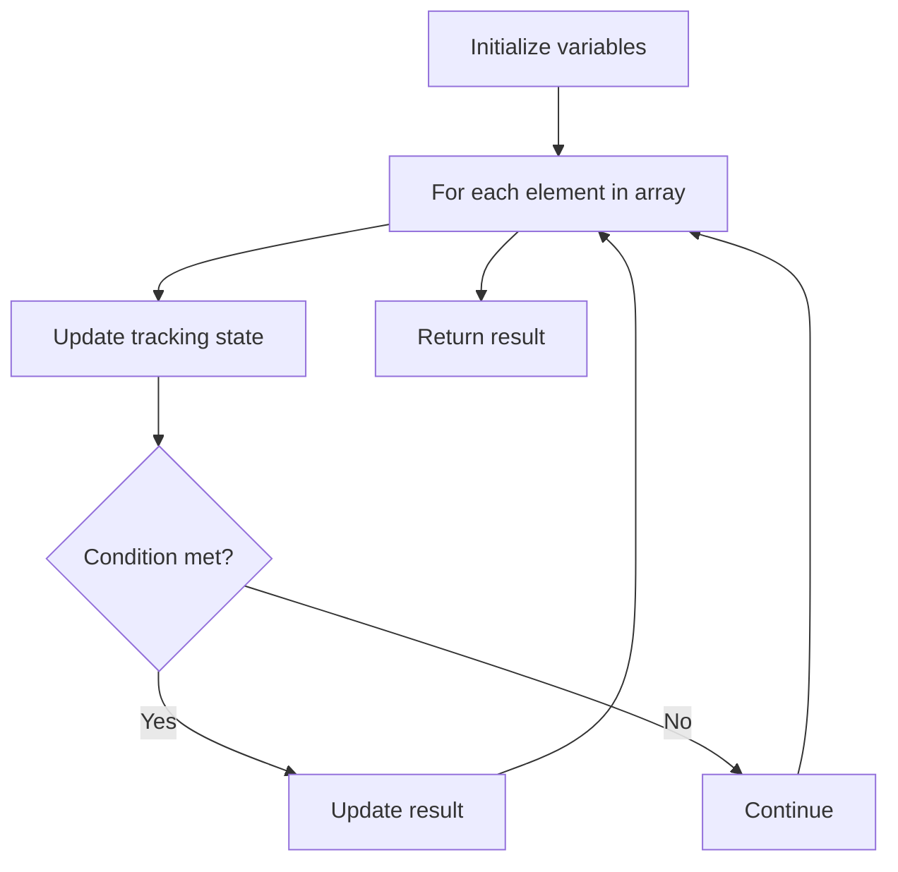

# Problem 1272: Remove Interval

**Difficulty:** Medium  
**Tags:** Array  
**Pattern:** Array Processing  
**Link:** [leetcode.com/problems/remove-interval](https://leetcode.com/problems/remove-interval/)

## Description

*(Premium problem -- description requires LeetCode subscription)*

## Approach: Array Processing

Process the array with a linear scan, tracking state variables. Look for patterns: running maximum/minimum, counting, or transformations.

## Pseudocode

```
1. Initialize tracking variables
2. Iterate through array:
   a. Update tracking state
   b. Check conditions
   c. Update result
3. Return result
```

## Algorithm Flow



## Complexity Analysis

- **Time:** O(n)
- **Space:** O(1)

## Solution (Python3)

```python
class Solution:
    pass
```

## Solution (C++)

```cpp
class Solution {
public:
    // Design problem stub
};
```
