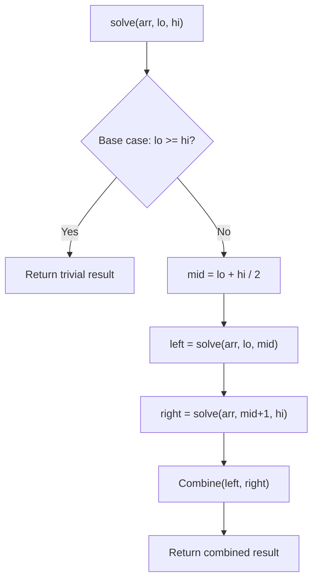

# Problem 1274: Number of Ships in a Rectangle

**Difficulty:** Hard  
**Tags:** Array, Divide and Conquer, Interactive  
**Pattern:** Divide and Conquer  
**Link:** [leetcode.com/problems/number-of-ships-in-a-rectangle](https://leetcode.com/problems/number-of-ships-in-a-rectangle/)

## Description

*(Premium problem -- description requires LeetCode subscription)*

## Approach: Divide and Conquer

Split the problem into smaller subproblems, solve them recursively, and combine the results. The key is the merge/combine step.

## Pseudocode

```
1. Base case: if input size <= 1, return trivial answer
2. Divide: split input into two halves
3. Conquer: recursively solve left and right
4. Combine: merge solutions from left and right
5. Return combined result
```

## Algorithm Flow



## Complexity Analysis

- **Time:** O(n log n)
- **Space:** O(n)

## Solution (Python3)

```python
class Solution:
    pass
```

## Solution (C++)

```cpp
class Solution {
public:
    // Design problem stub
};
```
