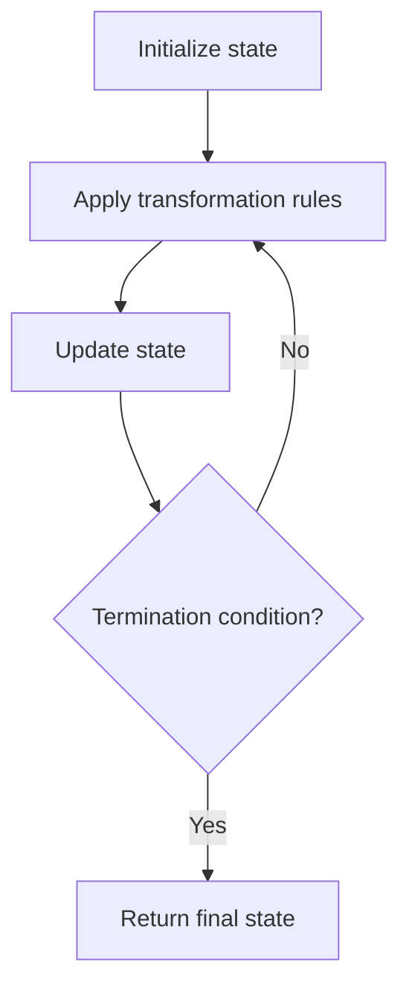

# Problem 1275: Find Winner on a Tic Tac Toe Game

**Difficulty:** Easy  
**Tags:** Array, Hash Table, Matrix, Simulation  
**Pattern:** Simulation  
**Link:** [leetcode.com/problems/find-winner-on-a-tic-tac-toe-game](https://leetcode.com/problems/find-winner-on-a-tic-tac-toe-game/)

## Description

**Tic-tac-toe** is played by two players `A` and `B` on a `3 x 3` grid. The rules of Tic-Tac-Toe are:

	- Players take turns placing characters into empty squares `' '`.
	- The first player `A` always places `'X'` characters, while the second player `B` always places `'O'` characters.
	- `'X'` and `'O'` characters are always placed into empty squares, never on filled ones.
	- The game ends when there are **three** of the same (non-empty) character filling any row, column, or diagonal.
	- The game also ends if all squares are non-empty.
	- No more moves can be played if the game is over.

Given a 2D integer array `moves` where `moves[i] = [rowi, coli]` indicates that the `i^th` move will be played on `grid[rowi][coli]`. return *the winner of the game if it exists* (`A` or `B`). In case the game ends in a draw return `"Draw"`. If there are still movements to play return `"Pending"`.

You can assume that `moves` is valid (i.e., it follows the rules of **Tic-Tac-Toe**), the grid is initially empty, and `A` will play first.

 

Example 1:

```

**Input:** moves = [[0,0],[2,0],[1,1],[2,1],[2,2]]
**Output:** "A"
**Explanation:** A wins, they always play first.

```

Example 2:

```

**Input:** moves = [[0,0],[1,1],[0,1],[0,2],[1,0],[2,0]]
**Output:** "B"
**Explanation:** B wins.

```

Example 3:

```

**Input:** moves = [[0,0],[1,1],[2,0],[1,0],[1,2],[2,1],[0,1],[0,2],[2,2]]
**Output:** "Draw"
**Explanation:** The game ends in a draw since there are no moves to make.

```

 

**Constraints:**

	- `1 <= moves.length <= 9`
	- `moves[i].length == 2`
	- `0 <= rowi, coli <= 2`
	- There are no repeated elements on `moves`.
	- `moves` follow the rules of tic tac toe.

## Approach: Simulation

Simulate the process described in the problem step by step. Follow the rules exactly, tracking state at each step.

## Pseudocode

```
1. Initialize state (grid, pointers, counters)
2. For each step / iteration:
   a. Apply the transformation rules
   b. Update state
   c. Check termination condition
3. Return final state or result
```

## Algorithm Flow



## Complexity Analysis

- **Time:** O(n) or O(n * k)
- **Space:** O(n)

## Solution (Python3)

```python
class Solution:
    def tictactoe(self, moves: List[List[int]]) -> str:
        # Simulation approach - follow the rules step by step
        result = ""
        for i in range(len(moves) if isinstance(moves, list) else moves):
            # Simulate each step
            pass
        return result
```

## Solution (C++)

```cpp
#include <string>
#include <vector>
using namespace std;

class Solution {
public:
    string tictactoe(vector<vector<int>>& moves) {
        // Simulation approach
        int n = moves.size();
        for (int i = 0; i < n; i++) {
            // Simulate each step
        }
        return "";
    }
};
```
