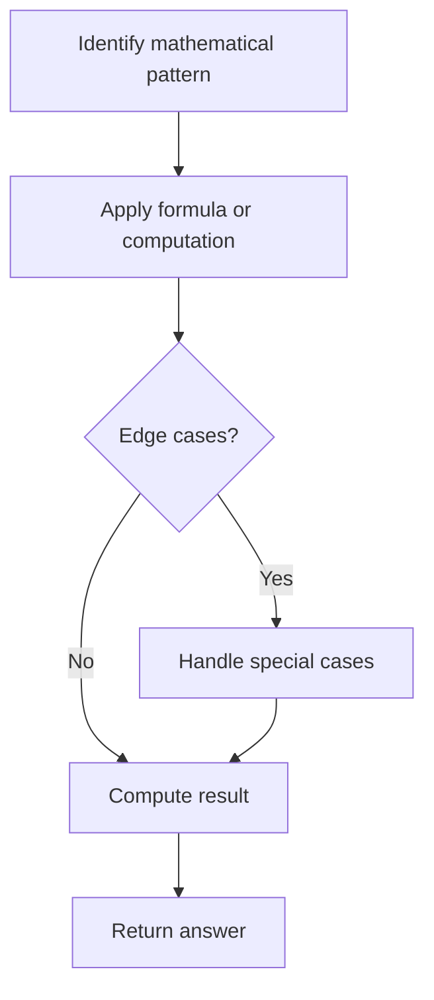

# Problem 1276: Number of Burgers with No Waste of Ingredients

**Difficulty:** Medium  
**Tags:** Math  
**Pattern:** Math  
**Link:** [leetcode.com/problems/number-of-burgers-with-no-waste-of-ingredients](https://leetcode.com/problems/number-of-burgers-with-no-waste-of-ingredients/)

## Description

Given two integers `tomatoSlices` and `cheeseSlices`. The ingredients of different burgers are as follows:

	- **Jumbo Burger:** `4` tomato slices and `1` cheese slice.
	- **Small Burger:** `2` Tomato slices and `1` cheese slice.

Return `[total_jumbo, total_small]` so that the number of remaining `tomatoSlices` equal to `0` and the number of remaining `cheeseSlices` equal to `0`. If it is not possible to make the remaining `tomatoSlices` and `cheeseSlices` equal to `0` return `[]`.

 

Example 1:

```

**Input:** tomatoSlices = 16, cheeseSlices = 7
**Output:** [1,6]
**Explantion:** To make one jumbo burger and 6 small burgers we need 4*1 + 2*6 = 16 tomato and 1 + 6 = 7 cheese.
There will be no remaining ingredients.

```

Example 2:

```

**Input:** tomatoSlices = 17, cheeseSlices = 4
**Output:** []
**Explantion:** There will be no way to use all ingredients to make small and jumbo burgers.

```

Example 3:

```

**Input:** tomatoSlices = 4, cheeseSlices = 17
**Output:** []
**Explantion:** Making 1 jumbo burger there will be 16 cheese remaining and making 2 small burgers there will be 15 cheese remaining.

```

 

**Constraints:**

	- `0 <= tomatoSlices, cheeseSlices <= 10^7`

## Approach: Math

Apply mathematical properties, formulas, or number-theoretic concepts. Look for patterns, modular arithmetic, or closed-form solutions.

## Pseudocode

```
1. Identify the mathematical pattern or formula
2. Apply computation:
   - Modular arithmetic for large numbers
   - GCD/LCM for divisibility
   - Sieve for primes
3. Handle edge cases
4. Return result
```

## Algorithm Flow



## Complexity Analysis

- **Time:** O(n) or O(sqrt(n))
- **Space:** O(1)

## Solution (Python3)

```python
class Solution:
    def numOfBurgers(self, tomatoSlices: int, cheeseSlices: int) -> List[int]:
        # Mathematical approach
        result = 0
        x = tomatoSlices
        while x != 0:
            result = result * 10 + x % 10
            x //= 10 if isinstance(x, int) else 1
        return result
```

## Solution (C++)

```cpp
#include <string>
#include <vector>
using namespace std;

class Solution {
public:
    vector<int> numOfBurgers(int tomatoSlices, int cheeseSlices) {
        // Mathematical approach
        long long result = 0;
        int x = tomatoSlices;
        while (x != 0) {
            result = result * 10 + x % 10;
            x /= 10;
        }
        return (int)result;
    }
};
```
