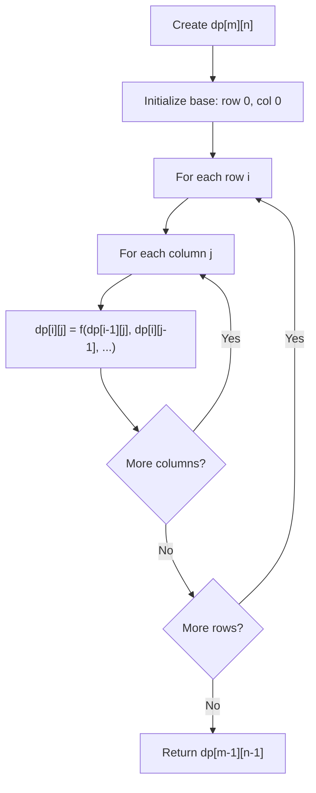
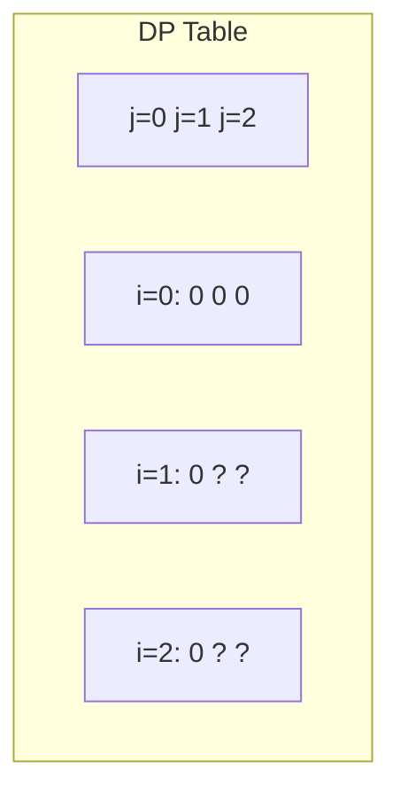
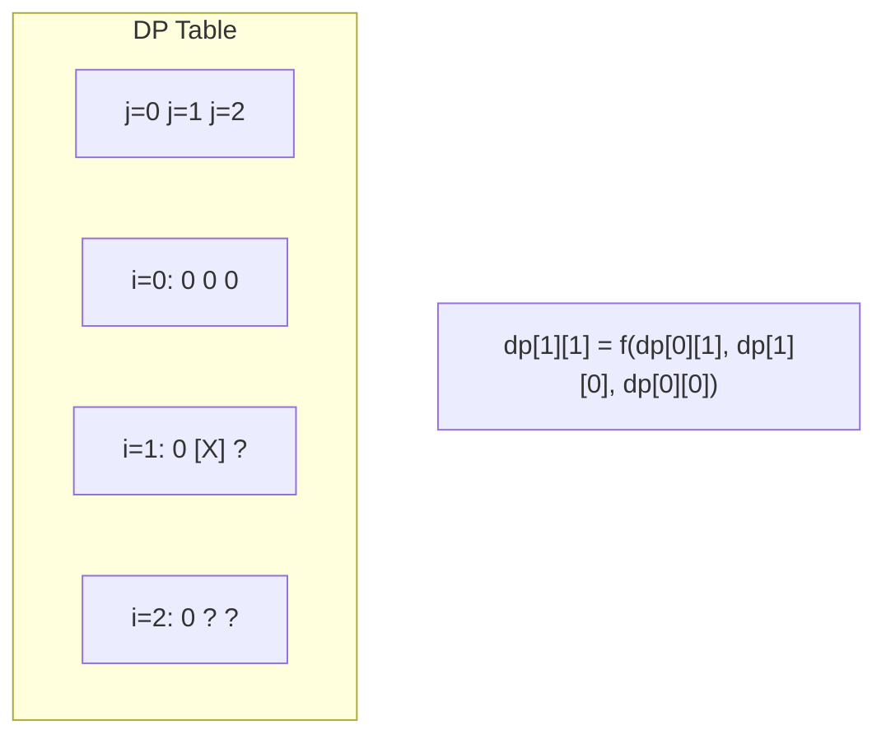
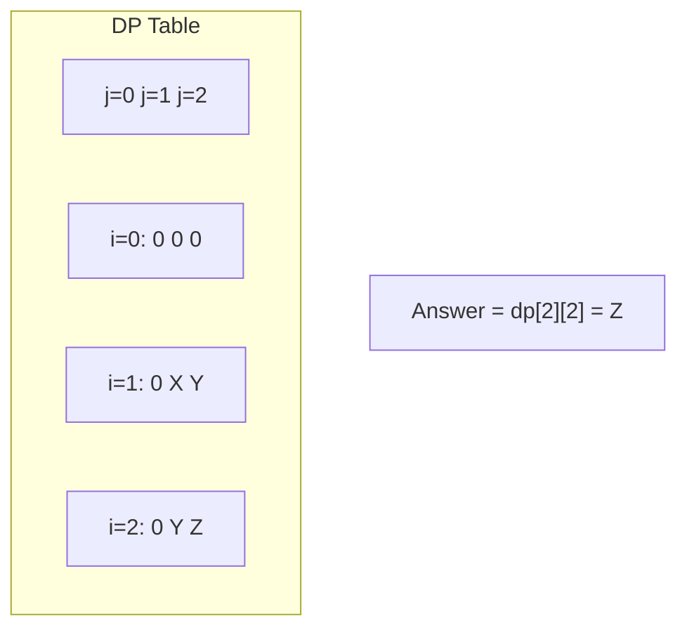

# Problem 1277: Count Square Submatrices with All Ones

**Difficulty:** Medium  
**Tags:** Array, Dynamic Programming, Matrix  
**Pattern:** Dynamic Programming (2D Grid/Matrix)  
**Link:** [leetcode.com/problems/count-square-submatrices-with-all-ones](https://leetcode.com/problems/count-square-submatrices-with-all-ones/)

## Description

Given a `m * n` matrix of ones and zeros, return how many **square** submatrices have all ones.

 

Example 1:

```

**Input:** matrix =
[
  [0,1,1,1],
  [1,1,1,1],
  [0,1,1,1]
]
**Output:** 15
**Explanation:** 
There are **10** squares of side 1.
There are **4** squares of side 2.
There is  **1** square of side 3.
Total number of squares = 10 + 4 + 1 = **15**.

```

Example 2:

```

**Input:** matrix = 
[
  [1,0,1],
  [1,1,0],
  [1,1,0]
]
**Output:** 7
**Explanation:** 
There are **6** squares of side 1.  
There is **1** square of side 2. 
Total number of squares = 6 + 1 = **7**.

```

 

**Constraints:**

	- `1 <= arr.length <= 300`
	- `1 <= arr[0].length <= 300`
	- `0 <= arr[i][j] <= 1`

## Approach: Dynamic Programming (2D Grid/Matrix)

Use a 2D DP table where dp[i][j] represents the optimal value for the subproblem defined by rows 0..i and columns 0..j. Fill row by row or column by column.

## Pseudocode

```
1. Create dp[m][n] table
2. Initialize base cases (first row, first column)
3. For i from 1 to m-1:
   For j from 1 to n-1:
     dp[i][j] = recurrence(dp[i-1][j], dp[i][j-1], dp[i-1][j-1])
4. Return dp[m-1][n-1]
```

## Algorithm Flow



## Visual State Transitions

**2D DP Table Build:**

**Frame 1: Initialize borders**


**Frame 2: Fill cell by cell**


**Frame 3: Table complete**



## Complexity Analysis

- **Time:** O(m * n)
- **Space:** O(m * n)

## Solution (Python3)

```python
class Solution:
    def countSquares(self, matrix: List[List[int]]) -> int:
        # Dynamic programming (2D) - O(m*n) time and space
        if not matrix:
            return 0
        m, n = len(matrix), len(matrix[0])
        dp = [[0] * (n + 1) for _ in range(m + 1)]
        for i in range(1, m + 1):
            for j in range(1, n + 1):
                dp[i][j] = max(dp[i-1][j], dp[i][j-1])
                # Add problem-specific transition
        return dp[m][n]
```

## Solution (C++)

```cpp
#include <algorithm>
#include <string>
#include <vector>
using namespace std;

class Solution {
public:
    int countSquares(vector<vector<int>>& matrix) {
        // Dynamic programming (2D) - O(m*n) time and space
        if (matrix.empty()) return 0;
        int m = matrix.size(), n = matrix[0].size();
        vector<vector<int>> dp(m + 1, vector<int>(n + 1, 0));
        for (int i = 1; i <= m; i++) {
            for (int j = 1; j <= n; j++) {
                dp[i][j] = max(dp[i-1][j], dp[i][j-1]);
            }
        }
        return dp[m][n];
    }
};
```
