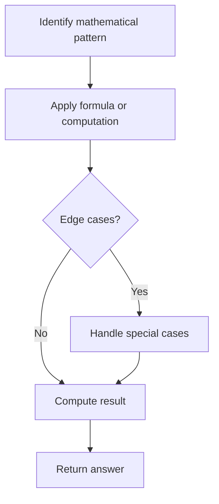

# Problem 1281: Subtract the Product and Sum of Digits of an Integer

**Difficulty:** Easy  
**Tags:** Math  
**Pattern:** Math  
**Link:** [leetcode.com/problems/subtract-the-product-and-sum-of-digits-of-an-integer](https://leetcode.com/problems/subtract-the-product-and-sum-of-digits-of-an-integer/)

## Description

Given an integer number `n`, return the difference between the product of its digits and the sum of its digits.
 

Example 1:

```

**Input:** n = 234
**Output:** 15 
**Explanation:** 
Product of digits = 2 * 3 * 4 = 24 
Sum of digits = 2 + 3 + 4 = 9 
Result = 24 - 9 = 15

```

Example 2:

```

**Input:** n = 4421
**Output:** 21
Explanation: 
Product of digits = 4 * 4 * 2 * 1 = 32 
Sum of digits = 4 + 4 + 2 + 1 = 11 
Result = 32 - 11 = 21

```

 

**Constraints:**

	- `1 <= n <= 10^5`

## Approach: Math

Apply mathematical properties, formulas, or number-theoretic concepts. Look for patterns, modular arithmetic, or closed-form solutions.

## Pseudocode

```
1. Identify the mathematical pattern or formula
2. Apply computation:
   - Modular arithmetic for large numbers
   - GCD/LCM for divisibility
   - Sieve for primes
3. Handle edge cases
4. Return result
```

## Algorithm Flow



## Complexity Analysis

- **Time:** O(n) or O(sqrt(n))
- **Space:** O(1)

## Solution (Python3)

```python
class Solution:
    def subtractProductAndSum(self, n: int) -> int:
        # Mathematical approach
        result = 0
        x = n
        while x != 0:
            result = result * 10 + x % 10
            x //= 10 if isinstance(x, int) else 1
        return result
```

## Solution (C++)

```cpp
#include <string>
#include <vector>
using namespace std;

class Solution {
public:
    int subtractProductAndSum(int n) {
        // Mathematical approach
        long long result = 0;
        int x = n;
        while (x != 0) {
            result = result * 10 + x % 10;
            x /= 10;
        }
        return (int)result;
    }
};
```
