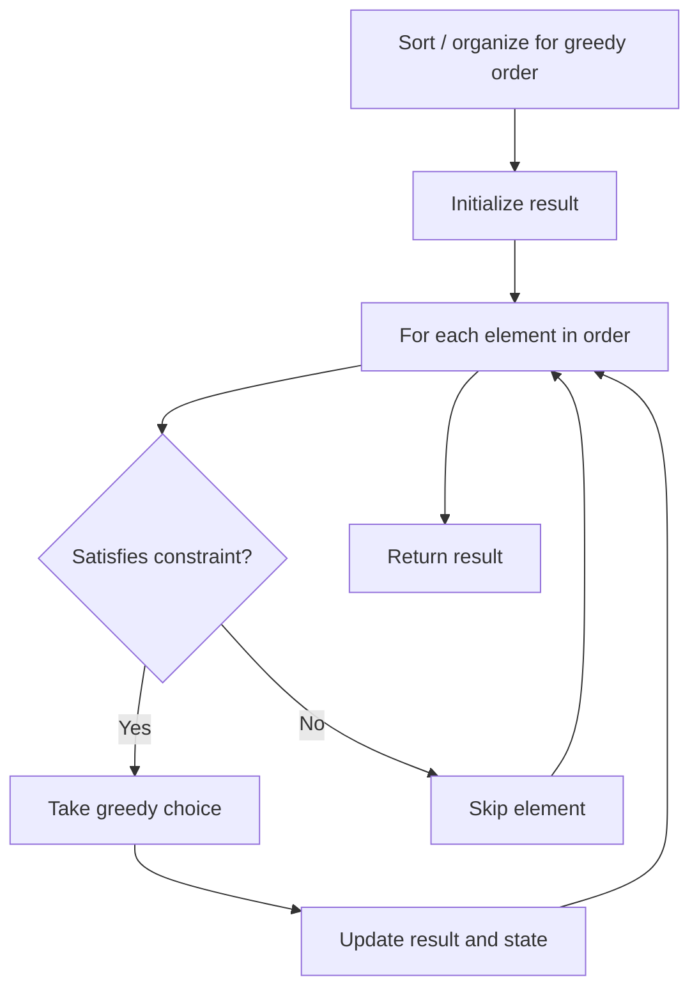

# Problem 1282: Group the People Given the Group Size They Belong To

**Difficulty:** Medium  
**Tags:** Array, Hash Table, Greedy  
**Pattern:** Greedy  
**Link:** [leetcode.com/problems/group-the-people-given-the-group-size-they-belong-to](https://leetcode.com/problems/group-the-people-given-the-group-size-they-belong-to/)

## Description

There are `n` people that are split into some unknown number of groups. Each person is labeled with a **unique ID** from `0` to `n - 1`.

You are given an integer array `groupSizes`, where `groupSizes[i]` is the size of the group that person `i` is in. For example, if `groupSizes[1] = 3`, then person `1` must be in a group of size `3`.

Return *a list of groups such that each person `i` is in a group of size `groupSizes[i]`*.

Each person should appear in **exactly one group**, and every person must be in a group. If there are multiple answers, **return any of them**. It is **guaranteed** that there will be **at least one** valid solution for the given input.

 

Example 1:

```

**Input:** groupSizes = [3,3,3,3,3,1,3]
**Output:** [[5],[0,1,2],[3,4,6]]
**Explanation:** 
The first group is [5]. The size is 1, and groupSizes[5] = 1.
The second group is [0,1,2]. The size is 3, and groupSizes[0] = groupSizes[1] = groupSizes[2] = 3.
The third group is [3,4,6]. The size is 3, and groupSizes[3] = groupSizes[4] = groupSizes[6] = 3.
Other possible solutions are [[2,1,6],[5],[0,4,3]] and [[5],[0,6,2],[4,3,1]].

```

Example 2:

```

**Input:** groupSizes = [2,1,3,3,3,2]
**Output:** [[1],[0,5],[2,3,4]]

```

 

**Constraints:**

	- `groupSizes.length == n`
	- `1 <= n <= 500`
	- `1 <= groupSizes[i] <= n`

## Approach: Greedy

Make the locally optimal choice at each step, trusting it leads to a global optimum. Greedy works when the problem has the greedy-choice property and optimal substructure.

## Pseudocode

```
1. Sort or organize data for greedy ordering
2. Initialize result
3. For each element in greedy order:
   a. If element satisfies constraint:
      - Take the greedy choice
      - Update result and state
4. Return result
```

## Algorithm Flow



## Complexity Analysis

- **Time:** O(n log n)
- **Space:** O(1)

## Solution (Python3)

```python
class Solution:
    def groupThePeople(self, groupSizes: List[int]) -> List[List[int]]:
        # Greedy approach - O(n) time
        result = 0
        curr_max = 0
        for i in range(len(groupSizes)):
            if isinstance(groupSizes[i], int):
                curr_max = max(curr_max, groupSizes[i])
                result = max(result, curr_max)
            else:
                result += 1
        return result
```

## Solution (C++)

```cpp
#include <algorithm>
#include <string>
#include <vector>
using namespace std;

class Solution {
public:
    vector<vector<int>> groupThePeople(vector<int>& groupSizes) {
        // Greedy approach - O(n) time
        int result = 0, curr_max = 0;
        for (int i = 0; i < (int)groupSizes.size(); i++) {
            curr_max = max(curr_max, groupSizes[i]);
            result = max(result, curr_max);
        }
        return result;
    }
};
```
