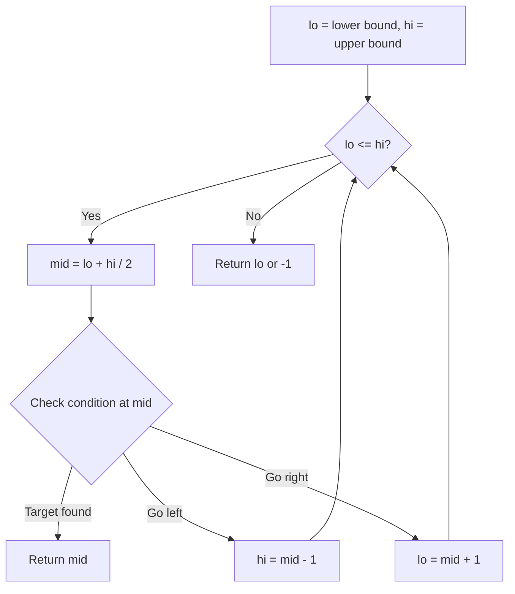
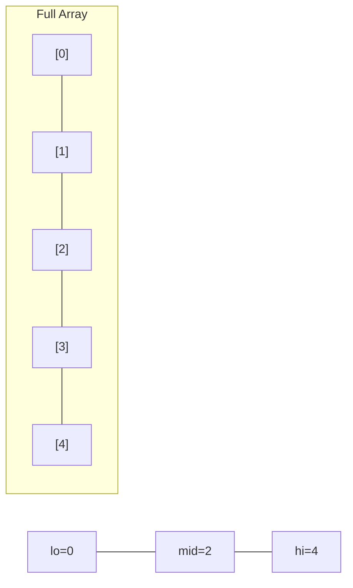
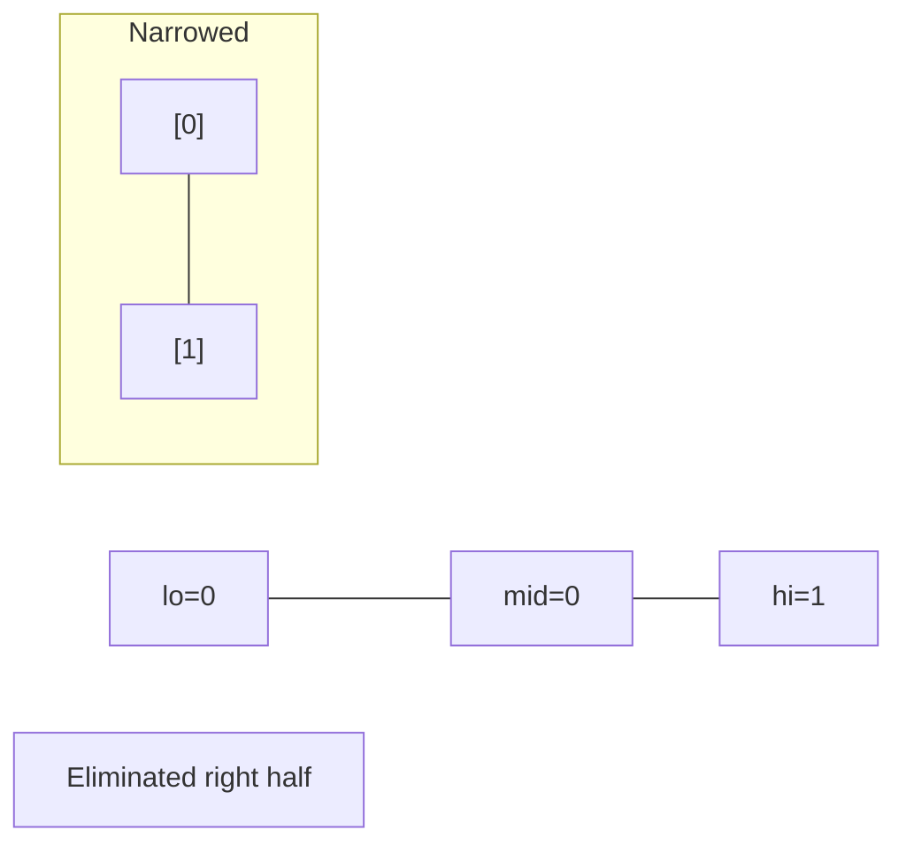
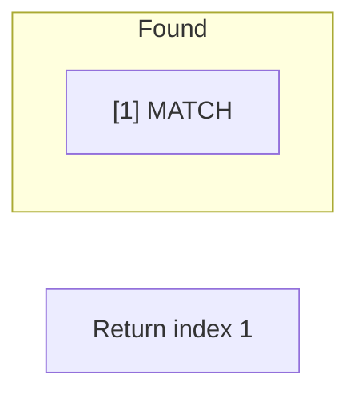

# Problem 1283: Find the Smallest Divisor Given a Threshold

**Difficulty:** Medium  
**Tags:** Array, Binary Search  
**Pattern:** Binary Search  
**Link:** [leetcode.com/problems/find-the-smallest-divisor-given-a-threshold](https://leetcode.com/problems/find-the-smallest-divisor-given-a-threshold/)

## Description

Given an array of integers `nums` and an integer `threshold`, we will choose a positive integer `divisor`, divide all the array by it, and sum the division's result. Find the **smallest** `divisor` such that the result mentioned above is less than or equal to `threshold`.

Each result of the division is rounded to the nearest integer greater than or equal to that element. (For example: `7/3 = 3` and `10/2 = 5`).

The test cases are generated so that there will be an answer.

 

Example 1:

```

**Input:** nums = [1,2,5,9], threshold = 6
**Output:** 5
**Explanation:** We can get a sum to 17 (1+2+5+9) if the divisor is 1. 
If the divisor is 4 we can get a sum of 7 (1+1+2+3) and if the divisor is 5 the sum will be 5 (1+1+1+2). 

```

Example 2:

```

**Input:** nums = [44,22,33,11,1], threshold = 5
**Output:** 44

```

 

**Constraints:**

	- `1 <= nums.length <= 5 * 10^4`
	- `1 <= nums[i] <= 10^6`
	- `nums.length <= threshold <= 10^6`

## Approach: Binary Search

Use binary search to halve the search space each iteration. Define the search range [lo, hi], compute mid, and decide which half to keep based on the problem's monotonic condition.

## Pseudocode

```
1. lo = lower_bound, hi = upper_bound
2. While lo <= hi (or lo < hi):
   a. mid = (lo + hi) // 2
   b. If condition(mid) is satisfied: record answer, search left half
   c. Else: search right half
3. Return answer
```

## Algorithm Flow



## Visual State Transitions

**Binary Search Step-by-Step:**

**Frame 1: Initial search space**


**Frame 2: Compare mid, narrow search**


**Frame 3: Found target**



## Complexity Analysis

- **Time:** O(log n)
- **Space:** O(1)

## Solution (Python3)

```python
class Solution:
    def smallestDivisor(self, nums: List[int], threshold: int) -> int:
        # Binary search - O(log n) time, O(1) space
        lo, hi = 0, len(nums) - 1
        while lo <= hi:
            mid = lo + (hi - lo) // 2
            if nums[mid] == threshold:
                return mid
            elif nums[mid] < threshold:
                lo = mid + 1
            else:
                hi = mid - 1
        return 0
```

## Solution (C++)

```cpp
#include <string>
#include <vector>
using namespace std;

class Solution {
public:
    int smallestDivisor(vector<int>& nums, int threshold) {
        // Binary search - O(log n) time, O(1) space
        int lo = 0, hi = nums.size() - 1;
        while (lo <= hi) {
            int mid = lo + (hi - lo) / 2;
            if (nums[mid] == threshold) {
                return mid;
            } else if (nums[mid] < threshold) {
                lo = mid + 1;
            } else {
                hi = mid - 1;
            }
        }
        return 0;
    }
};
```
