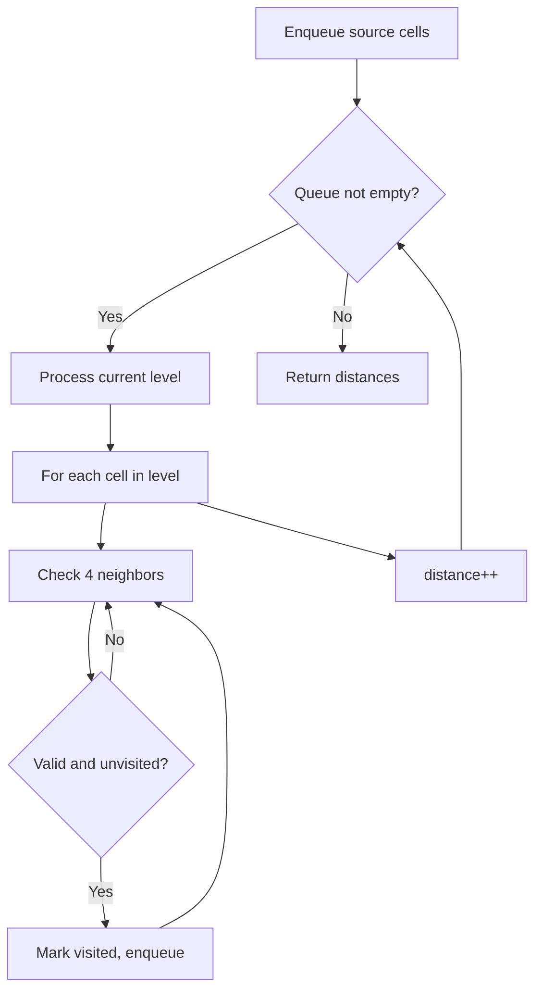
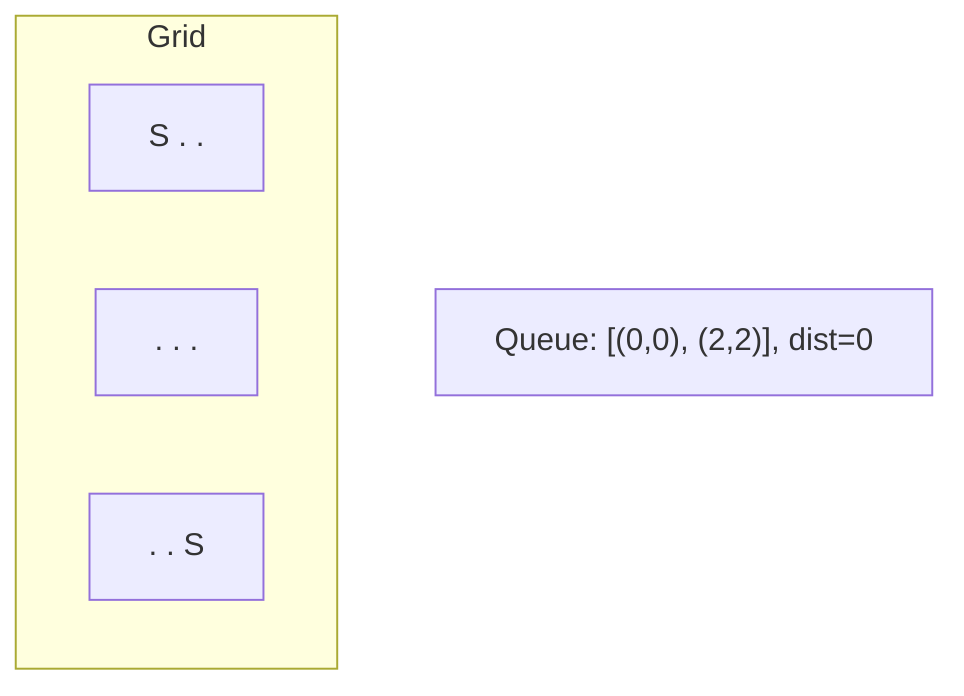
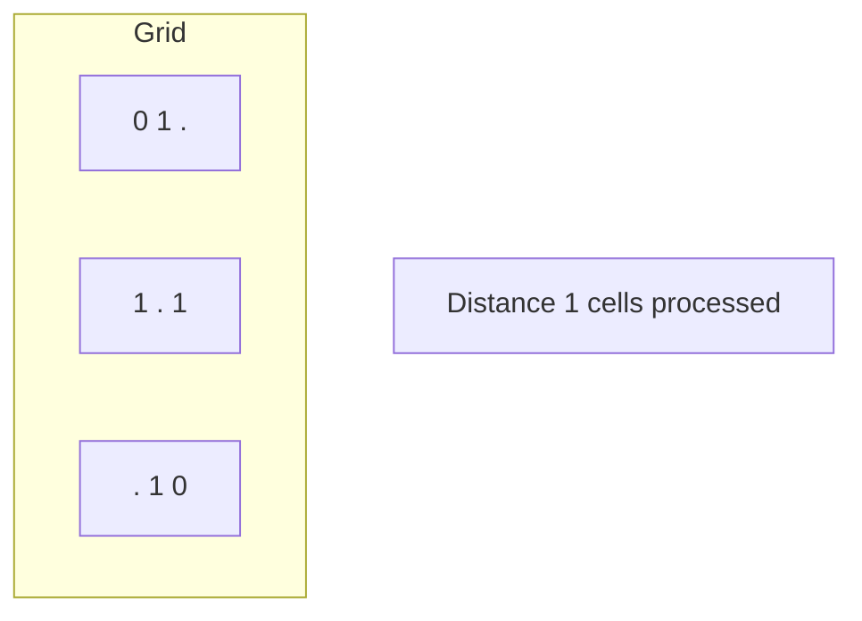
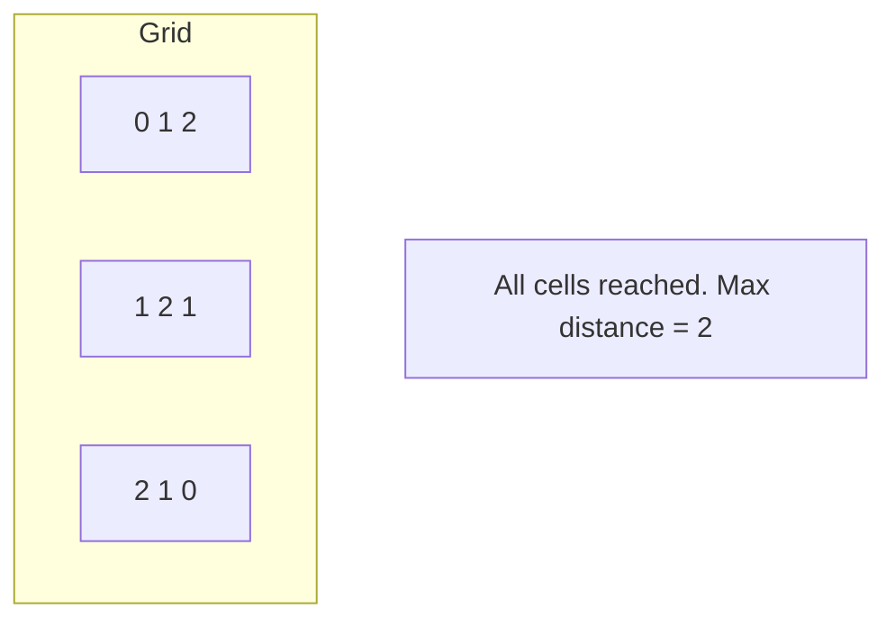

# Problem 1284: Minimum Number of Flips to Convert Binary Matrix to Zero Matrix

**Difficulty:** Hard  
**Tags:** Array, Hash Table, Bit Manipulation, Breadth-First Search, Matrix  
**Pattern:** BFS on Matrix / Grid  
**Link:** [leetcode.com/problems/minimum-number-of-flips-to-convert-binary-matrix-to-zero-matrix](https://leetcode.com/problems/minimum-number-of-flips-to-convert-binary-matrix-to-zero-matrix/)

## Description

Given a `m x n` binary matrix `mat`. In one step, you can choose one cell and flip it and all the four neighbors of it if they exist (Flip is changing `1` to `0` and `0` to `1`). A pair of cells are called neighbors if they share one edge.

Return the *minimum number of steps* required to convert `mat` to a zero matrix or `-1` if you cannot.

A **binary matrix** is a matrix with all cells equal to `0` or `1` only.

A **zero matrix** is a matrix with all cells equal to `0`.

 

Example 1:

```

**Input:** mat = [[0,0],[0,1]]
**Output:** 3
**Explanation:** One possible solution is to flip (1, 0) then (0, 1) and finally (1, 1) as shown.

```

Example 2:

```

**Input:** mat = [[0]]
**Output:** 0
**Explanation:** Given matrix is a zero matrix. We do not need to change it.

```

Example 3:

```

**Input:** mat = [[1,0,0],[1,0,0]]
**Output:** -1
**Explanation:** Given matrix cannot be a zero matrix.

```

 

**Constraints:**

	- `m == mat.length`
	- `n == mat[i].length`
	- `1 <= m, n <= 3`
	- `mat[i][j]` is either `0` or `1`.

## Approach: BFS on Matrix / Grid

Breadth-first search on the grid. Enqueue all starting cells, then expand level by level. BFS on grids finds shortest distance from source(s).

## Pseudocode

```
1. Enqueue all source cells, mark visited
2. distance = 0
3. While queue not empty:
   a. Process all cells at current distance
   b. For each cell, enqueue unvisited neighbors
   c. distance++
4. Return result
```

## Algorithm Flow



## Visual State Transitions

**Multi-source BFS on Grid:**

**Frame 1: Enqueue all sources**


**Frame 2: Expand distance 1**


**Frame 3: Expand distance 2**



## Complexity Analysis

- **Time:** O(m * n)
- **Space:** O(m * n)

## Solution (Python3)

```python
class Solution:
    def minFlips(self, mat: List[List[int]]) -> int:
        # BFS on grid - O(m*n) time
        from collections import deque
        if not mat:
            return 0
        rows, cols = len(mat), len(mat[0])
        queue = deque()
        visited = set()
        # Initialize BFS sources
        for r in range(rows):
            for c in range(cols):
                if mat[r][c] == 1 or mat[r][c] == '1':
                    queue.append((r, c, 0))
                    visited.add((r, c))
        steps = 0
        while queue:
            r, c, d = queue.popleft()
            steps = max(steps, d)
            for dr, dc in [(1,0),(-1,0),(0,1),(0,-1)]:
                nr, nc = r+dr, c+dc
                if 0 <= nr < rows and 0 <= nc < cols and (nr,nc) not in visited:
                    visited.add((nr, nc))
                    queue.append((nr, nc, d+1))
        return steps
```

## Solution (C++)

```cpp
#include <algorithm>
#include <queue>
#include <string>
#include <tuple>
#include <vector>
using namespace std;

class Solution {
public:
    int minFlips(vector<vector<int>>& mat) {
        // BFS on grid - O(m*n) time
        if (mat.empty()) return 0;
        int rows = mat.size(), cols = mat[0].size();
        queue<tuple<int,int,int>> q;
        vector<vector<bool>> visited(rows, vector<bool>(cols, false));
        int dirs[4][2] = {{1,0},{-1,0},{0,1},{0,-1}};
        for (int r = 0; r < rows; r++)
            for (int c = 0; c < cols; c++)
                if (mat[r][c] == 1) {
                    q.push({r, c, 0});
                    visited[r][c] = true;
                }
        int steps = 0;
        while (!q.empty()) {
            auto [r, c, d] = q.front(); q.pop();
            steps = max(steps, d);
            for (auto& dir : dirs) {
                int nr = r+dir[0], nc = c+dir[1];
                if (nr>=0 && nr<rows && nc>=0 && nc<cols && !visited[nr][nc]) {
                    visited[nr][nc] = true;
                    q.push({nr, nc, d+1});
                }
            }
        }
        return steps;
    }
};
```
