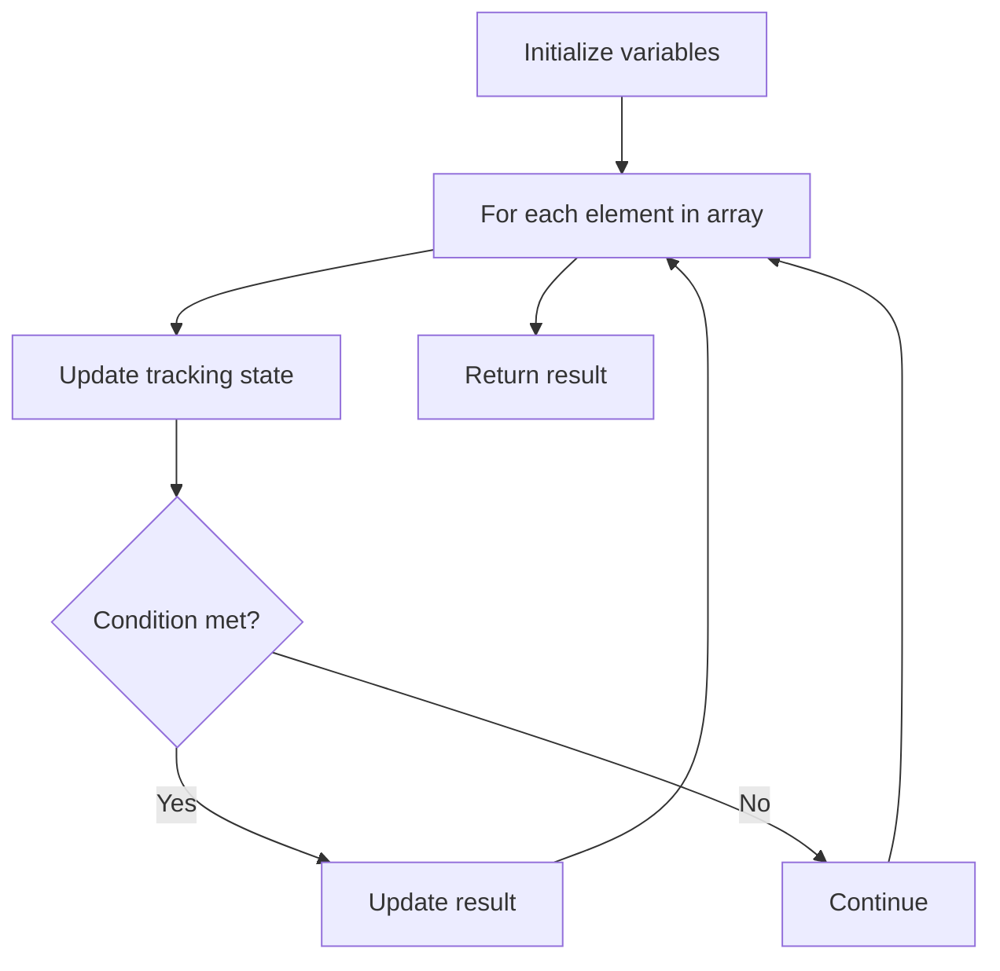

# Problem 1287: Element Appearing More Than 25% In Sorted Array

**Difficulty:** Easy  
**Tags:** Array  
**Pattern:** Array Processing  
**Link:** [leetcode.com/problems/element-appearing-more-than-25-in-sorted-array](https://leetcode.com/problems/element-appearing-more-than-25-in-sorted-array/)

## Description

Given an integer array **sorted** in non-decreasing order, there is exactly one integer in the array that occurs more than 25% of the time, return that integer.

 

Example 1:

```

**Input:** arr = [1,2,2,6,6,6,6,7,10]
**Output:** 6

```

Example 2:

```

**Input:** arr = [1,1]
**Output:** 1

```

 

**Constraints:**

	- `1 <= arr.length <= 10^4`
	- `0 <= arr[i] <= 10^5`

## Approach: Array Processing

Process the array with a linear scan, tracking state variables. Look for patterns: running maximum/minimum, counting, or transformations.

## Pseudocode

```
1. Initialize tracking variables
2. Iterate through array:
   a. Update tracking state
   b. Check conditions
   c. Update result
3. Return result
```

## Algorithm Flow



## Complexity Analysis

- **Time:** O(n)
- **Space:** O(1)

## Solution (Python3)

```python
class Solution:
    def findSpecialInteger(self, arr: List[int]) -> int:
        # Array processing - O(n) time
        result = 0
        for i in range(len(arr)):
            # Process element
            pass
        return result
```

## Solution (C++)

```cpp
#include <string>
#include <vector>
using namespace std;

class Solution {
public:
    int findSpecialInteger(vector<int>& arr) {
        // Array processing - O(n) time
        for (int i = 0; i < (int)arr.size(); i++) {
            // Process element
        }
        return 0;
    }
};
```
