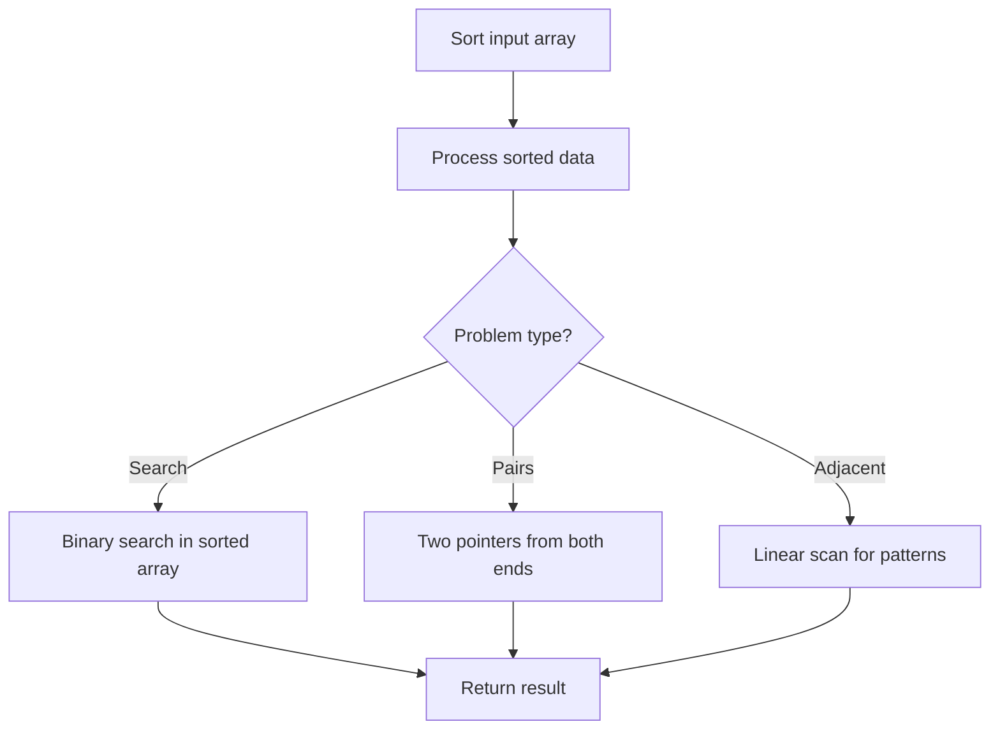

# Problem 1288: Remove Covered Intervals

**Difficulty:** Medium  
**Tags:** Array, Sorting  
**Pattern:** Sorting  
**Link:** [leetcode.com/problems/remove-covered-intervals](https://leetcode.com/problems/remove-covered-intervals/)

## Description

Given an array `intervals` where `intervals[i] = [li, ri]` represent the interval `[li, ri)`, remove all intervals that are covered by another interval in the list.

The interval `[a, b)` is covered by the interval `[c, d)` if and only if `c <= a` and `b <= d`.

Return *the number of remaining intervals*.

 

Example 1:

```

**Input:** intervals = [[1,4],[3,6],[2,8]]
**Output:** 2
**Explanation:** Interval [3,6] is covered by [2,8], therefore it is removed.

```

Example 2:

```

**Input:** intervals = [[1,4],[2,3]]
**Output:** 1

```

 

**Constraints:**

	- `1 <= intervals.length <= 1000`
	- `intervals[i].length == 2`
	- `0 <= li < ri <= 10^5`
	- All the given intervals are **unique**.

## Approach: Sorting

Sort the data to enable efficient processing. After sorting, use techniques like binary search, two pointers, or linear scan to solve the problem.

## Pseudocode

```
1. Sort the input array
2. Process sorted data:
   - Use binary search for lookups
   - Use two pointers for pair finding
   - Scan for adjacent patterns
3. Return result
```

## Algorithm Flow



## Complexity Analysis

- **Time:** O(n log n)
- **Space:** O(n)

## Solution (Python3)

```python
class Solution:
    def removeCoveredIntervals(self, intervals: List[List[int]]) -> int:
        # Sort-based approach - O(n log n) time
        intervals.sort(key=lambda x: x[0] if isinstance(x, (list, tuple)) else x)
        result = [intervals[0]]
        for i in range(1, len(intervals)):
            curr = intervals[i]
            if isinstance(curr, (list, tuple)) and isinstance(result[-1], (list, tuple)):
                if curr[0] <= result[-1][1]:
                    result[-1] = [result[-1][0], max(result[-1][1], curr[1])]
                else:
                    result.append(curr)
            else:
                result.append(curr)
        return result
```

## Solution (C++)

```cpp
#include <algorithm>
#include <string>
#include <vector>
using namespace std;

class Solution {
public:
    int removeCoveredIntervals(vector<vector<int>>& intervals) {
        // Sort-based approach - O(n log n) time
        sort(intervals.begin(), intervals.end());
        vector<vector<int>> result;
        result.push_back(intervals[0]);
        for (int i = 1; i < (int)intervals.size(); i++) {
            if (intervals[i][0] <= result.back()[1]) {
                result.back()[1] = max(result.back()[1], intervals[i][1]);
            } else {
                result.push_back(intervals[i]);
            }
        }
        return result;
    }
};
```
