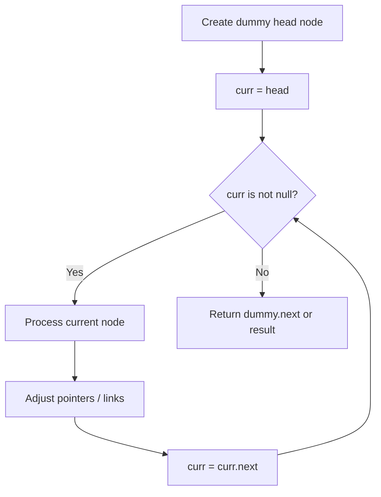
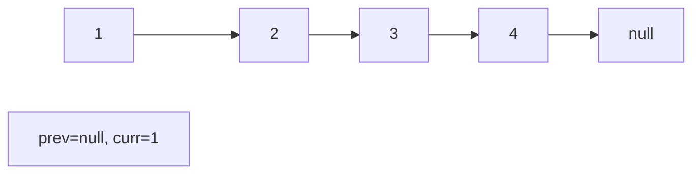
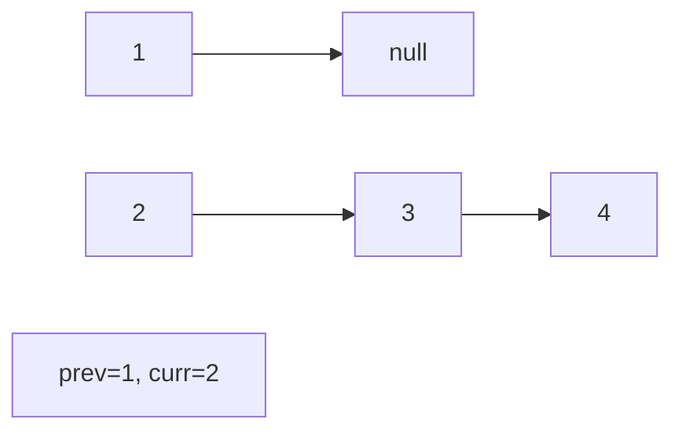
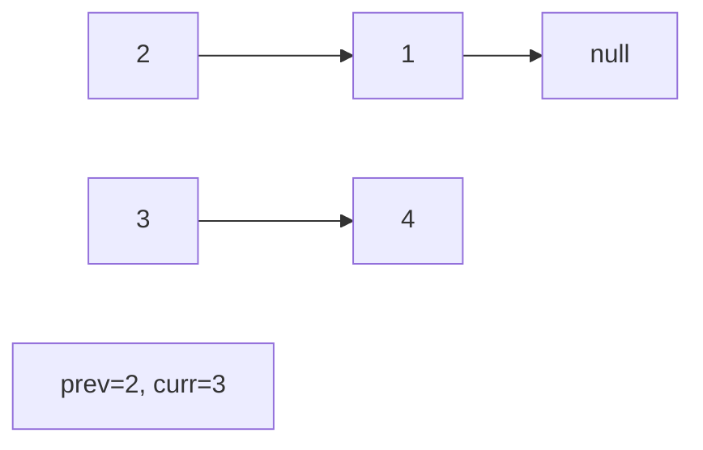
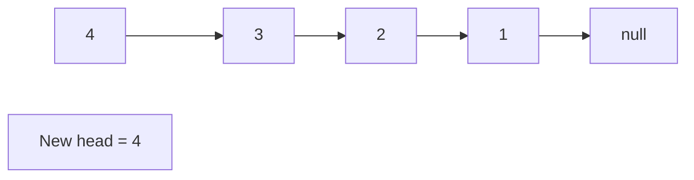

# Problem 1290: Convert Binary Number in a Linked List to Integer

**Difficulty:** Easy  
**Tags:** Linked List, Math  
**Pattern:** Linked List  
**Link:** [leetcode.com/problems/convert-binary-number-in-a-linked-list-to-integer](https://leetcode.com/problems/convert-binary-number-in-a-linked-list-to-integer/)

## Description

Given `head` which is a reference node to a singly-linked list. The value of each node in the linked list is either `0` or `1`. The linked list holds the binary representation of a number.

Return the *decimal value* of the number in the linked list.

The **most significant bit** is at the head of the linked list.

 

Example 1:

```

**Input:** head = [1,0,1]
**Output:** 5
**Explanation:** (101) in base 2 = (5) in base 10

```

Example 2:

```

**Input:** head = [0]
**Output:** 0

```

 

**Constraints:**

	- The Linked List is not empty.
	- Number of nodes will not exceed `30`.
	- Each node's value is either `0` or `1`.

## Approach: Linked List

Traverse or manipulate the linked list using pointer techniques. Common patterns: dummy head node for edge cases, fast/slow pointers for cycle detection or middle finding, in-place reversal, and merge operations.

## Pseudocode

```
1. Create dummy head if needed
2. Initialize pointer(s) at head
3. Traverse / modify list:
   a. Process current node
   b. Adjust next pointers as needed
   c. Move to next node
4. Return dummy.next or result
```

## Algorithm Flow



## Visual State Transitions

**Linked List Operation (Reverse):**

**Frame 1: Initial list**


**Frame 2: Reverse first link**


**Frame 3: Reverse second link**


**Frame 4: Fully reversed**



## Complexity Analysis

- **Time:** O(n)
- **Space:** O(1)

## Solution (Python3)

```python
class Solution:
    def getDecimalValue(self, head: Optional[ListNode]) -> int:
        # Linked list traversal/manipulation
        dummy = ListNode(0)
        dummy.next = head
        prev, curr = dummy, head
        while curr:
            nxt = curr.next
            # Process current node
            prev = curr
            curr = nxt
        return dummy.next
```

## Solution (C++)

```cpp
#include <string>
#include <vector>
using namespace std;

class Solution {
public:
    int getDecimalValue(ListNode* head) {
        // Linked list traversal/manipulation
        ListNode dummy(0);
        dummy.next = head;
        ListNode* prev = &dummy;
        ListNode* curr = head;
        while (curr) {
            ListNode* nxt = curr->next;
            // Process current node
            prev = curr;
            curr = nxt;
        }
        return dummy.next;
    }
};
```
