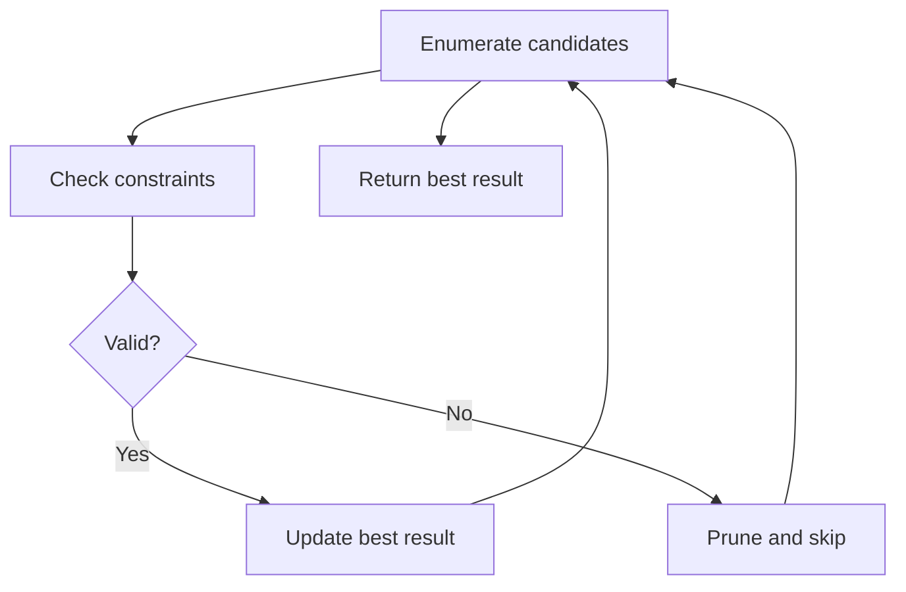

# Problem 1291: Sequential Digits

**Difficulty:** Medium  
**Tags:** Enumeration  
**Pattern:** Enumeration  
**Link:** [leetcode.com/problems/sequential-digits](https://leetcode.com/problems/sequential-digits/)

## Description

An integer has *sequential digits* if and only if each digit in the number is one more than the previous digit.

Return a **sorted** list of all the integers in the range `[low, high]` inclusive that have sequential digits.

 

Example 1:

```
**Input:** low = 100, high = 300
**Output:** [123,234]

```
Example 2:

```
**Input:** low = 1000, high = 13000
**Output:** [1234,2345,3456,4567,5678,6789,12345]

```

 

**Constraints:**

	- `10 <= low <= high <= 10^9`

## Approach: Enumeration

Enumerate all possible candidates or subsets and check each one. Apply pruning to skip invalid branches early.

## Pseudocode

```
1. For each candidate / subset:
   a. Check if it satisfies constraints
   b. If valid: update best result
   c. Prune impossible branches
2. Return best result
```

## Algorithm Flow



## Complexity Analysis

- **Time:** O(n^2) or O(2^n)
- **Space:** O(n)

## Solution (Python3)

```python
class Solution:
    def sequentialDigits(self, low: int, high: int) -> List[int]:
        # Enumeration approach - try all valid candidates
        result = []
        for i in range(len(low) if isinstance(low, list) else low):
            # Check if candidate i is valid
            valid = True
            if valid:
                result = i
                break
        return result
```

## Solution (C++)

```cpp
#include <string>
#include <vector>
using namespace std;

class Solution {
public:
    vector<int> sequentialDigits(int low, int high) {
        // Enumeration approach
        int n = low.size();
        for (int i = 0; i < n; i++) {
            // Check if candidate is valid
            bool valid = true;
            if (valid) return i;
        }
        return {};
    }
};
```
