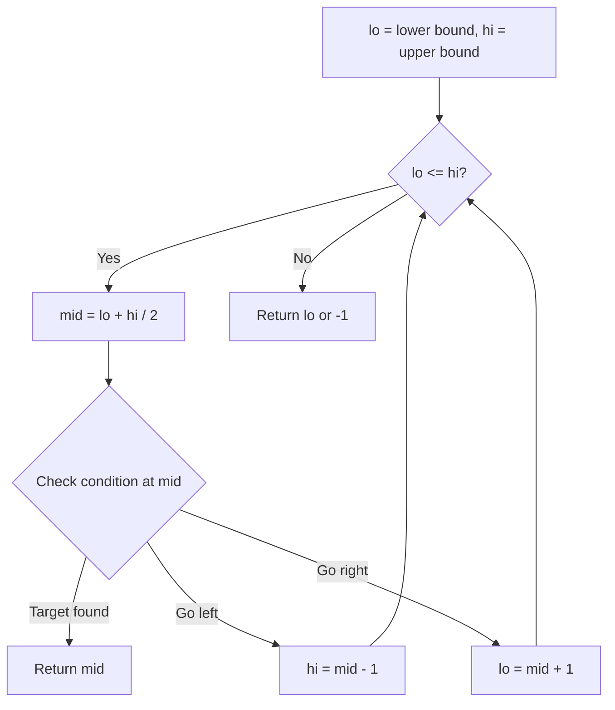
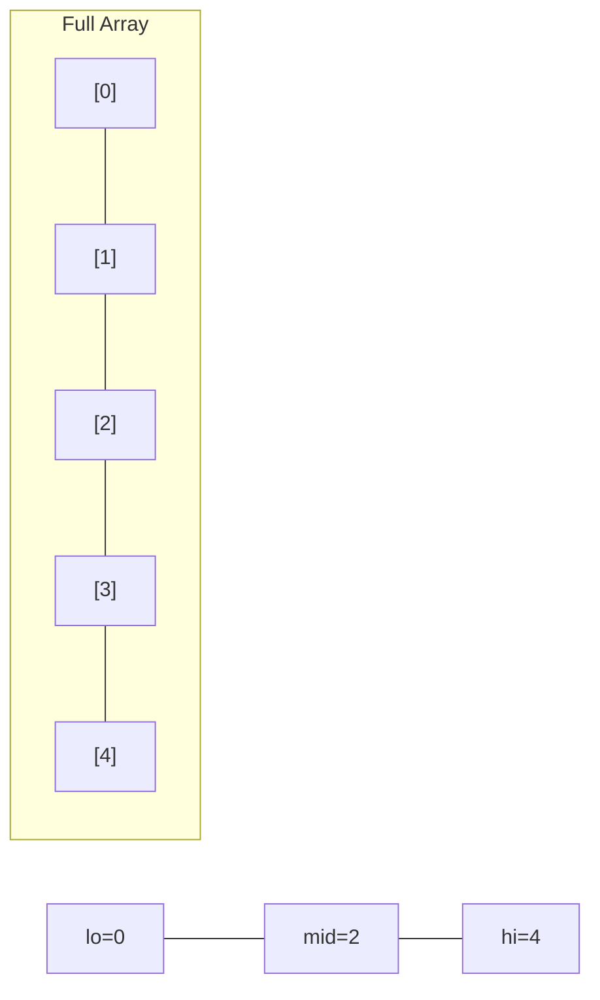
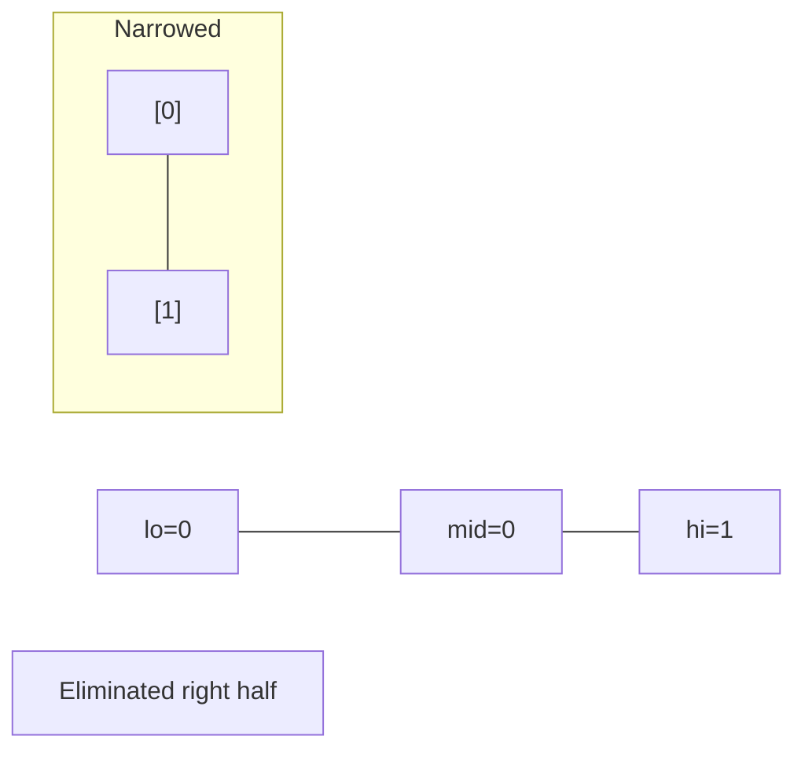
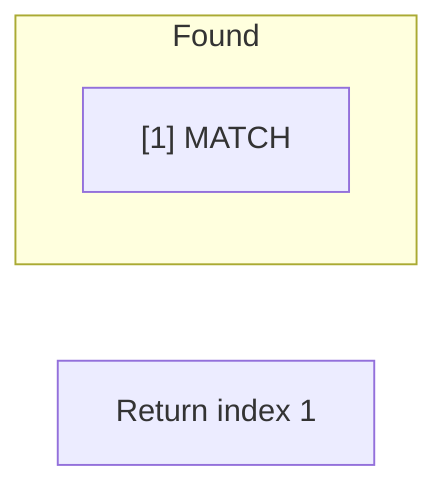

# Problem 1292: Maximum Side Length of a Square with Sum Less than or Equal to Threshold

**Difficulty:** Medium  
**Tags:** Array, Binary Search, Matrix, Prefix Sum  
**Pattern:** Binary Search  
**Link:** [leetcode.com/problems/maximum-side-length-of-a-square-with-sum-less-than-or-equal-to-threshold](https://leetcode.com/problems/maximum-side-length-of-a-square-with-sum-less-than-or-equal-to-threshold/)

## Description

Given a `m x n` matrix `mat` and an integer `threshold`, return *the maximum side-length of a square with a sum less than or equal to *`threshold`* or return *`0`* if there is no such square*.

 

Example 1:

```

**Input:** mat = [[1,1,3,2,4,3,2],[1,1,3,2,4,3,2],[1,1,3,2,4,3,2]], threshold = 4
**Output:** 2
**Explanation:** The maximum side length of square with sum less than or equal to 4 is 2 as shown.

```

Example 2:

```

**Input:** mat = [[2,2,2,2,2],[2,2,2,2,2],[2,2,2,2,2],[2,2,2,2,2],[2,2,2,2,2]], threshold = 1
**Output:** 0

```

 

**Constraints:**

	- `m == mat.length`
	- `n == mat[i].length`
	- `1 <= m, n <= 300`
	- `0 <= mat[i][j] <= 10^4`
	- `0 <= threshold <= 10^5`

## Approach: Binary Search

Use binary search to halve the search space each iteration. Define the search range [lo, hi], compute mid, and decide which half to keep based on the problem's monotonic condition.

## Pseudocode

```
1. lo = lower_bound, hi = upper_bound
2. While lo <= hi (or lo < hi):
   a. mid = (lo + hi) // 2
   b. If condition(mid) is satisfied: record answer, search left half
   c. Else: search right half
3. Return answer
```

## Algorithm Flow



## Visual State Transitions

**Binary Search Step-by-Step:**

**Frame 1: Initial search space**


**Frame 2: Compare mid, narrow search**


**Frame 3: Found target**



## Complexity Analysis

- **Time:** O(log n)
- **Space:** O(1)

## Solution (Python3)

```python
class Solution:
    def maxSideLength(self, mat: List[List[int]], threshold: int) -> int:
        # Binary search - O(log n) time, O(1) space
        lo, hi = 0, len(mat) - 1
        while lo <= hi:
            mid = lo + (hi - lo) // 2
            if mat[mid] == threshold:
                return mid
            elif mat[mid] < threshold:
                lo = mid + 1
            else:
                hi = mid - 1
        return 0
```

## Solution (C++)

```cpp
#include <string>
#include <vector>
using namespace std;

class Solution {
public:
    int maxSideLength(vector<vector<int>>& mat, int threshold) {
        // Binary search - O(log n) time, O(1) space
        int lo = 0, hi = mat.size() - 1;
        while (lo <= hi) {
            int mid = lo + (hi - lo) / 2;
            if (mat[mid] == threshold) {
                return mid;
            } else if (mat[mid] < threshold) {
                lo = mid + 1;
            } else {
                hi = mid - 1;
            }
        }
        return 0;
    }
};
```
