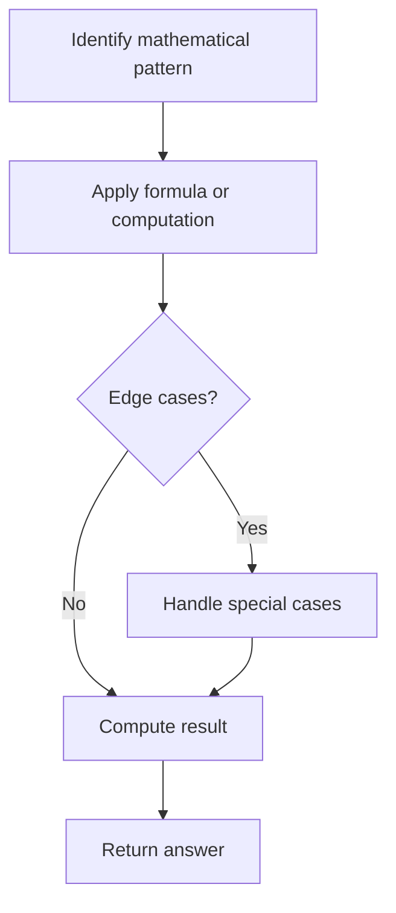

# Problem 1295: Find Numbers with Even Number of Digits

**Difficulty:** Easy  
**Tags:** Array, Math  
**Pattern:** Math  
**Link:** [leetcode.com/problems/find-numbers-with-even-number-of-digits](https://leetcode.com/problems/find-numbers-with-even-number-of-digits/)

## Description

Given an array `nums` of integers, return how many of them contain an **even number** of digits.

 

Example 1:

```

**Input:** nums = [12,345,2,6,7896]
**Output:** 2
Explanation: 
12 contains 2 digits (even number of digits). 
345 contains 3 digits (odd number of digits). 
2 contains 1 digit (odd number of digits). 
6 contains 1 digit (odd number of digits). 
7896 contains 4 digits (even number of digits). 
Therefore only 12 and 7896 contain an even number of digits.

```

Example 2:

```

**Input:** nums = [555,901,482,1771]
**Output:** 1 
**Explanation: **
Only 1771 contains an even number of digits.

```

 

**Constraints:**

	- `1 <= nums.length <= 500`
	- `1 <= nums[i] <= 10^5`

## Approach: Math

Apply mathematical properties, formulas, or number-theoretic concepts. Look for patterns, modular arithmetic, or closed-form solutions.

## Pseudocode

```
1. Identify the mathematical pattern or formula
2. Apply computation:
   - Modular arithmetic for large numbers
   - GCD/LCM for divisibility
   - Sieve for primes
3. Handle edge cases
4. Return result
```

## Algorithm Flow



## Complexity Analysis

- **Time:** O(n) or O(sqrt(n))
- **Space:** O(1)

## Solution (Python3)

```python
class Solution:
    def findNumbers(self, nums: List[int]) -> int:
        # Mathematical approach
        result = 0
        x = nums
        while x != 0:
            result = result * 10 + x % 10
            x //= 10 if isinstance(x, int) else 1
        return result
```

## Solution (C++)

```cpp
#include <string>
#include <vector>
using namespace std;

class Solution {
public:
    int findNumbers(vector<int>& nums) {
        // Mathematical approach
        long long result = 0;
        int x = nums;
        while (x != 0) {
            result = result * 10 + x % 10;
            x /= 10;
        }
        return (int)result;
    }
};
```
