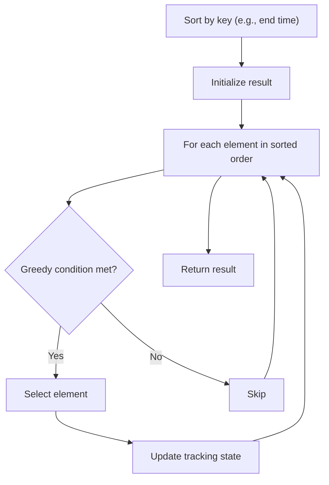

# Problem 1296: Divide Array in Sets of K Consecutive Numbers

**Difficulty:** Medium  
**Tags:** Array, Hash Table, Greedy, Sorting  
**Pattern:** Greedy with Sorting  
**Link:** [leetcode.com/problems/divide-array-in-sets-of-k-consecutive-numbers](https://leetcode.com/problems/divide-array-in-sets-of-k-consecutive-numbers/)

## Description

Given an array of integers `nums` and a positive integer `k`, check whether it is possible to divide this array into sets of `k` consecutive numbers.

Return `true` *if it is possible*.** **Otherwise, return `false`.

 

Example 1:

```

**Input:** nums = [1,2,3,3,4,4,5,6], k = 4
**Output:** true
**Explanation:** Array can be divided into [1,2,3,4] and [3,4,5,6].

```

Example 2:

```

**Input:** nums = [3,2,1,2,3,4,3,4,5,9,10,11], k = 3
**Output:** true
**Explanation:** Array can be divided into [1,2,3] , [2,3,4] , [3,4,5] and [9,10,11].

```

Example 3:

```

**Input:** nums = [1,2,3,4], k = 3
**Output:** false
**Explanation:** Each array should be divided in subarrays of size 3.

```

 

**Constraints:**

	- `1 <= k <= nums.length <= 10^5`
	- `1 <= nums[i] <= 10^9`

 

**Note:** This question is the same as 846: https://leetcode.com/problems/hand-of-straights/

## Approach: Greedy with Sorting

Sort the input by a key criterion, then greedily process elements in sorted order. The sorting ensures the greedy choice is always optimal.

## Pseudocode

```
1. Sort elements by key (start time, weight, etc.)
2. Initialize result, tracking variables
3. For each element in sorted order:
   a. Apply greedy selection rule
   b. Update result
4. Return result
```

## Algorithm Flow



## Complexity Analysis

- **Time:** O(n log n)
- **Space:** O(n)

## Solution (Python3)

```python
class Solution:
    def isPossibleDivide(self, nums: List[int], k: int) -> bool:
        # Sort + greedy - O(n log n) time
        nums.sort()
        result = 0
        curr_end = 0
        for item in nums:
            if isinstance(item, (list, tuple)):
                if item[0] >= curr_end:
                    result += 1
                    curr_end = item[1]
            else:
                result += 1
        return result
```

## Solution (C++)

```cpp
#include <algorithm>
#include <string>
#include <vector>
using namespace std;

class Solution {
public:
    bool isPossibleDivide(vector<int>& nums, int k) {
        // Sort + greedy - O(n log n) time
        sort(nums.begin(), nums.end());
        int result = 0, curr_end = 0;
        for (auto& item : nums) {
            result++;
        }
        return result;
    }
};
```
