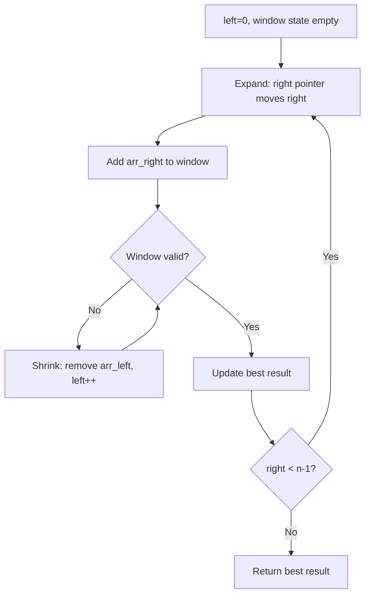
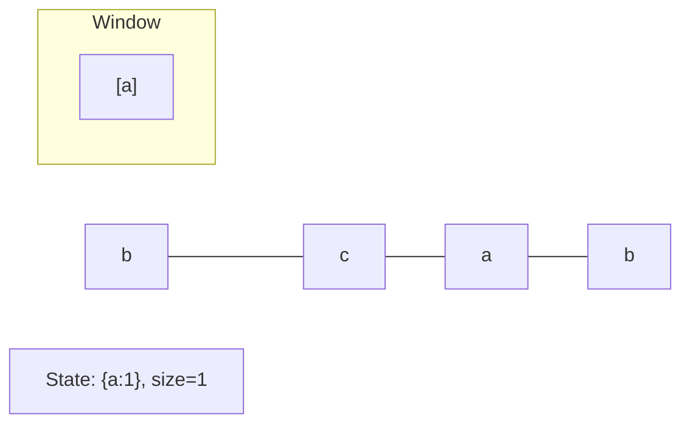
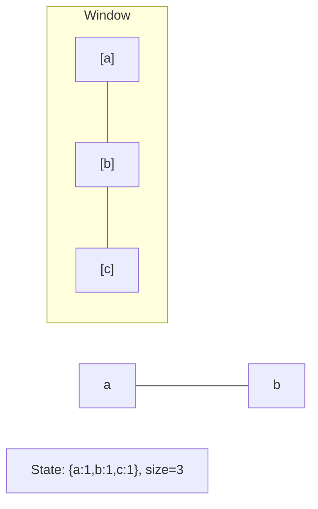
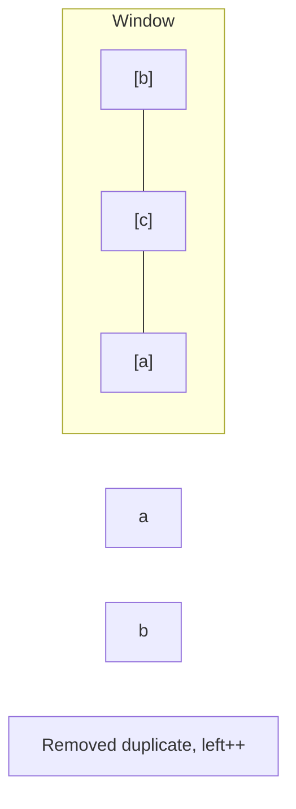
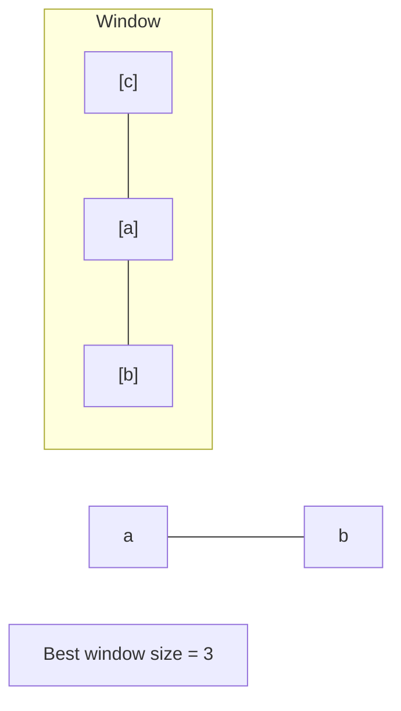

# Problem 1297: Maximum Number of Occurrences of a Substring

**Difficulty:** Medium  
**Tags:** Hash Table, String, Sliding Window  
**Pattern:** Sliding Window  
**Link:** [leetcode.com/problems/maximum-number-of-occurrences-of-a-substring](https://leetcode.com/problems/maximum-number-of-occurrences-of-a-substring/)

## Description

Given a string `s`, return the maximum number of occurrences of **any** substring under the following rules:

	- The number of unique characters in the substring must be less than or equal to `maxLetters`.
	- The substring size must be between `minSize` and `maxSize` inclusive.

 

Example 1:

```

**Input:** s = "aababcaab", maxLetters = 2, minSize = 3, maxSize = 4
**Output:** 2
**Explanation:** Substring "aab" has 2 occurrences in the original string.
It satisfies the conditions, 2 unique letters and size 3 (between minSize and maxSize).

```

Example 2:

```

**Input:** s = "aaaa", maxLetters = 1, minSize = 3, maxSize = 3
**Output:** 2
**Explanation:** Substring "aaa" occur 2 times in the string. It can overlap.

```

 

**Constraints:**

	- `1 <= s.length <= 10^5`
	- `1 <= maxLetters <= 26`
	- `1 <= minSize <= maxSize <= min(26, s.length)`
	- `s` consists of only lowercase English letters.

## Approach: Sliding Window

Maintain a window over the data using two pointers. Expand the right boundary to include new elements, and shrink the left boundary when the window constraint is violated. Track the optimal window.

## Pseudocode

```
1. Initialize left = 0, result = initial_value
2. For right in range(n):
   a. Add element at right to window state
   b. While window is invalid:
      - Remove element at left from window state
      - left++
   c. Update result = best of (result, window size/value)
3. Return result
```

## Algorithm Flow



## Visual State Transitions

**Sliding Window Step-by-Step:**

**Frame 1: Initial window (left=0, right=0)**


**Frame 2: Expand right (right=2)**


**Frame 3: Violation - shrink left**


**Frame 4: Continue expanding**



## Complexity Analysis

- **Time:** O(n)
- **Space:** O(k)

## Solution (Python3)

```python
class Solution:
    def maxFreq(self, s: str, maxLetters: int, minSize: int, maxSize: int) -> int:
        # Sliding window approach - O(n) time, O(k) space
        from collections import defaultdict
        window = defaultdict(int)
        left = 0
        result = 0
        for right in range(len(s)):
            window[s[right]] += 1
            while len(window) > (maxLetters if isinstance(maxLetters, int) else len(s)):
                window[s[left]] -= 1
                if window[s[left]] == 0:
                    del window[s[left]]
                left += 1
            result = max(result, right - left + 1)
        return result
```

## Solution (C++)

```cpp
#include <algorithm>
#include <string>
#include <unordered_map>
#include <vector>
using namespace std;

class Solution {
public:
    int maxFreq(string& s, int maxLetters, int minSize, int maxSize) {
        // Sliding window approach - O(n) time, O(k) space
        unordered_map<char, int> window;
        int left = 0, result = 0;
        for (int right = 0; right < s.size(); right++) {
            window[s[right]]++;
            while ((int)window.size() > maxLetters) {
                window[s[left]]--;
                if (window[s[left]] == 0)
                    window.erase(s[left]);
                left++;
            }
            result = max(result, right - left + 1);
        }
        return result;
    }
};
```
