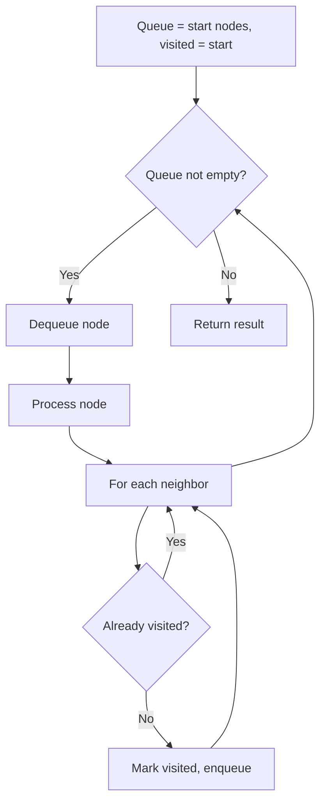
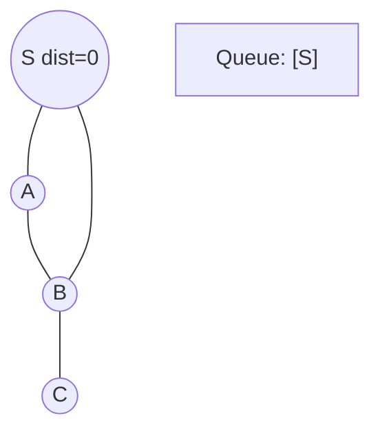
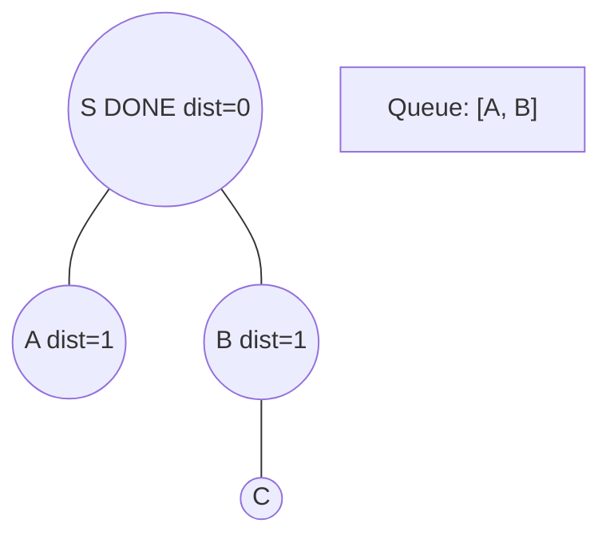
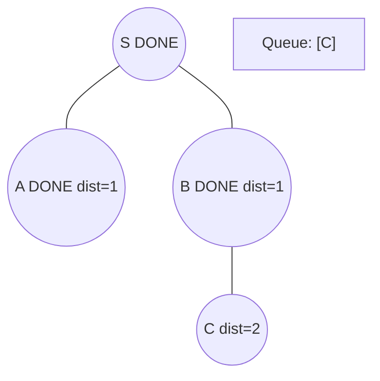
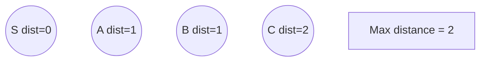

# Problem 1298: Maximum Candies You Can Get from Boxes

**Difficulty:** Hard  
**Tags:** Array, Breadth-First Search, Graph Theory  
**Pattern:** BFS Graph Traversal  
**Link:** [leetcode.com/problems/maximum-candies-you-can-get-from-boxes](https://leetcode.com/problems/maximum-candies-you-can-get-from-boxes/)

## Description

You have `n` boxes labeled from `0` to `n - 1`. You are given four arrays: `status`, `candies`, `keys`, and `containedBoxes` where:

	- `status[i]` is `1` if the `i^th` box is open and `0` if the `i^th` box is closed,
	- `candies[i]` is the number of candies in the `i^th` box,
	- `keys[i]` is a list of the labels of the boxes you can open after opening the `i^th` box.
	- `containedBoxes[i]` is a list of the boxes you found inside the `i^th` box.

You are given an integer array `initialBoxes` that contains the labels of the boxes you initially have. You can take all the candies in **any open box** and you can use the keys in it to open new boxes and you also can use the boxes you find in it.

Return *the maximum number of candies you can get following the rules above*.

 

Example 1:

```

**Input:** status = [1,0,1,0], candies = [7,5,4,100], keys = [[],[],[1],[]], containedBoxes = [[1,2],[3],[],[]], initialBoxes = [0]
**Output:** 16
**Explanation:** You will be initially given box 0. You will find 7 candies in it and boxes 1 and 2.
Box 1 is closed and you do not have a key for it so you will open box 2. You will find 4 candies and a key to box 1 in box 2.
In box 1, you will find 5 candies and box 3 but you will not find a key to box 3 so box 3 will remain closed.
Total number of candies collected = 7 + 4 + 5 = 16 candy.

```

Example 2:

```

**Input:** status = [1,0,0,0,0,0], candies = [1,1,1,1,1,1], keys = [[1,2,3,4,5],[],[],[],[],[]], containedBoxes = [[1,2,3,4,5],[],[],[],[],[]], initialBoxes = [0]
**Output:** 6
**Explanation:** You have initially box 0. Opening it you can find boxes 1,2,3,4 and 5 and their keys.
The total number of candies will be 6.

```

 

**Constraints:**

	- `n == status.length == candies.length == keys.length == containedBoxes.length`
	- `1 <= n <= 1000`
	- `status[i]` is either `0` or `1`.
	- `1 <= candies[i] <= 1000`
	- `0 <= keys[i].length <= n`
	- `0 <= keys[i][j] < n`
	- All values of `keys[i]` are **unique**.
	- `0 <= containedBoxes[i].length <= n`
	- `0 <= containedBoxes[i][j] < n`
	- All values of `containedBoxes[i]` are unique.
	- Each box is contained in one box at most.
	- `0 <= initialBoxes.length <= n`
	- `0 <= initialBoxes[i] < n`

## Approach: BFS Graph Traversal

Explore the graph breadth-first using a queue. Process nodes level by level; BFS finds shortest paths in unweighted graphs.

## Pseudocode

```
1. Initialize queue with start node(s), visited set
2. While queue not empty:
   a. Dequeue node
   b. Process node
   c. For each unvisited neighbor:
      - Mark visited, enqueue
3. Return result
```

## Algorithm Flow



## Visual State Transitions

**BFS Level-by-Level Traversal:**

**Frame 1: Start BFS from source**


**Frame 2: Process level 0, enqueue neighbors**


**Frame 3: Process level 1**


**Frame 4: All nodes reached**



## Complexity Analysis

- **Time:** O(V + E)
- **Space:** O(V)

## Solution (Python3)

```python
class Solution:
    def maxCandies(self, status: List[int], candies: List[int], keys: List[List[int]], containedBoxes: List[List[int]], initialBoxes: List[int]) -> int:
        # BFS on graph - O(V+E) time
        from collections import deque
        if not status:
            return 0
        visited = set()
        queue = deque([0])
        visited.add(0)
        dist = 0
        while queue:
            for _ in range(len(queue)):
                node = queue.popleft()
                # Process node
            dist += 1
        return dist
```

## Solution (C++)

```cpp
#include <queue>
#include <string>
#include <unordered_set>
#include <vector>
using namespace std;

class Solution {
public:
    int maxCandies(vector<int>& status, vector<int>& candies, vector<vector<int>>& keys, vector<vector<int>>& containedBoxes, vector<int>& initialBoxes) {
        // BFS on graph - O(V+E) time
        if (status.empty()) return 0;
        queue<int> q;
        unordered_set<int> visited;
        q.push(0);
        visited.insert(0);
        int dist = 0;
        while (!q.empty()) {
            int sz = q.size();
            for (int i = 0; i < sz; i++) {
                int node = q.front(); q.pop();
                // Process node
            }
            dist++;
        }
        return dist;
    }
};
```
