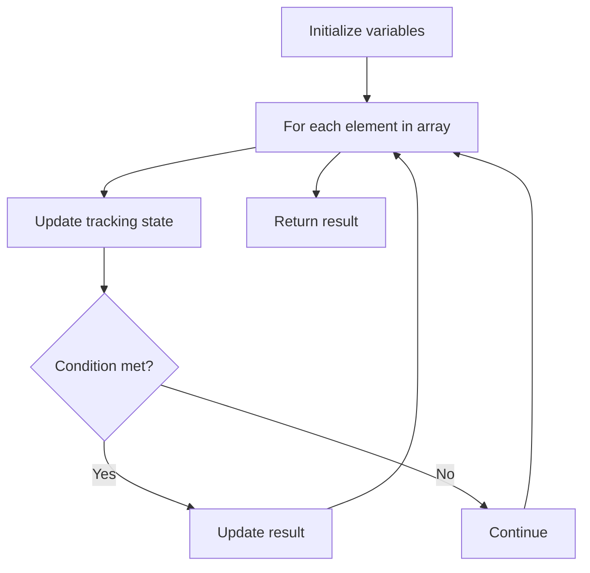

# Problem 1299: Replace Elements with Greatest Element on Right Side

**Difficulty:** Easy  
**Tags:** Array  
**Pattern:** Array Processing  
**Link:** [leetcode.com/problems/replace-elements-with-greatest-element-on-right-side](https://leetcode.com/problems/replace-elements-with-greatest-element-on-right-side/)

## Description

Given an array `arr`, replace every element in that array with the greatest element among the elements to its right, and replace the last element with `-1`.

After doing so, return the array.

 

Example 1:

```

**Input:** arr = [17,18,5,4,6,1]
**Output:** [18,6,6,6,1,-1]
**Explanation:** 
- index 0 --> the greatest element to the right of index 0 is index 1 (18).
- index 1 --> the greatest element to the right of index 1 is index 4 (6).
- index 2 --> the greatest element to the right of index 2 is index 4 (6).
- index 3 --> the greatest element to the right of index 3 is index 4 (6).
- index 4 --> the greatest element to the right of index 4 is index 5 (1).
- index 5 --> there are no elements to the right of index 5, so we put -1.

```

Example 2:

```

**Input:** arr = [400]
**Output:** [-1]
**Explanation:** There are no elements to the right of index 0.

```

 

**Constraints:**

	- `1 <= arr.length <= 10^4`
	- `1 <= arr[i] <= 10^5`

## Approach: Array Processing

Process the array with a linear scan, tracking state variables. Look for patterns: running maximum/minimum, counting, or transformations.

## Pseudocode

```
1. Initialize tracking variables
2. Iterate through array:
   a. Update tracking state
   b. Check conditions
   c. Update result
3. Return result
```

## Algorithm Flow



## Complexity Analysis

- **Time:** O(n)
- **Space:** O(1)

## Solution (Python3)

```python
class Solution:
    def replaceElements(self, arr: List[int]) -> List[int]:
        # Array processing - O(n) time
        result = []
        for i in range(len(arr)):
            # Process element
            pass
        return result
```

## Solution (C++)

```cpp
#include <string>
#include <vector>
using namespace std;

class Solution {
public:
    vector<int> replaceElements(vector<int>& arr) {
        // Array processing - O(n) time
        for (int i = 0; i < (int)arr.size(); i++) {
            // Process element
        }
        return {};
    }
};
```
