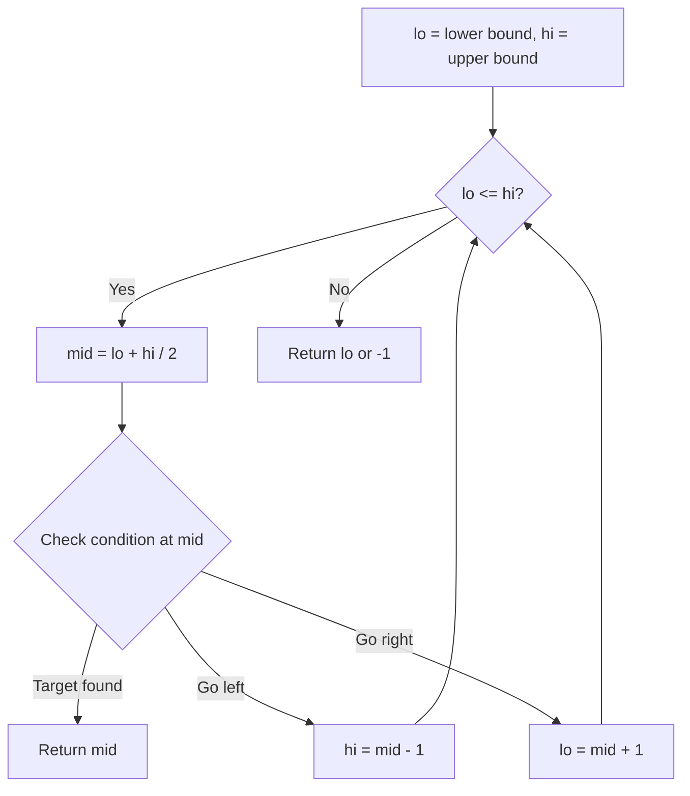
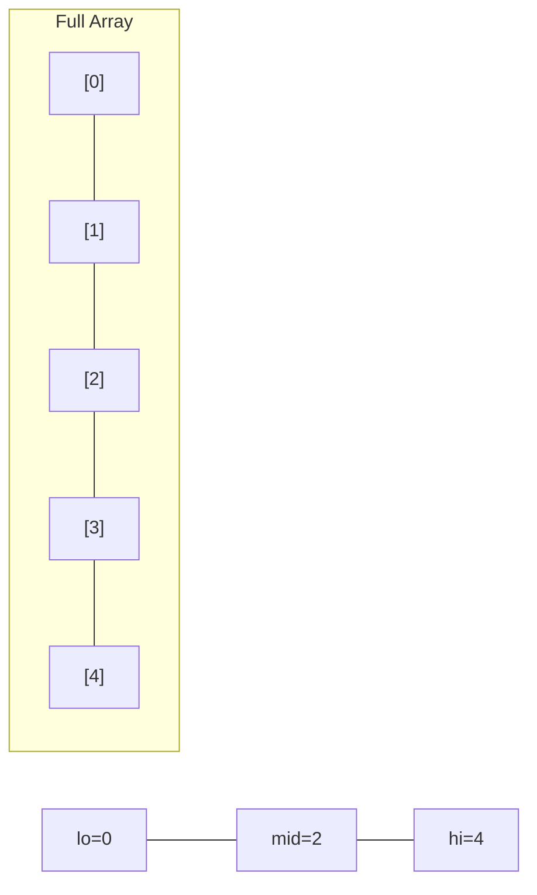
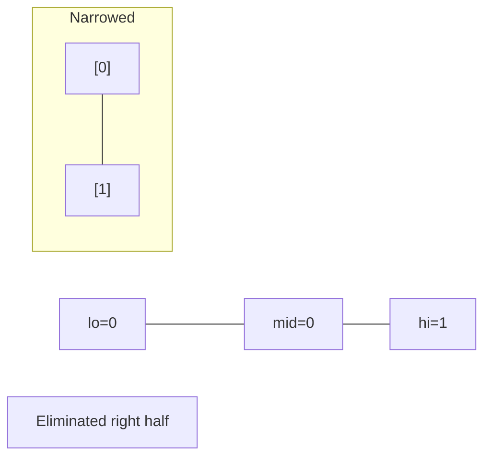
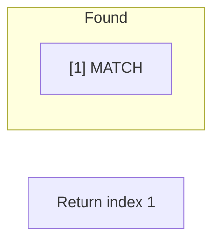

# Problem 1300: Sum of Mutated Array Closest to Target

**Difficulty:** Medium  
**Tags:** Array, Binary Search, Sorting  
**Pattern:** Binary Search  
**Link:** [leetcode.com/problems/sum-of-mutated-array-closest-to-target](https://leetcode.com/problems/sum-of-mutated-array-closest-to-target/)

## Description

Given an integer array `arr` and a target value `target`, return the integer `value` such that when we change all the integers larger than `value` in the given array to be equal to `value`, the sum of the array gets as close as possible (in absolute difference) to `target`.

In case of a tie, return the minimum such integer.

Notice that the answer is not neccesarilly a number from `arr`.

 

Example 1:

```

**Input:** arr = [4,9,3], target = 10
**Output:** 3
**Explanation:** When using 3 arr converts to [3, 3, 3] which sums 9 and that's the optimal answer.

```

Example 2:

```

**Input:** arr = [2,3,5], target = 10
**Output:** 5

```

Example 3:

```

**Input:** arr = [60864,25176,27249,21296,20204], target = 56803
**Output:** 11361

```

 

**Constraints:**

	- `1 <= arr.length <= 10^4`
	- `1 <= arr[i], target <= 10^5`

## Approach: Binary Search

Use binary search to halve the search space each iteration. Define the search range [lo, hi], compute mid, and decide which half to keep based on the problem's monotonic condition.

## Pseudocode

```
1. lo = lower_bound, hi = upper_bound
2. While lo <= hi (or lo < hi):
   a. mid = (lo + hi) // 2
   b. If condition(mid) is satisfied: record answer, search left half
   c. Else: search right half
3. Return answer
```

## Algorithm Flow



## Visual State Transitions

**Binary Search Step-by-Step:**

**Frame 1: Initial search space**


**Frame 2: Compare mid, narrow search**


**Frame 3: Found target**



## Complexity Analysis

- **Time:** O(log n)
- **Space:** O(1)

## Solution (Python3)

```python
class Solution:
    def findBestValue(self, arr: List[int], target: int) -> int:
        # Binary search - O(log n) time, O(1) space
        lo, hi = 0, len(arr) - 1
        while lo <= hi:
            mid = lo + (hi - lo) // 2
            if arr[mid] == target:
                return mid
            elif arr[mid] < target:
                lo = mid + 1
            else:
                hi = mid - 1
        return 0
```

## Solution (C++)

```cpp
#include <string>
#include <vector>
using namespace std;

class Solution {
public:
    int findBestValue(vector<int>& arr, int target) {
        // Binary search - O(log n) time, O(1) space
        int lo = 0, hi = arr.size() - 1;
        while (lo <= hi) {
            int mid = lo + (hi - lo) / 2;
            if (arr[mid] == target) {
                return mid;
            } else if (arr[mid] < target) {
                lo = mid + 1;
            } else {
                hi = mid - 1;
            }
        }
        return 0;
    }
};
```
