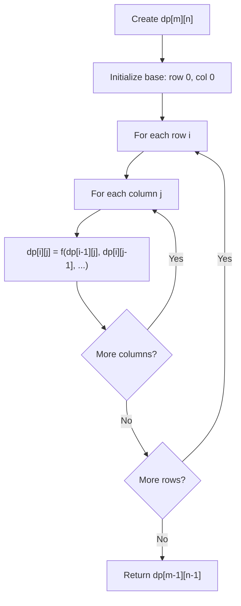
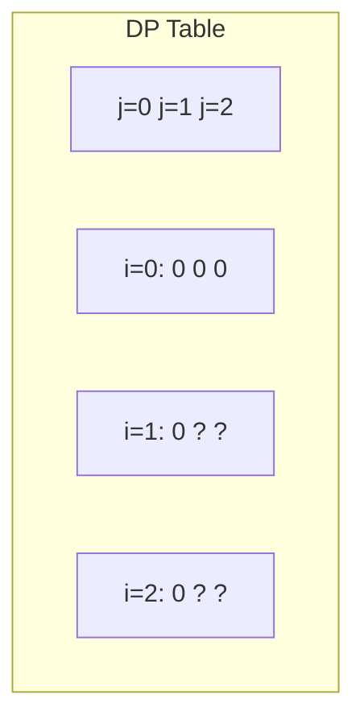
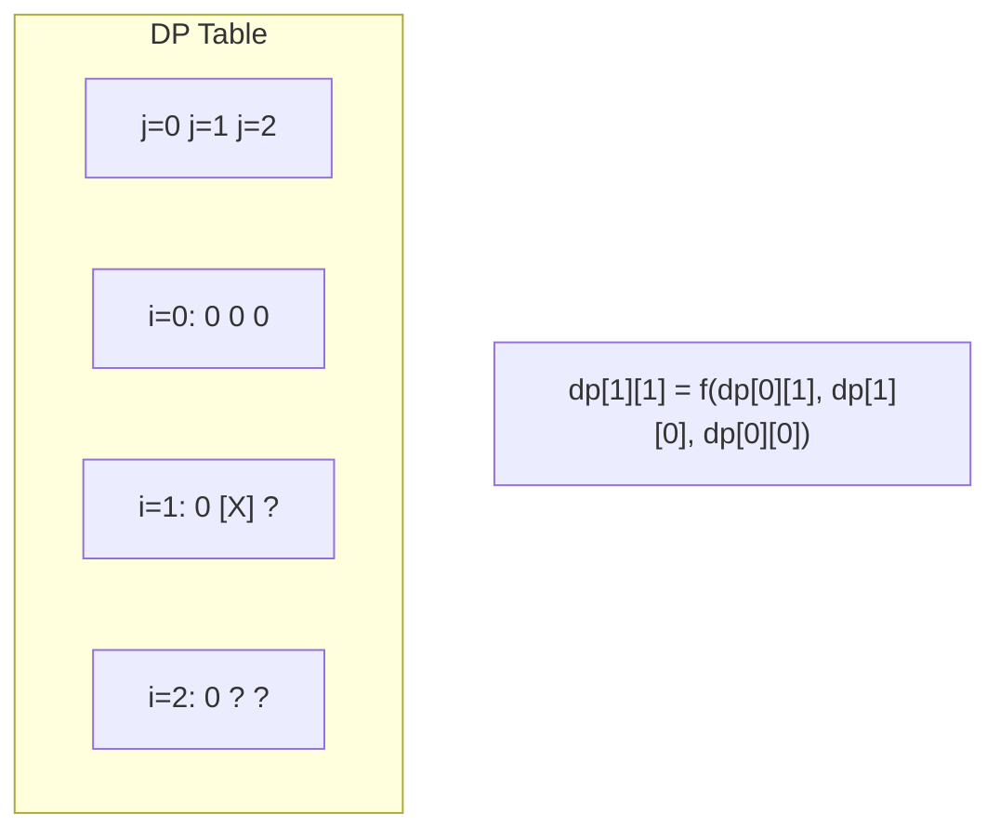
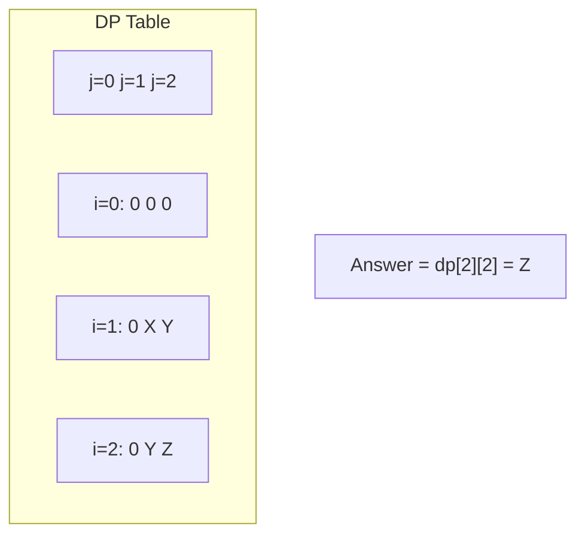

# Problem 1301: Number of Paths with Max Score

**Difficulty:** Hard  
**Tags:** Array, Dynamic Programming, Matrix  
**Pattern:** Dynamic Programming (2D Grid/Matrix)  
**Link:** [leetcode.com/problems/number-of-paths-with-max-score](https://leetcode.com/problems/number-of-paths-with-max-score/)

## Description

You are given a square `board` of characters. You can move on the board starting at the bottom right square marked with the character `'S'`.


You need to reach the top left square marked with the character `'E'`. The rest of the squares are labeled either with a numeric character `1, 2, ..., 9` or with an obstacle `'X'`. In one move you can go up, left or up-left (diagonally) only if there is no obstacle there.


Return a list of two integers: the first integer is the maximum sum of numeric characters you can collect, and the second is the number of such paths that you can take to get that maximum sum, **taken modulo `10^9 + 7`**.


In case there is no path, return `[0, 0]`.


 

Example 1:


```
**Input:** board = ["E23","2X2","12S"]
**Output:** [7,1]

```
Example 2:


```
**Input:** board = ["E12","1X1","21S"]
**Output:** [4,2]

```
Example 3:


```
**Input:** board = ["E11","XXX","11S"]
**Output:** [0,0]

```

 

**Constraints:**


	- `2 <= board.length == board[i].length <= 100`

## Approach: Dynamic Programming (2D Grid/Matrix)

Use a 2D DP table where dp[i][j] represents the optimal value for the subproblem defined by rows 0..i and columns 0..j. Fill row by row or column by column.

## Pseudocode

```
1. Create dp[m][n] table
2. Initialize base cases (first row, first column)
3. For i from 1 to m-1:
   For j from 1 to n-1:
     dp[i][j] = recurrence(dp[i-1][j], dp[i][j-1], dp[i-1][j-1])
4. Return dp[m-1][n-1]
```

## Algorithm Flow



## Visual State Transitions

**2D DP Table Build:**

**Frame 1: Initialize borders**


**Frame 2: Fill cell by cell**


**Frame 3: Table complete**



## Complexity Analysis

- **Time:** O(m * n)
- **Space:** O(m * n)

## Solution (Python3)

```python
class Solution:
    def pathsWithMaxScore(self, board: List[str]) -> List[int]:
        # Dynamic programming (2D) - O(m*n) time and space
        if not board:
            return 0
        m, n = len(board), len(board[0])
        dp = [[0] * (n + 1) for _ in range(m + 1)]
        for i in range(1, m + 1):
            for j in range(1, n + 1):
                dp[i][j] = max(dp[i-1][j], dp[i][j-1])
                # Add problem-specific transition
        return dp[m][n]
```

## Solution (C++)

```cpp
#include <algorithm>
#include <string>
#include <vector>
using namespace std;

class Solution {
public:
    vector<int> pathsWithMaxScore(vector<string>& board) {
        // Dynamic programming (2D) - O(m*n) time and space
        if (board.empty()) return 0;
        int m = board.size(), n = board[0].size();
        vector<vector<int>> dp(m + 1, vector<int>(n + 1, 0));
        for (int i = 1; i <= m; i++) {
            for (int j = 1; j <= n; j++) {
                dp[i][j] = max(dp[i-1][j], dp[i][j-1]);
            }
        }
        return dp[m][n];
    }
};
```
